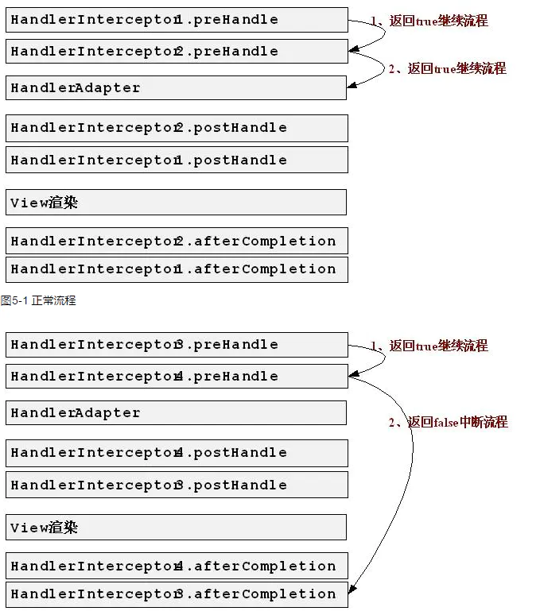

# 处理器拦截器（HandlerInterceptor）详解

> https://www.jianshu.com/p/1e8d088c2be9

```java
public class AuthInterceptor extends HandlerInterceptorAdapter {
    private static final Logger log = LoggerFactory.getLogger(AuthInterceptor.class);
    /**
     * 预处理回调方法，实现处理器的预处理，比如检查登录，第三个作为响应的处理器，自定义controller
     * 返回值：true, 表示继续流程（如调用下一个拦截器或处理器）
     * 返回值：false 表示流程中断，不会调用拦截器或者处理器，此时我们需要通过response 来产生响应,
     */
    @Override
    public boolean preHandle(HttpServletRequest request, HttpServletResponse response,Object handler) {
        String  sessionId ="";
        try{
            return true;
        }catch(RuntimeException re){
            log.error(re.getMessage());
        }
        catch (Exception e){
            log.error("：",e);
        }
        return false;
    }

    /**
     * 后回调方法，实现处理器的后处理（但在渲染视图之前），此时我们通过modelAndView （模型和试图）对模型数据进行处理，
     * 或者对试图进行处理，modelAndView 也可能时null
     */
    @Override
    public void postHandle(HttpServletRequest request, HttpServletResponse response,
                           Object handler, ModelAndView modelAndView) throws Exception {
    }

    /**
     *整个请求处理完毕回调方法，即在视图渲染完毕时回调，如性能监控中我们可以在此处记录结束时间并输出消耗时间，还可以进行一些资源清理
     * 仅调用处理器执行链中
     */
    @Override
    public void afterCompletion(HttpServletRequest request, HttpServletResponse response, Object handler, Exception ex) throws Exception {
    }
}
```

在afterCompletion 中可以进行  获取错误打 日志的操作

```java
package com.examination.design.component.interceptor;

import org.slf4j.Logger;
import org.slf4j.LoggerFactory;
import org.springframework.web.method.HandlerMethod;
import org.springframework.web.servlet.ModelAndView;
import org.springframework.web.servlet.handler.HandlerInterceptorAdapter;

import javax.servlet.ServletOutputStream;
import javax.servlet.http.HttpServletRequest;
import javax.servlet.http.HttpServletResponse;
import java.lang.reflect.Method;

public class AuthInterceptor3 extends HandlerInterceptorAdapter {
    private static final Logger log = LoggerFactory.getLogger(AuthInterceptor3.class);
    /**
     * 预处理回调方法，实现处理器的预处理，比如检查登录，第三个作为响应的处理器，自定义controller
     * 返回值：true, 表示继续流程（如调用下一个拦截器或处理器）
     * 返回值：false 表示流程中断，不会调用拦截器或者处理器，此时我们需要通过response 来产生响应,
     */
    @Override
    public boolean preHandle(HttpServletRequest request, HttpServletResponse response,Object handler) {
        String  sessionId ="";
        try{
            System.out.println("==========================================3================================================");

            return true;
        }catch(RuntimeException re){
            log.error(re.getMessage());
        }
        catch (Exception e){
            log.error("：",e);
        }
        return false;
    }

    /**
     * 后回调方法，实现处理器的后处理（但在渲染视图之前），此时我们通过modelAndView （模型和试图）对模型数据进行处理，
     * 或者对试图进行处理，modelAndView 也可能时null
     */
    @Override
    public void postHandle(HttpServletRequest request, HttpServletResponse response,
                           Object handler, ModelAndView modelAndView) throws Exception {

        System.out.println("==========================================Post3================================================");
    }

    /**
     *整个请求处理完毕回调方法，即在视图渲染完毕时回调，如性能监控中我们可以在此处记录结束时间并输出消耗时间，还可以进行一些资源清理
     * 仅调用处理器执行链中
     */
    @Override
    public void afterCompletion(HttpServletRequest request, HttpServletResponse response, Object handler, Exception ex) throws Exception {
        HandlerMethod method =  (HandlerMethod)handler;
        Class<? extends Object> aClass = method.getBean().getClass();
        Method method1 = method.getMethod();
        String  name = aClass.getName();
        String methodName = method1.getName();
        System.out.println("=========aClassgetSimpleName==Post3"+aClass.getSimpleName());
        System.out.println("["+name+"]["+methodName+"]出现异常:");
        System.out.println("=========aClass==Post3"+aClass);
        System.out.println("=========method1==Post3"+method1);
        System.out.println("==========================================after3================================================");
        ServletOutputStream out = response.getOutputStream();
        String nihao = "hi ,wo jiushige  tishi";
        out.write(nihao.getBytes());
        out.flush();
    }
}

```



> 运行流程总结如下：
>
> **1、拦截器执行顺序是按照Spring配置文件中定义的顺序而定的。**
>
> **2、会先按照顺序执行所有拦截器的preHandle方法，一直遇到return false为止，比如第二个preHandle方法是return false，则第三个以及以后所有拦截器都不会执行。若都是return true，则按顺序加载完preHandle方法。**
>
> **3、然后执行主方法（自己的controller接口），若中间抛出异常，则跟return false效果一致，不会继续执行postHandle，只会倒序执行afterCompletion方法。**
>
> **4、在主方法执行完业务逻辑（页面还未渲染数据）时，按倒序执行postHandle方法。若第三个拦截器的preHandle方法return false，则会执行第二个和第一个的postHandle方法和afterCompletion（postHandle都执行完才会执行这个，也就是页面渲染完数据后，执行after进行清理工作）方法。（postHandle和afterCompletion都是倒序执行）**
>
> 

