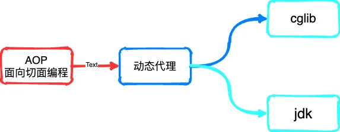
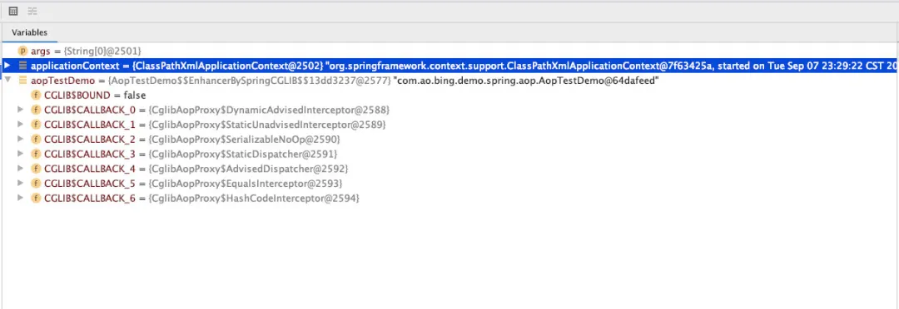
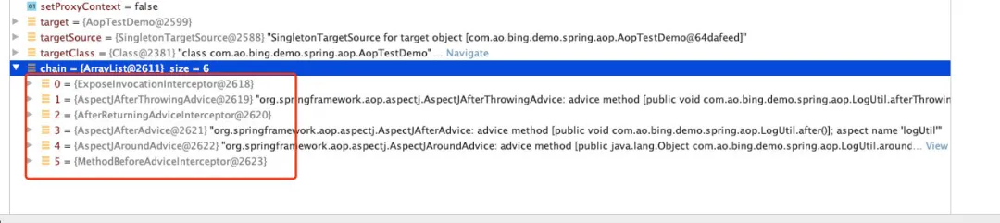
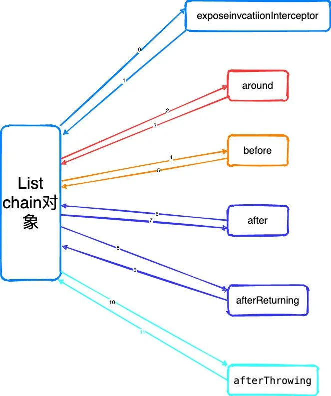
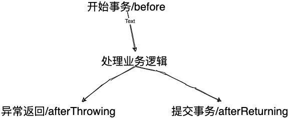

# SpringAOP

## 什么是AOP？

> AOP通常叫面向切面编程（Aspect-oriented Programming，简称AOP），它是一种编程范式，通过预编译的方式和运行期动态代理实现程序功能的统一维护的一种技术。
>
> 通常用来对隔离不同业务逻辑，比如常见的事务管理、日志管理等。同时实现AOP的方式也有两种：cglib 以及 jdk两种方式来实现。



### 为什么要有AOP？

假设现在有几个实现方法，需要做日志处理，正常来说我们只需要手动添加一下日志就可以了，我们都知道在真正的业务代码中，代码行数，以及方法数那是一个天文数字，如果都要手动添加那工作量不现实。

本着作为程序员因该想着怎么合理的偷懒的习惯，所以应该想办法提高效率。

AOP因此就产生了，说白了AOP就是通过某种匹配规则去匹配方法，然后再添加对应的日志处理。而`AOP`本身的实现方式就是通过`ASM`字节码框架动态生成技术，在程序运行的时候，根据需求（添加文件）动态创建字节码文件，之前讲的设计模式中**动态代理模式**中也有讲到，大家可以再去复习一下。

### AOP的核心概念

> - 切面(Aspect)：似于 Java 中的类声明，常用于应用中配置事务或者日志管理。一般使用 `@Aspect` 注解或者 `<aop:aspect>` 来定义一个切面。
>
> - 连接点(Join Point)：程序执行中的特定点，比如方法执行、处理一个异常等
>
> - 切点(Pointcut)：通过一种规则匹配的正则表达式，当有连接点可以匹配到切点时，就会触发改切点相关联的指定通知。
>
> - 通知(Advice)：在切面中某个连接点采取的动作，通知方式也有5种
>
> - - around(环绕通知)：前后都加
>   - before(前置通知)
>   - after(后置通知)
>   - exception(异常通知)
>   - return(返回通知)
>
> - 织入(Weaving)：链接切面和目标对象创建一个通知对象的过程。
>
> AOP其实就是一种编程思想，而这上面的这个点就是编程的具体实现规范。
>
> 一个应用中可以有多种通知方式所以在AOP中引入一种设计模式**责任链模式**通过这这种模式来顺序执行每一个通知当然也可以使用`@Order`注解，配置数字越小，越先执行。关于责任链模式的大家也可以去看看我之前写的设计模式复习一下。

### AOP的执行过程

之前跟大家聊IOC的时候跟大家聊过它的启动过程，同样的AOP也有指定的执行流程，但是需要IOC作为基础。

> - IOC容器启动，用来存放对象
> - 进行对象的实例化和初始化操作，将生成的完成的对象存放到容器中（容器运行中的一些对象比如BeanFactoryProcesser、methodInterceptore等还有其他的很多对象）
> - 从创建好的容器中获取需要对象
> - 调用具体的方法开始调用

说了这么多理论知识，要想知道里面的具体执行流程，还是老样子，一步一步debug进入源码查看流程了

首先还是需要先准备配置一个切面

```java
@Aspect
@Component
public class LogUtil {

    @Pointcut("execution(public * com.ao.bing.demo.spring.aop..*.*(..))")
    public void pctMethod() {
    }

    @Around(value = "pctMethod()")
    public Object around(ProceedingJoinPoint pjp) throws Throwable {
        Object ret = pjp.proceed();
        System.out.println("Around advice");
        return ret;
    }

    @Before("pctMethod()")
    public void before() {
        System.out.println("Before advice");
    }

    @After(value = "pctMethod()")
    public void after() {
        System.out.println("After advice");
    }

    @AfterReturning(value = "pctMethod()")
    public void afterReturning() {
        System.out.println("AfterReturning advice");
    }

    @AfterThrowing(value = "pctMethod()")
    public void afterThrowing() {
        System.out.println("AfterThrowing advice");
    }
  
  
    // mian方法测试demo
      public static void main(String[] args) {
        ApplicationContext applicationContext = new ClassPathXmlApplicationContext("classpath:applicationContext.xml");
        AopTestDemo aopTestDemo = applicationContext.getBean(AopTestDemo.class);
        aopTestDemo.method("测试AOP");

    }
}
```

这里配置一个LogUtil的切面demo，五种通知都写了一遍,同时也有一个main方法测试。准备工作做完了就正式开始debug代码了



首先在aopTestDemo里面我们打上断点，此时我们的过去的bean对象aopTestDemo已经是通过动态代理生成的对象了，其中这里面有很多的CALLBACK方法属性。那写方法属性是什么呢？

其实这里面就又跟Spring的拦截器有关，其实就是一种设计模式**观察者模式**说白了就是对对象的一种行为的监听。通过回调机制来实现通知的功能。

那既然是回调方法，那就先进DynamicAdvisedInterceptor方法中

```java
    private static class DynamicAdvisedInterceptor implements MethodInterceptor, Serializable {
        private final AdvisedSupport advised;

        public DynamicAdvisedInterceptor(AdvisedSupport advised) {
            this.advised = advised;
        }

        @Nullable
        public Object intercept(Object proxy, Method method, Object[] args, MethodProxy methodProxy) throws Throwable {
            Object oldProxy = null;
            boolean setProxyContext = false;
            Object target = null;
            TargetSource targetSource = this.advised.getTargetSource();

            Object var16;
            try {
                if (this.advised.exposeProxy) {
                    oldProxy = AopContext.setCurrentProxy(proxy);
                    setProxyContext = true;
                }

                target = targetSource.getTarget();
                Class<?> targetClass = target != null ? target.getClass() : null;
              // 从advised中 获取配置好的AOP的通知方法 -重点
                List<Object> chain = this.advised.getInterceptorsAndDynamicInterceptionAdvice(method, targetClass);
                Object retVal;
              // 如果没有配置通知方法，则直接调用target对象的调用方法
                if (chain.isEmpty() && Modifier.isPublic(method.getModifiers())) {
                    Object[] argsToUse = AopProxyUtils.adaptArgumentsIfNecessary(method, args);
                    retVal = methodProxy.invoke(target, argsToUse);
                } else {
               // 通过CglibMethodInvocation来启动advice通知 - 重点
                    retVal = (new CglibAopProxy.CglibMethodInvocation(proxy, target, method, args, targetClass, chain, methodProxy)).proceed();
                }

                retVal = CglibAopProxy.processReturnType(proxy, target, method, retVal);
                var16 = retVal;
            } finally {
                if (target != null && !targetSource.isStatic()) {
                    targetSource.releaseTarget(target);
                }

                if (setProxyContext) {
                    AopContext.setCurrentProxy(oldProxy);
                }

            }

            return var16;
        }
```

在DynamicAdvisedInterceptor中有一个`List<Object> chain`这里获取到我们配置的通知方法



从上面的截图可以看到Spring先是把所有的通知获取到，放在一个list集合对象中，因为此时list不为空所以就又会走到 通过CglibMethodInvocation来启动advice通知这一步的流程中

```java
public class ReflectiveMethodInvocation implements ProxyMethodInvocation, Cloneable {

 protected final Object proxy;

 @Nullable
 protected final Object target;

 protected final Method method;

 protected Object[] arguments = new Object[0];

 @Nullable
 private final Class<?> targetClass;

 /**
  * Lazily initialized map of user-specific attributes for this invocation.
  */
 @Nullable
 private Map<String, Object> userAttributes;

 /**
  * List of MethodInterceptor and InterceptorAndDynamicMethodMatcher
  * that need dynamic checks.
  */
 protected final List<?> interceptorsAndDynamicMethodMatchers;

 /**
  * Index from 0 of the current interceptor we're invoking.
  * -1 until we invoke: then the current interceptor.
  */
 private int currentInterceptorIndex = -1;

 // 省略其他的方法

 @Override
 @Nullable
 public Object proceed() throws Throwable {
  // We start with an index of -1 and increment early.
    // 从索引为-1的拦截器还是调用，并且按顺序递增，如果整个List chain中调用完毕，则开始调用target的函数
    // 具体的实现方式在AOPUtils.invokeJoinpointUsingRefection方法中，说白了就是通过反射实现目标方法
  if (this.currentInterceptorIndex == this.interceptorsAndDynamicMethodMatchers.size() - 1) {
   return invokeJoinpoint();
  }
  // 获取下一个需要执行的拦截器，沿着定义好的interceptorOrInterceptionAdvice的链进行处理
  Object interceptorOrInterceptionAdvice =
    this.interceptorsAndDynamicMethodMatchers.get(++this.currentInterceptorIndex);
  if (interceptorOrInterceptionAdvice instanceof InterceptorAndDynamicMethodMatcher) {
   // Evaluate dynamic method matcher here: static part will already have
   // been evaluated and found to match.
      // 对拦截器进行动态匹配，如果和定义的pointcut匹配 则就会执行当前的这个advice
   InterceptorAndDynamicMethodMatcher dm =
     (InterceptorAndDynamicMethodMatcher) interceptorOrInterceptionAdvice;
   Class<?> targetClass = (this.targetClass != null ? this.targetClass : this.method.getDeclaringClass());
   if (dm.methodMatcher.matches(this.method, targetClass, this.arguments)) {
    return dm.interceptor.invoke(this);
   }
   else {
    // Dynamic matching failed.
    // Skip this interceptor and invoke the next in the chain.
    return proceed();
   }
  }
  else {
   // It's an interceptor, so we just invoke it: The pointcut will have
   // been evaluated statically before this object was constructed.
      // 普通拦截器，直接调用拦截器，将当前的this（CglibMethodInvocation）作为参数保证当前实例中调用链的执行
   return ((MethodInterceptor) interceptorOrInterceptionAdvice).invoke(this);
  }
 }

 // 省略其他的方法
}
```

这里需要注意的一点 从上面的源码中currentInterceptorIndex默认值定义为-1，相当于是作为判断当前通知链式是执行完成，执行完那就是直接通过反射调用目标方法，否者向下接着执行。

> ((MethodInterceptor) interceptorOrInterceptionAdvice).invoke(this)

interceptorOrInterceptionAdvice这个方法是关键点，即具体的调用拦截器去执行具体的方法

```java
public final class ExposeInvocationInterceptor implements MethodInterceptor, PriorityOrdered, Serializable {
 
 @Override
 public Object invoke(MethodInvocation mi) throws Throwable {
  MethodInvocation oldInvocation = invocation.get();
  invocation.set(mi);
  try {
      // 具体执行
   return mi.proceed();
  }
  finally {
   invocation.set(oldInvocation);
  }
 }
}
```

不知道大家发现了问题没有，在刚上面截图的时候`List<Object> chain`中有6个通知方法，而在配置的util中只配置了5个方法，第一个这就是ExposeInvocationInterceptor这个方法，那这个到底是啥呢？

> 其实这里是Spring引入的又一个设计模式**责任链设计模式**引入这个设计模式原因就是在于，配置的通知方法这么多，那spring怎么知道去执行那一个advice呢？所以通过ExposeInvocationInterceptor（暴露调用器的拦截器）作为第一个通知方法，来保证所以的通知方法按按这中连式方式执行下去。

至此SpringAOP的通知连式结构调用流程就开始了，重复开始循环调用。一直到List chain整个链全部执行完毕

当前这里面还有一些其他的逻辑需我就没有具体细说了

比如整个链有没有一种顺序执行？还是说根据代码编写的先后顺序执行？

> org.springframework.aop.aspectj.autoproxy.AspectJAwareAdvisorAutoProxyCreator#sortAdvisors

在获取到整个责任链之后会经过一次排序执行，这个排序默认是使用拓扑排序方法，大家可以具体的去看看sortAdvisors这个方法

然后在执行每一种通知方法时，都会有对应的切面通知方法

> - org.springframework.aop.aspectj.AspectJAfterAdvice
> - org.springframework.aop.aspectj.AspectJAfterReturningAdvice
> - org.springframework.aop.aspectj.AspectJAfterThrowingAdvice
> - org.springframework.aop.aspectj.AspectJAroundAdvice
> - org.springframework.aop.aspectj.AspectJMethodBeforeAdvice
>
> 我们配置的五种通知对应着上面的五种处理逻辑

所以整个责任链来说通知调用链路可以理解为一张图结构：



以上就是Spring通知整个执行的过程，总结一下

> Spring中的五种通知，首先是通过具Spring容器的启动过程获取到具体的通知，在调用对象时，通过动态代理ASM技术，把需要执行的advice先全部放在一个chain对象的集合中，为了保证整个链的调用默认会先调用ExposeInvocationInterceptor去触发整个链式执行，在执行完每一个advice时后都会再次回到super的proceed方法中，执行下一个advice，在执行不通的advice时后有对应的切面通知方法，当所有的advice执行完毕再通过反射调用目标方法
>
> 整个过程大家可以自己dubug试一下，也不是特别的麻烦！！！

### AOP事务功能

AOP处理常见的配置切面处理日志等业务，还有大家也比较熟悉的那就是事务。

其实AOP的事务也是通过配置的advice的方式来执行的



通知对advice的拆解来实现事务的功能。

> 在看源码的时候能给我们带来很多的思考，对我们

在Spring中大家可以通过`@Transactional`注解来现实事务功能，看过源码的同学肯定看过`TransactionAspectSupport`这个类

```java
public abstract class TransactionAspectSupport implements BeanFactoryAware, InitializingBean {
 // 省略其他代码。。。。
 @Nullable
 protected Object invokeWithinTransaction(Method method, @Nullable Class<?> targetClass,
   final InvocationCallback invocation) throws Throwable {

  // If the transaction attribute is null, the method is non-transactional.
  TransactionAttributeSource tas = getTransactionAttributeSource();
  final TransactionAttribute txAttr = (tas != null ? tas.getTransactionAttribute(method, targetClass) : null);
  final PlatformTransactionManager tm = determineTransactionManager(txAttr);
  final String joinpointIdentification = methodIdentification(method, targetClass, txAttr);

  if (txAttr == null || !(tm instanceof CallbackPreferringPlatformTransactionManager)) {
   // Standard transaction demarcation with getTransaction and commit/rollback calls.
   TransactionInfo txInfo = createTransactionIfNecessary(tm, txAttr, joinpointIdentification);
   Object retVal = null;
   try {
    // This is an around advice: Invoke the next interceptor in the chain.
    // This will normally result in a target object being invoked.
    retVal = invocation.proceedWithInvocation();
   }
   catch (Throwable ex) {
    // target invocation exception
        // 异常回滚 重点
    completeTransactionAfterThrowing(txInfo, ex);
    throw ex;
   }
   finally {
    cleanupTransactionInfo(txInfo);
   } 
      // 成功后提交 重点
   commitTransactionAfterReturning(txInfo);
   return retVal;
  }
 
 // 省略其他的代码。。。。

}
```

因此SpringAOP的声明事务也是通过advice实现。

> AOP的事务整体来说比较简单，说白了就是通过advice的从新组合来完成事务功能，当然也是Spring的强大之处，扩展性是真的高。

## 总结


为了加强理解，还是有两个比较常见的面试题

advice的通知执行流程？

> 看完整个流程如果还是不理解我觉得可以自己debug走一遍加深自己的理解，文中我也做了总结。但是要自己真的理解才能不会被面试官问倒

AOP中的Transactional事务是怎么实现的？

> 这个问题如果理解advice的调用流程那么也就能很简单的回答了。