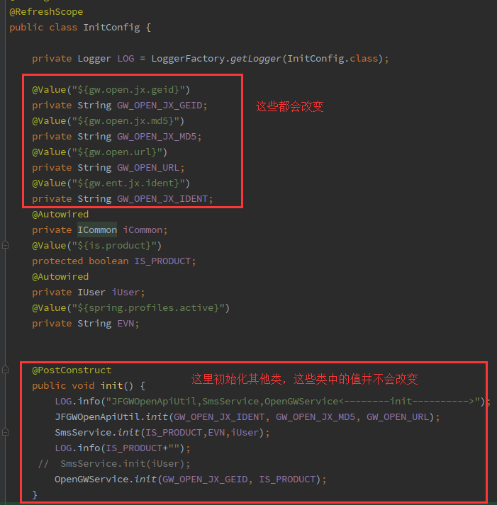

1.在启动类添加apollo 注解

```java
@EnableApolloConfig
public class KdspApiApplication {

    public static void main(String[] args) {
        SpringApplication.run(KdspApiApplication.class, args);
        log.info("ksdp-api started...");
    }
}
```


2.添加apollo 的监听

```java
public class ApolloConfig {
    @Resource
    private RefreshScope refreshScope;

    /**
     * 监听apollo配置变化
     *
     * @param changeEvent 变化事件
     */
    @ApolloConfigChangeListener(value = {ConfigConsts.NAMESPACE_APPLICATION})
    public void onChange(ConfigChangeEvent changeEvent) {
        for (String changedKey : changeEvent.changedKeys()) {
            log.info("apollo changed namespace:{} Key:{} value:{}", changeEvent.getNamespace(), changedKey, changeEvent.getChange(changedKey));
        }
        refreshScope.refreshAll();
    }

}
```

3. 在需要实时变更的变量的上方添加 @RefreshScope 注解

   



# [**Spring Cloud @RefreshScope刷新问题**](https://www.cnblogs.com/ingxx/p/11274818.html)

# 问题

使用@RefreshScope会刷新在sprign ioc中所有bean中使用@Value的值，但是在配置类中使用方法去配置的其他类参数并不会改变例如
[  ](https://img2018.cnblogs.com/blog/1265875/201907/1265875-20190731104742590-970786663.png)


# 解决方案

```java
//使用此方法监听事件
@EventListener
    public void envListener(EnvironmentChangeEvent event) {
    }
```

# 原因

在调用刷新方法是会产生一个`EnvironmentChangeEvent`事件。
其实进入 ContextRefresher 的源码，看下refresh接口，就很明确了

```java
public synchronized Set<String> refresh() {
	Map<String, Object> before = extract(
			this.context.getEnvironment().getPropertySources());
	addConfigFilesToEnvironment();
	Set<String> keys = changes(before,
			extract(this.context.getEnvironment().getPropertySources())).keySet();
	// 注意这一行，抛出了一个变更事件
	this.context.publishEvent(new EnvironmentChangeEvent(context, keys));
	this.scope.refreshAll();
	return keys;
}
```

https://my.oschina.net/u/566591/blog/2245509

# [SpringBoot基础篇配置信息之配置刷新](https://my.oschina.net/u/566591/blog/2245509)

