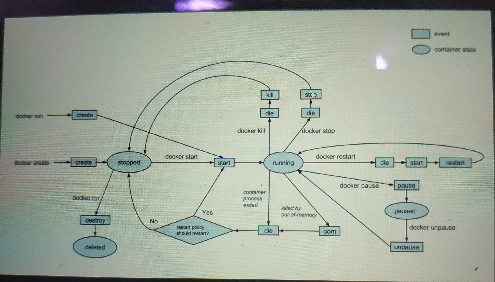

##### 容器和镜像

镜像：镜像是文件，是只读的，提供了运行程序完整的软硬件资源，是应用程序的集装箱

容器：是镜像的实例，由Docker 负责创建，容器之间彼此隔离

##### tomcat 容器的内部结构

Linux(Red hat 4.8.4-28)      一个迷你的linux 系统

-> jdk（1.8.0_22）     

 ->  Apache tomcat(8.5.46)

##### Docker 常用命令

> docker pull 镜像名 <:tags> -从远程仓库抽取镜像
>
> docker images  -查看本地镜像
>
> docker run  镜像名<:tags>  -创建容器  ，启动应用 ，启动应用
>
> ```
> docker run -p 8000:8080 tomcat
> ```
>
> docker ps - 查看正在运行的docker 镜像
>
> docker rm  <-f> 容器id  删除容器
>
> docker rmi <-f> 镜像名:<tags> 删除镜像


##### 在容器中执行命令

格式 ：

```
docker exec[-it] 容器id 命令
exec: 在对应容器中执行命令
-it: 采用交互的方式执行命令

实例 ：docker exec -it  0877722dd  /bin/bash
```

##### 容器的生命周期



##### Dockerfile 镜像描述文件

Dockerfile 是 一个用于包含用于组合镜像的命令的文本文档

Docker 通过读取Dockerfile 中的指令按步自动生成镜像

```
docker build -t 机构/镜像名<:tags> Dockerfile 目录
```

```
FROM tomcat:latest
MAINAINER baidu.com
WORKDIE /usr/local/tomcat/webapps
add docker-web ./docker-web
```

##### 镜像分层 layer

```
FROM centos:7
RUN yum install -y vim
RUN yum install -y httpd
CMD ["/bin/bash"]

# docker build -t ryan/httpd:v1.0 .
Sending build context to Docker daemon  6.144kB
Step 1/4 : FROM centos:7
 ---> 1e1148e4cc2c
Step 2/4 : RUN yum install -y vim
 ---> Using cache
 ---> 74bdbea98f73
Step 3/4 : RUN yum install -y httpd
 ---> Using cache
 ---> 17d8c4095dc4
Step 4/4 : CMD /bin/bash
 ---> Using cache
 ---> f2b58b1192de
Successfully built f2b58b1192de
Successfully tagged ryan/httpd:latest
```

我们可以查看镜像的历史，用上一步的镜像id f2b58b1192de

```
# docker history f2b58b1192de
IMAGE               CREATED             CREATED BY                                      SIZE                COMMENT
f2b58b1192de        About an hour ago   /bin/sh -c #(nop)  CMD ["/bin/bash"]            0B                  
17d8c4095dc4        About an hour ago   /bin/sh -c yum install -y httpd                 110MB               
74bdbea98f73        About an hour ago   /bin/sh -c yum install -y vim                   133MB               
1e1148e4cc2c        2 months ago        /bin/sh -c #(nop)  CMD ["/bin/bash"]            0B                  
<missing>           2 months ago        /bin/sh -c #(nop)  LABEL org.label-schema....   0B                  
<missing>           2 months ago        /bin/sh -c #(nop) ADD file:6f877549795f479...   202MB   
```

##### Dockerfile  基础命令

```
FROM -基于基准镜像
FROM  centos #制作基准镜像(基于centos:lastest)
FROM  scrath #不依赖任何基准进项 base image
FROM tomcat:9.0.22-jdk8-openjdk
```

```
LABEL&MAINTAINER  -说明镜像是
MAINTAINER baidu.com
LABEL version="1.0"
LABEL description ="wusuowei"
```

```
WORKDR - 设置工作目录
WORKDIR /usr/local
WORKDIR /usr/local/newdir #自动创建
尽量使用绝对路径
```

```
ADD&COPY -复制文件
ADD hello /#复制到根目录
ADD test.tar.gz /#添加根目录并解压
ADD 除了复制还具备添加远程文件功能
```

```
ENV -设置环境变量
ENV JAVA_HOME /usr/local/openjdk8
RUN ${JAVA_HOME}/bin/java -jar test.jar
```

```dockerfile
RUN & CMD & ENTRYPOINT
RUN : 在builg 构建时执行命令
ENTRYPOINT :容器启动时执行的命令
CMD : 容器启动后执行默认的命令 或参数

```

```
RUN-构建时执行
RUN yum install -y vim   # Shell 命令格式
RUN ["yum","install","-y","vim"]  #Exec命令格式

Shell 运行方式
使用Shell执行时，当前Shell是父进程，生成一个子shell进程
在子shell 中执行脚本，脚本执行完毕，推出子shell,回到当前shell

Exec命令格式 执行方式
会用Exec进程替换当前进程，并且保持PID不变
执行完毕，直接退出，并不会退回之前的进程环境
```

ENTRYPOINT 启动命令

```
ENTRYPOINT(入口点)用于在容器启动时执行命令
Dockerfile 中只有最后一个ENTRYPOINT 会被执行
ENTRYPOINT ["ps"] #推荐使用exec 格式
```

CMD命令

```
CMD 用于设置默认执行的命令
如果dockerfile 中出现多个CMD,则只有最后一个被执行
cmd 不一定会被执行，如容器启动时附件命令，则CMD 被忽略
CMD ["ps","-ef"]

dokcer run xxx  ls 
ls 命令 会覆盖掉CMD 命令
```

##### Volume 容器间共享数据

