#### **1** ***\*Docker简介\****

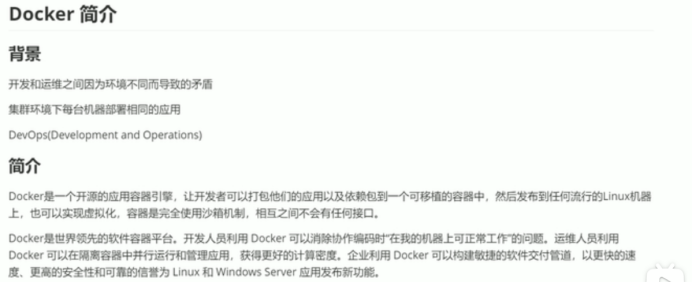

#### 2.***\*什么是镜像\****

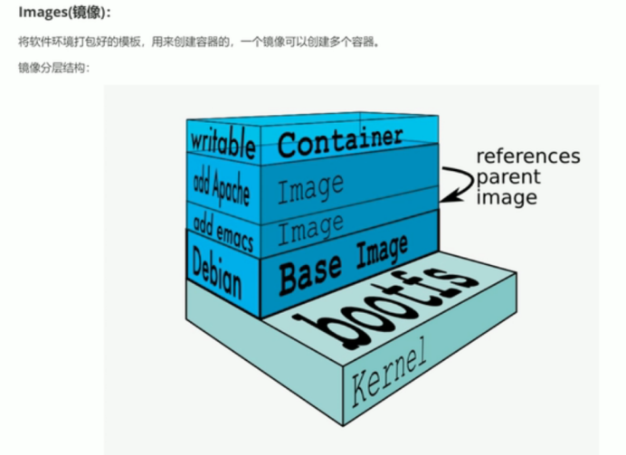

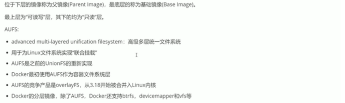

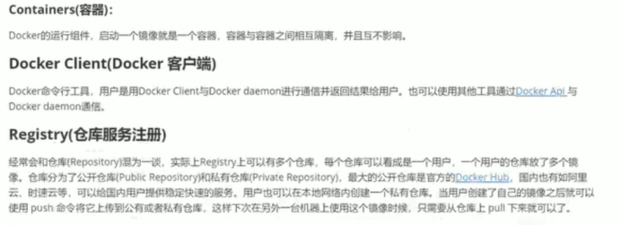

#### 3 docker安装

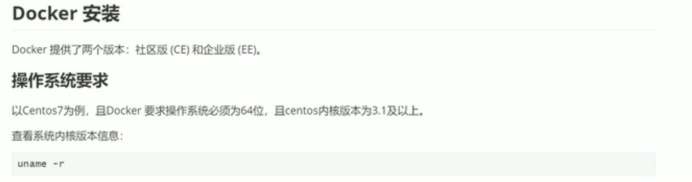

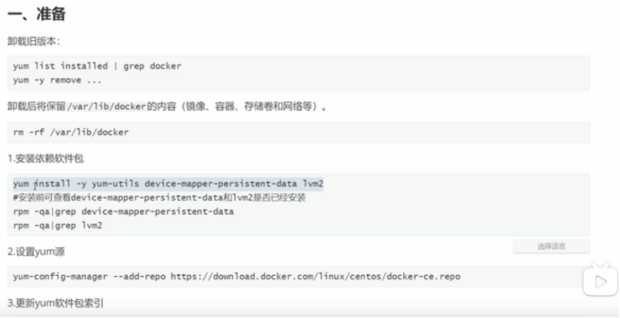

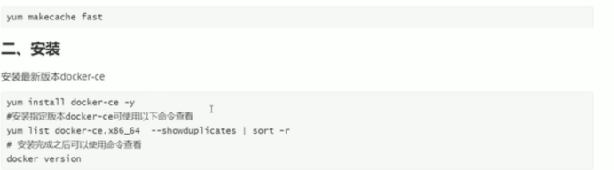

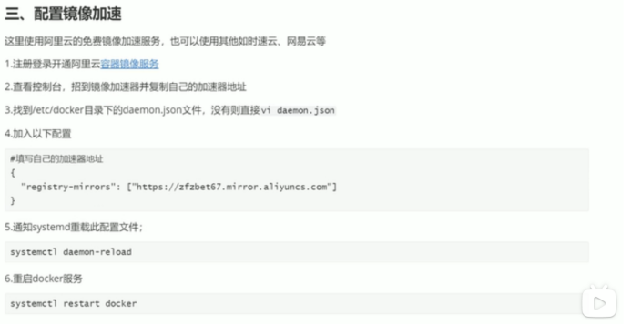

#### 4.Docker常用操作

###### 4.1***\*镜像常用操作\****

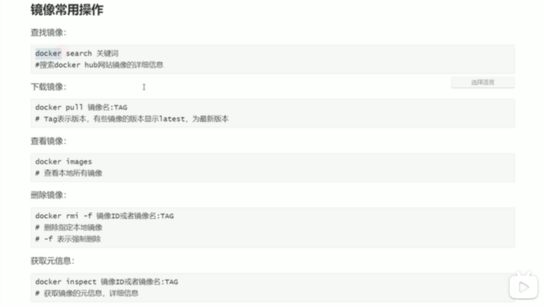

###### 4.2 容器常用操作

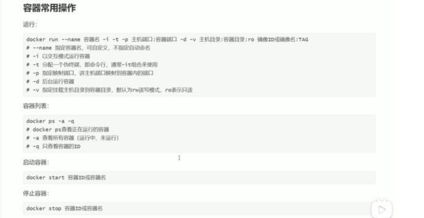

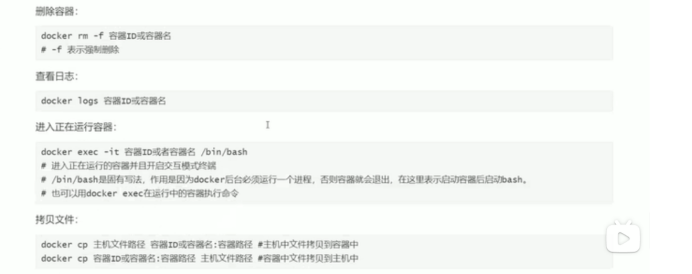

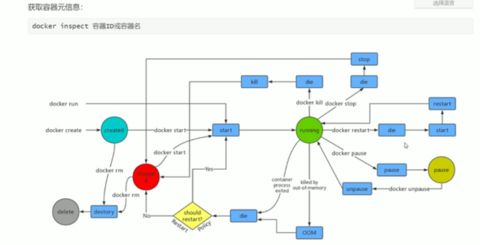

#### 5 Docker网络

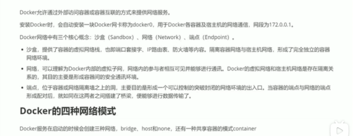

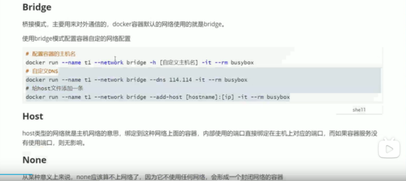

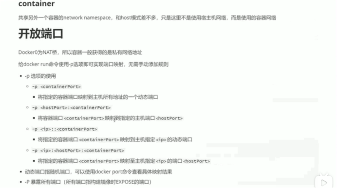

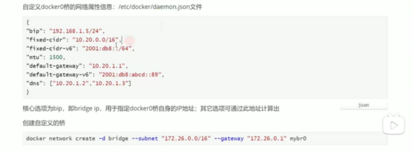

###### 5.1 Docker生成镜像的两种方式

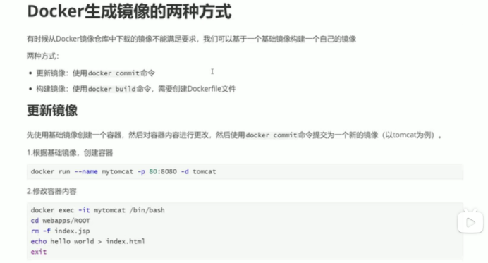

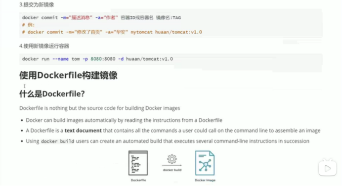

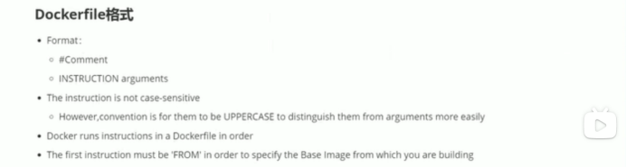

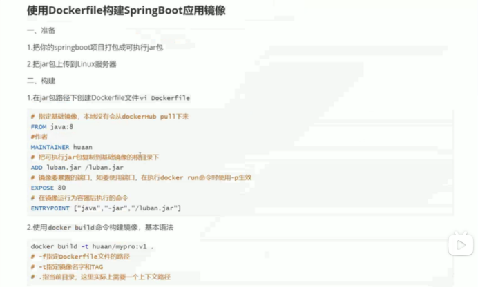

###### 5.2 Dockerfile常用指令

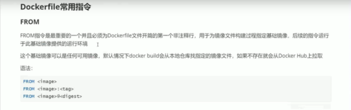

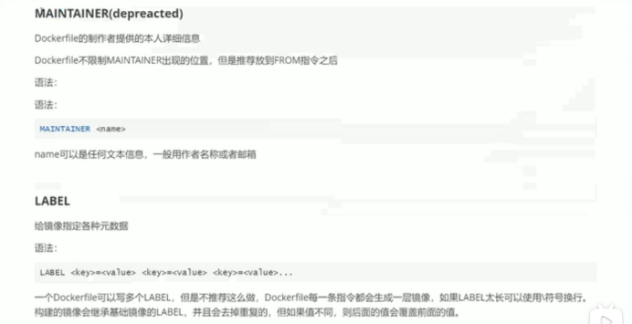

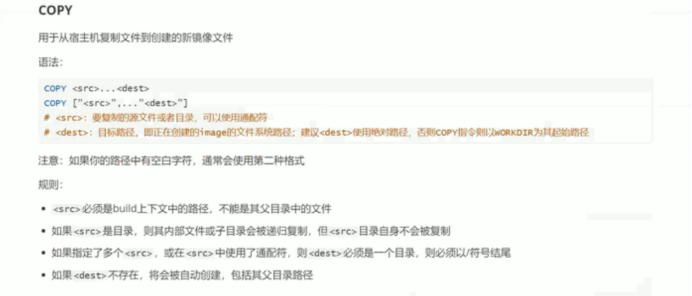

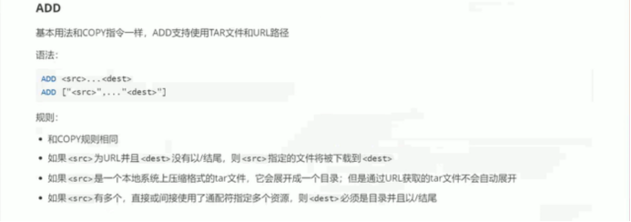

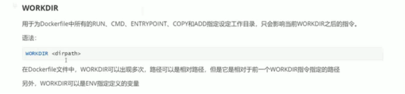

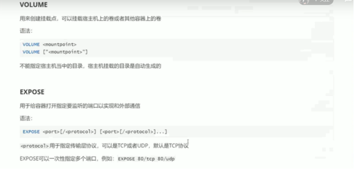

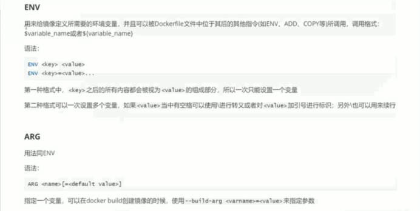

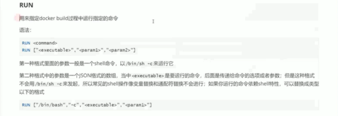

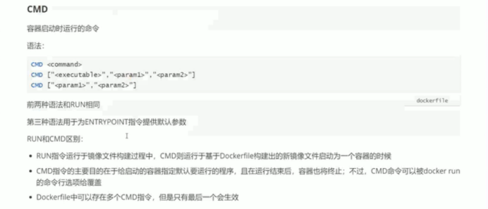

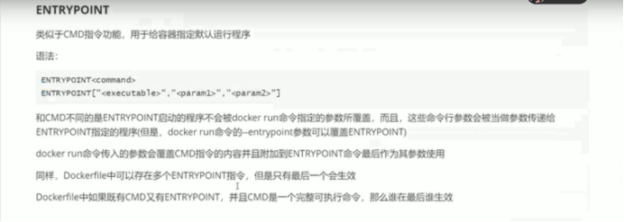

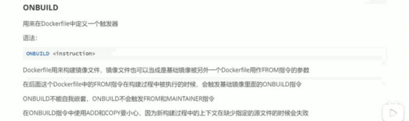

#### 6 将本地镜像发布到阿里云

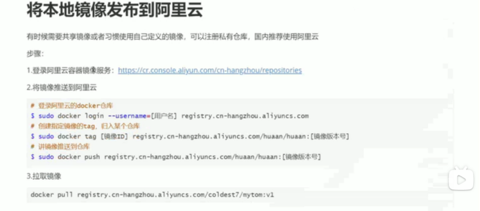

#### 7 自定义tomcat镜像

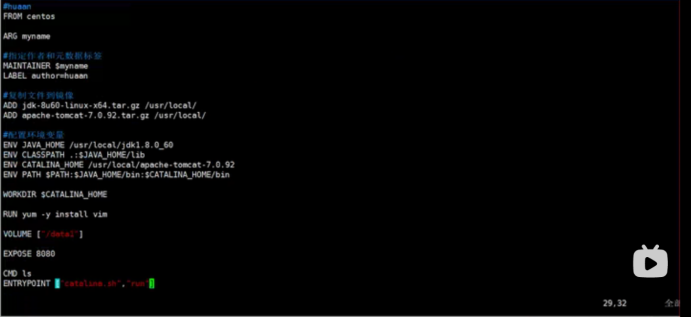

#### 8 Docker安装mysql

```
Hub.docker.com中有安装注意事项，安装前一定要看官方的安装指南。
1、docker search mysql
2、Docker pull mysql:5.7
3、Docker image ls
4、Docker run --name mysql -d -p 6666:3306 mysql:5.7
5、Docker container ps (Docker container ps -a 会显示正在停止的容器)
6、Docker container rm -f mysql
7、Docker run --name mysql -d -p 6666:3306 -e MYSQL_ROOT_PASSWORD=1234 mysql
8、Docker ps
9、Docker container exec -it mysql /bin/bash
10、Create database digitaltest;
11、Show databases;
12、Show tables;
13、Docker container inspect mysql（重点看mounts source和destination）
14、Mkdir -p /my/mysql/conf
15、Mkdir -p /my/mysql/data
16、Mkdir -p /my/mysql/logs
17、Docker cp mysql /etc/mysql/mysql.conf.d/mysql.conf /my/mysql/conf/
18、Cd /my/mysql/conf/
19、Vi mysql.conf
20、Docker ps
21、Docker rm -f mysql
22、docker run --name mysql -d -p 6666:3306 
-v /my/mysql/conf:/etc/mysql/mysql.conf.d/
-e MYSQL_ROOT_PASSWORD=1234 mysql
```

