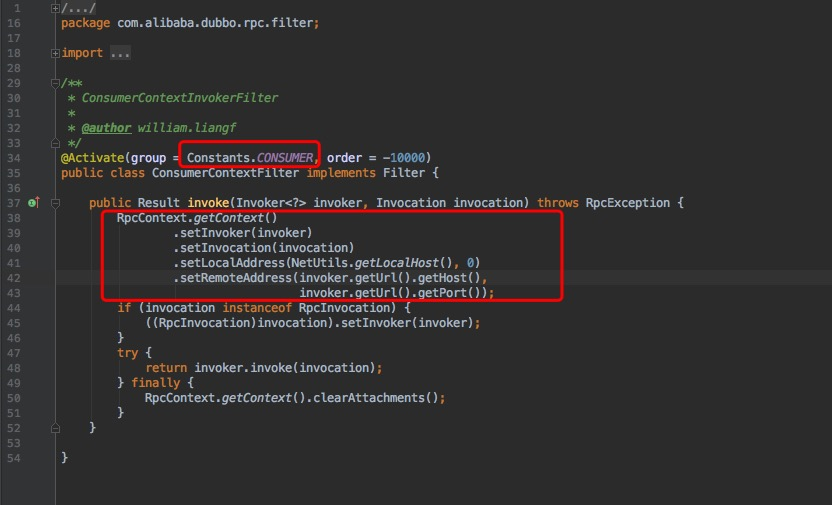
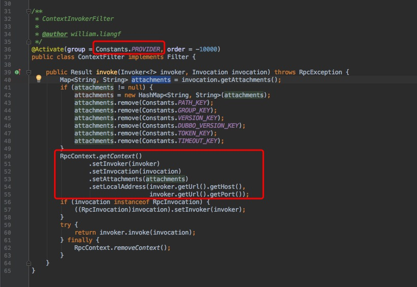
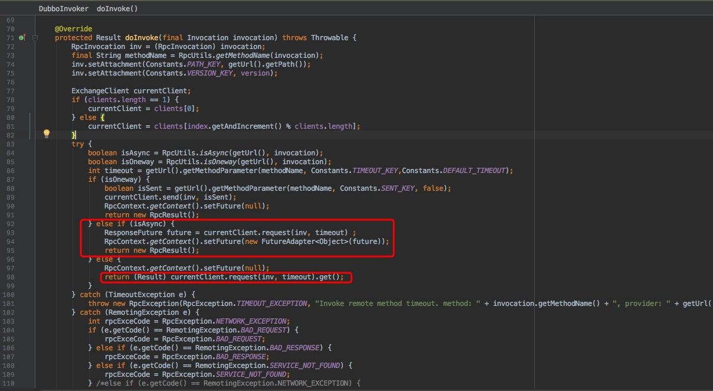
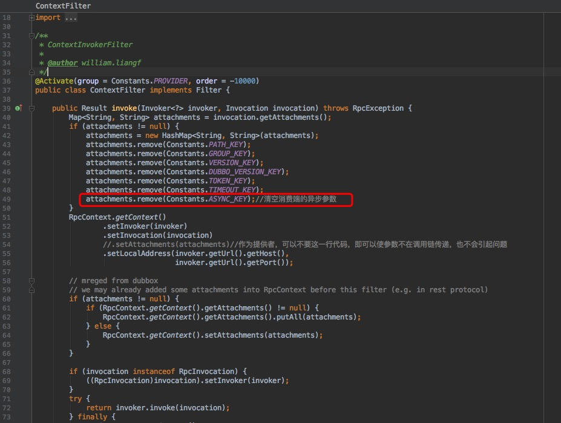

https://www.iteye.com/blog/ncs123-2428255

### Dubbo之RpcContext详解

**一、RpcContext简介**
  RpcContext 是一个 ThreadLocal 的临时状态记录器，当接收到 RPC 请求，或发起 RPC 请求时，RpcContext 的状态都会变化。
  比如：A调B，B再调C，则B机器上，在B调C之前，RpcContext记录的是A调B的信息，在B调C之后，RpcContext记录的是B调C的信息。

**二、RpcContext的使用**
  **消费端**

Java代码 [](javascript:void())

```java
// 远程调用之前，通过attachment传KV给提供方  
RpcContext.getContext().setAttachment("userKey", "userValue");  
// 远程调用  
xxxService.xxx();  
// 本端是否为消费端，这里会返回true  
boolean isConsumerSide = RpcContext.getContext().isConsumerSide();  
// 获取最后一次调用的提供方IP地址  
String serverIP = RpcContext.getContext().getRemoteHost();  
// 获取当前服务配置信息，所有配置信息都将转换为URL的参数  
String application = RpcContext.getContext().getUrl().getParameter("application");  
// 注意：每发起RPC调用，上下文状态会变化  
yyyService.yyy();  
// 此时 RpcContext 的状态已变化   
RpcContext.getContext();    
```

  **服务端**

Java代码 [](javascript:void())

```java
public class XxxServiceImpl implements XxxService {  
  
    public void xxx() {  
        // 通过RpcContext获取用户传参，这里会返回userValue  
        String value = RpcContext.getContext().getAttachment("userKey");  
        // 本端是否为提供端，这里会返回true  
        boolean isProviderSide = RpcContext.getContext().isProviderSide();  
        // 获取调用方IP地址  
        String clientIP = RpcContext.getContext().getRemoteHost();  
        // 获取当前服务配置信息，所有配置信息都将转换为URL的参数  
        String application = RpcContext.getContext().getUrl().getParameter("application");  
        // 注意：每发起RPC调用，上下文状态会变化  
        yyyService.yyy();  
        // 此时本端变成消费端，这里会返回false  
        boolean isProviderSide = RpcContext.getContext().isProviderSide();  
    }   
}  
```

**三、RpcContext原理**
  **消费端**在执行Rpc调用之前，经过Filter处理, 会将信息写入RpcContext.见**ConsumerContextFilter**:



**服务端**在执行调用之前，也会经过Filter处理，将信息写入RpcContext. 见**ContextFilter**类



**四、Dubbo异步调用**

Java代码 [](javascript:void())

```java
//配置方式  
<dubbo:reference id="demoServicemy2" interface="com.test.dubboser.ServiceDemo2">  
      <dubbo:method name="getPerson" async="true"  />  
</dubbo:reference>  
  
//编程方式  
Future<T> future = RpcContext.getContext().asyncCall(new Callable<T>(){...});  
  
//访问服务之后获取异步调用的结果，通过Future.  
Future<T> future = RpcContext.getContext().getFuture();  
T t = future.get();  
```

**五、Dubbo异步调用源码解析**
  **同步调用：**ResponseFuture.get()同步等待返回结果并实时返回。
  **异步调用：**ResponseFuture放入RpcContext，实时返回一个空的RpcResult实例，后序通过RpcContext.getContext().getFuture() .get()获取返回值。

详情见**DubboInvoker**




**六、Dubbo异步调用的坑**
  **异步调用依赖传递性**
  

- **问题表现：**如果consumer-A异步调用provider-B，而provider-B本身又调用了provider-C。当provider-B调用provider-C时，会变成异步。
- **问题原因：**是否异步调用取决于RpcContext中async的值，其次才是服务本身的配置。当A调用B时，会把async=true传给B的RpcContext；B调用C时，虽然服务本身async=false，但RpcContext中async=true，自然也就成了异步调用。

**异步回调返回null**
  

- **问题表现：**consumer-A调用provider-B，而provider-B本身又调用了provider-C。consumer-A调用provider-B返回null。
- **问题原因：**异步调用直接返回空的RpcResult实例，需要后序通过RpcContext.getContext().getFuture() .get()获取返回值。async透传到provider-B端之后，也是异步调用provider-C，但是直接返回空的RpcResult实例给consumer-A。


  **解决方案：**别让async参数应用到provider端。
  修改ContextFilter源码，重写RpcContext时删除async参数



