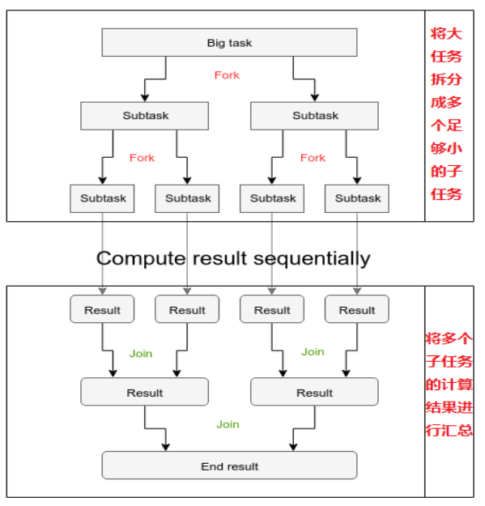
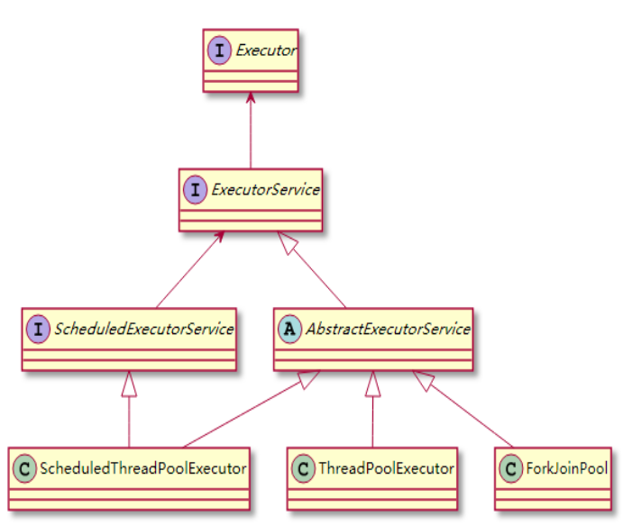
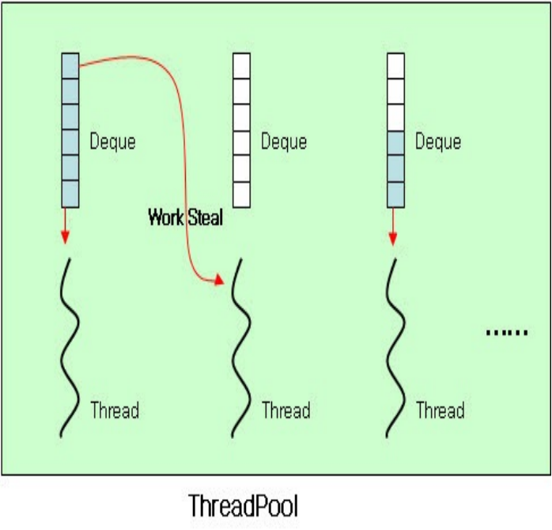
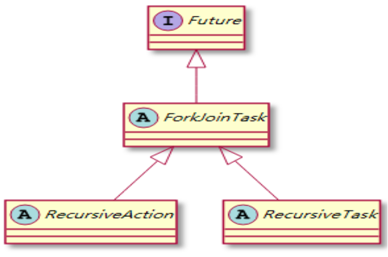
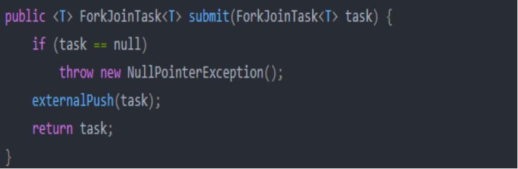
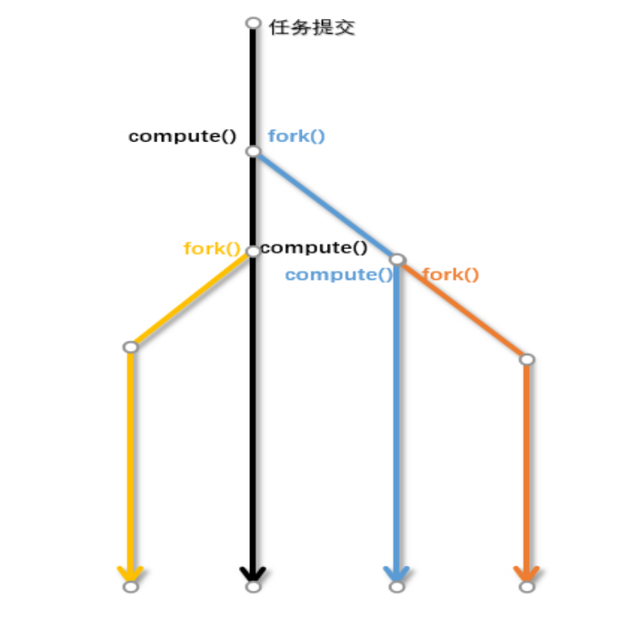

# Java--8--新特性--串并行流与ForkJoin框架

#### 1.框架原理

> ForkJoin框架将一个大任务拆分成多个小任务后，使用fork可以将小任务分发给其他线程同时处理，使用join可以将多个线程处理的结果进行汇总；这实际上就是分治思想的并行版本

#### 2.任务拆分

```java
If  (problem size < default size) {  
      execute(problem) 
} else {     
    divide(problem) 
}
```



#### 3.ForkJoinPool

ForkJoinPool 类是Fork/Join 框架的核心，和ThreadPoolExecutor一样它也是ExecutorService接口的实现类。

 ForkJoinPool并不会为每个子任务创建单独的线程，池中每个线程都有自己的双端队列(Deque)用于存储任务。这个双端队列对于工作窃取算法至关重要。



#### 4.工作窃取

> 工作窃取（work-stealing）算法是指某个线程从其他队列里窃取任务来执行



#### 5.提交任务的ForkJoinTask

> 通常我们不会直接使用ForkJoinTask，而是使用它的两个抽象子类：
>
> RecursiveAction：没有返回值的任务 
>
> RecursiveTask：有返回值的任务



#### 6.ForkJoinTask

> 大多数情况下，我们都是直接提交ForkJoinTask对象到ForkJoinPool中



> ForkJoinTask有以下三个核心方法：
>
> ①fork()：在任务执行过程中将大任务划分为多个小的子任务，调用子任务的fork()方法可以将任务放到线程池中异步调度。
>
> ② join()：调用子任务的join()方法等待任务返回的结果。
>
>  ③compute()

#### 7.选择合适的子任务粒度

> 选择划分子任务的粒度(顺序执行的阈值)很重要，因为使用Fork/Join框架并不一定比顺序执行任务的效率高： 
>
>   如果任务太大，则无法提高并行的吞吐量；   
>
> 如果任务太小，子任务的调度开销可能会大于并行计算的性能提升（任务创建、线程调度、合并、内存消耗）
>
>  官方文档给出的粗略经验是：任务应该执行100~10000个基本的计算步骤。决定子任务的粒度的最好办法是实践，可以通过实际测试结果来确定阈值。 和其他Java代码一样，Fork/Join框架测试时需要“预热”或者说执行几遍才会被JIT(Just-in-time)编译器优化，所以测试性能之前跑几遍程序很重要。
>
> 


#### 8.避免不必要的join()

> 划分成两个子任务后，不要同时调用两个子任务的join()方法，直接调用compute()效率更高。直接调用子任务的compute()方法实际上就是在当前的工作线程进行了计算(线程重用)，否则任务将被提交到工作对烈烈，然后线程再从队列中拿任务。



9.代码

```java
package fork_join;

import java.util.concurrent.ForkJoinPool;
import java.util.concurrent.RecursiveTask;

public class ForkJoinExample extends RecursiveTask<Long> {

    private Long start;
    private Long end;

    private static final Long critical =1000L;

    public ForkJoinExample(Long start, Long end) {
        this.start = start;
        this.end = end;
    }

    @Override
    protected Long compute() {
        Long length = end -start;

        if(length < critical){
            Long result = 0L;
            for (Long i=start;i<=end;i++){
                result=result+i;
            }
            System.out.println("start="+start+";end="+end+";result ="+result);
            return result;
        }else{
            Long middle = (start+end)/2;
//System.out.println("middle="+middle);
            ForkJoinExample rightFork = new ForkJoinExample(start,middle);
            ForkJoinExample leftFork = new ForkJoinExample(middle+1L,end);
            Long leftresult =leftFork.compute();
// leftFork.fork();
            rightFork.fork();
            return rightFork.join()+leftresult;
        }
    }

    public static void main(String[] args) {
        Long startTime = System.currentTimeMillis();
        ForkJoinPool pool = new ForkJoinPool();
        ForkJoinExample task = new ForkJoinExample(0L,10000000L);
        Long invokResult = pool.invoke(task);
        System.out.println(System.currentTimeMillis()-startTime);
        System.out.println("result="+invokResult);
    }
}
```

