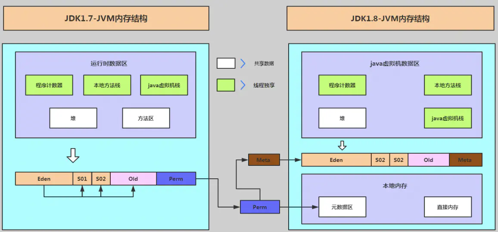

# 1.ps aux命令执行结果的几个列的信息的含义

```
USER    进程所属用户
PID     进程ID 
%CPU    进程占用CPU百分比
%MEM    进程占用内存百分比
VSZ     虚拟内存占用大小 单位：kb（killobytes）
RSS     实际内存占用大小 单位：kb（killobytes）
TTY     终端类型
STAT    进程状态
START   进程启动时刻
TIME    进程运行时长,进程已经消耗的CPU时间
COMMAND 启动进程的命令的名称和参数
```

# 2.top 命令 VSZ,RSS,TTY,STAT, VIRT,RES,SHR,DATA的含义

```
VIRT：virtual memory usage 虚拟内存
1、进程“需要的”虚拟内存大小，包括进程使用的库、代码、数据等
2、假如进程申请100m的内存，但实际只使用了10m，那么它会增长100m，而不是实际的使用量

RES：resident memory usage 常驻内存
1、进程当前使用的内存大小，但不包括swap out
2、包含其他进程的共享
3、如果申请100m的内存，实际使用10m，它只增长10m，与VIRT相反
4、关于库占用内存的情况，它只统计加载的库文件所占内存大小

SHR：shared memory 共享内存
1、除了自身进程的共享内存，也包括其他进程的共享内存
2、虽然进程只使用了几个共享库的函数，但它包含了整个共享库的大小
3、计算某个进程所占的物理内存大小公式：RES – SHR
4、swap out后，它将会降下来

DATA
1、数据占用的内存。如果top没有显示，按f键可以显示出来。
2、真正的该程序要求的数据空间，是真正在运行中要使用的。

top 运行中可以通过 top 的内部命令对进程的显示方式进行控制。内部命令如下：
s – 改变画面更新频率
l – 关闭或开启第一部分第一行 top 信息的表示
t – 关闭或开启第一部分第二行 Tasks 和第三行 Cpus 信息的表示
m – 关闭或开启第一部分第四行 Mem 和 第五行 Swap 信息的表示
N – 以 PID 的大小的顺序排列表示进程列表
P – 以 CPU 占用率大小的顺序排列进程列表
M – 以内存占用率大小的顺序排列进程列表
h – 显示帮助
n – 设置在进程列表所显示进程的数量
q – 退出 top
s – 改变画面更新周期

序号 列名 含义
a PID 进程id
b PPID 父进程id
c RUSER Real user name
d UID 进程所有者的用户id
e USER 进程所有者的用户名
f GROUP 进程所有者的组名
g TTY 启动进程的终端名。不是从终端启动的进程则显示为 ?
h PR 优先级
i NI nice值。负值表示高优先级，正值表示低优先级
j P 最后使用的CPU，仅在多CPU环境下有意义
k %CPU 上次更新到现在的CPU时间占用百分比
l TIME 进程使用的CPU时间总计，单位秒
m TIME+ 进程使用的CPU时间总计，单位1/100秒
n %MEM 进程使用的物理内存百分比
o VIRT 进程使用的虚拟内存总量，单位kb。VIRT=SWAP+RES
p SWAP 进程使用的虚拟内存中，被换出的大小，单位kb。
q RES 进程使用的、未被换出的物理内存大小，单位kb。RES=CODE+DATA
r CODE 可执行代码占用的物理内存大小，单位kb
s DATA 可执行代码以外的部分(数据段+栈)占用的物理内存大小，单位kb
t SHR 共享内存大小，单位kb
u nFLT 页面错误次数
v nDRT 最后一次写入到现在，被修改过的页面数。
w S 进程状态。（D=不可中断的睡眠状态，R=运行，S=睡眠，T=跟踪/停止，Z=僵尸进程）
x COMMAND 命令名/命令行
y WCHAN 若该进程在睡眠，则显示睡眠中的系统函数名
z Flags 任务标志，参考 sched.h

默认情况下仅显示比较重要的 PID、USER、PR、NI、VIRT、RES、SHR、S、%CPU、%MEM、TIME+、COMMAND 列。可以通过下面的快捷键来更改显示内容。

通过 f 键可以选择显示的内容。按 f 键之后会显示列的列表，按 a-z 即可显示或隐藏对应的列，最后按回车键确定。
按 o 键可以改变列的显示顺序。按小写的 a-z 可以将相应的列向右移动，而大写的 A-Z 可以将相应的列向左移动。最后按回车键确定。
按大写的 F 或 O 键，然后按 a-z 可以将进程按照相应的列进行排序。而大写的 R 键可以将当前的排序倒转。
```

# 3.jmap命令

```shell
jmap -heap 进程ID

Attaching to process ID 17775, please wait...
Debugger attached successfully.
Server compiler detected.
JVM version is 25.121-b13

using thread-local object allocation.
Parallel GC with 2 thread(s)           parallel并发垃圾回收器

Heap Configuration:
   MinHeapFreeRatio         = 0
   MaxHeapFreeRatio         = 100
   MaxHeapSize              = 1006632960 (960.0MB)  当前JVM最大堆大小
   NewSize                  = 20971520 (20.0MB)
   MaxNewSize               = 335544320 (320.0MB)
   OldSize                  = 41943040 (40.0MB)
   NewRatio                 = 2
   SurvivorRatio            = 8
   MetaspaceSize            = 21807104 (20.796875MB)  当前元空间大小
   CompressedClassSpaceSize = 1073741824 (1024.0MB)   
   MaxMetaspaceSize         = 17592186044415 MB       元空间最大大小
   G1HeapRegionSize         = 0 (0.0MB)

Heap Usage:
PS Young Generation
Eden Space:
   capacity = 25165824 (24.0MB)
   used     = 15424152 (14.709617614746094MB)
   free     = 9741672 (9.290382385253906MB)
   61.29007339477539% used
From Space:
   capacity = 1572864 (1.5MB)
   used     = 1013016 (0.9660873413085938MB)
   free     = 559848 (0.5339126586914062MB)
   64.40582275390625% used
To Space:
   capacity = 1572864 (1.5MB)
   used     = 0 (0.0MB)
   free     = 1572864 (1.5MB)
   0.0% used
PS Old Generation
   capacity = 84934656 (81.0MB)
   used     = 62824456 (59.91407012939453MB)
   free     = 22110200 (21.08592987060547MB)
   73.96798781406733% used
```

# 4.ps命令

```
ps -p 进程ID -o vsz,rss

   VSZ   RSS
3701784 413924

VSZ是指已分配的线性空间大小，这个大小通常并不等于程序实际用到的内存大小，产生这个的可能性很多，比如内存映射，共享的动态库，或者向系统申请了更多的堆，都会扩展线性空间大小。

RSZ是Resident Set Size，常驻内存大小，即进程实际占用的物理内存大小
```

# 5.pmap命令

```
pmap -x 进程ID
Address           Kbytes     RSS   Dirty Mode   Mapping
0000000000400000       4       4       0 r-x--  java
0000000000600000       4       4       4 rw---  java
00000000017f8000    2256    2136    2136 rw---    [ anon ]
00000000c4000000   82944   63488   63488 rw---    [ anon ]
00000000c9100000  572416       0       0 -----    [ anon ]
00000000ec000000   27648   27136   27136 rw---    [ anon ]
00000000edb00000  300032       0       0 -----    [ anon ]
......
total kB         3701784  413924  400716

Address: 内存分配地址
Kbytes:  实际分配的内存大小
RSS:     程序实际占用的内存大小
Mapping: 分配该内存的模块的名称

anon，这些表示这块内存是由mmap分配的
```

# 6.JAVA应用内存分析

JAVA进程内存 = JVM进程内存+heap内存+ 永久代内存+ 本地方法栈内存+线程栈内存 +堆外内存 +socket 缓冲区内存+元空间

linux内存和JAVA堆中的关系

RES = JAVA正在存活的内存对象大小 + 未回收的对象大小  + 其它

VIART= JAVA中申请的内存大小，即 -Xmx  -Xms + 其它

其它 = 永久代内存+ 本地方法栈内存+线程栈内存 +堆外内存 +socket 缓冲区内存 +JVM进程内存


# 7.JVM内存模型（1.7与1.8之间的区别）



> ```tex
> 算一下求和可以得知前者总共给Java环境分配了128M的内存，而ps输出的VSZ和RSS分别是3615M和404M。
> RSZ和实际堆内存占用差了276M，内存组成分别为:
> 
> JVM本身需要的内存，包括其加载的第三方库以及这些库分配的内存
> 
> NIO的DirectBuffer是分配的native memory
> 
> 内存映射文件，包括JVM加载的一些JAR和第三方库，以及程序内部用到的。上面 pmap 输出的内容里，有一些静态文件所占用的大小不在Java的heap里
> 
> JIT， JVM会将Class编译成native代码，这些内存也不会少，如果使用了Spring的AOP，CGLIB会生成更多的类，JIT的内存开销也会随之变大
> 
> JNI，一些JNI接口调用的native库也会分配一些内存，如果遇到JNI库的内存泄露，可以使用valgrind等内存泄露工具来检测
> 
> 线程栈，每个线程都会有自己的栈空间，如果线程一多，这个的开销就很明显
> 当前jvm线程数统计：jstack 进程ID |grep ‘tid’|wc –l  (linux 64位系统中jvm线程默认栈大小为1MB)
> ps huH p 进程ID|wc -l   ps -Lf 进程ID | wc -l
> top -H -p 进程ID
> cat /proc/{pid}/status
> 
> jmap/jstack 采样，频繁的采样也会增加内存占用，如果你有服务器健康监控，这个频率要控制一下
> ```

# 8.jstat命令

> ```shell
> JVM的几个GC堆和GC的情况，可以用jstat来监控，例如监控某个进程每隔1000毫秒刷新一次，输出20次
> 
> jstat -gcutil 进程ID 1000 20
> 
>   S0     S1     E      O      M     CCS    YGC     YGCT    FGC    FGCT     GCT   
>   0.00  39.58  95.63  74.66  98.35  96.93    815    4.002     3    0.331    4.333
>   0.00  39.58  95.76  74.66  98.35  96.93    815    4.002     3    0.331    4.333
>  41.67   0.00   1.62  74.67  98.35  96.93    816    4.006     3    0.331    4.337
>  41.67   0.00   1.67  74.67  98.35  96.93    816    4.006     3    0.331    4.337
>  41.67   0.00   3.12  74.67  98.35  96.93    816    4.006     3    0.331    4.337
>  41.67   0.00   3.12  74.67  98.35  96.93    816    4.006     3    0.331    4.337
>  41.67   0.00   8.39  74.67  98.35  96.93    816    4.006     3    0.331    4.337
>  41.67   0.00   9.85  74.67  98.35  96.93    816    4.006     3    0.331    4.337
>  
> S0    年轻代中第一个survivor(幸存区)已使用的占当前容量百分比
> S1    年轻代中第二个survivor(幸存区)已使用的占当前容量百分比
> E     年轻代中Eden(伊甸园)已使用的占当前容量百分比
> O     old代已使用的占当前容量百分比
> P     perm代已使用的占当前容量百分比
> YGC   从应用程序启动到采样时年轻代中gc次数
> YGCT  从应用程序启动到采样时年轻代中gc所用时间(s)
> FGC   从应用程序启动到采样时old代(全gc)gc次数
> FGCT  从应用程序启动到采样时old代(全gc)gc所用时间(s)
> GCT   从应用程序启动到采样时gc用的总时间(s)
> ```

# 9总结

> 正常情况下jmap输出的内存占用远小于 RSZ，可以不用太担心，除非发生一些严重错误，比如PermGen空间满了导致OutOfMemoryError发生，或者RSZ太高导致引起系统公愤被OOM Killer给干掉，就得注意了，该加内存加内存，没钱买内存加交换空间，或者按上面列的组成部分逐一排除。
>
> 这几个内存指标之间的关系是：VSZ >> RSZ >> Java程序实际使用的堆大小

作者：Java及SpringBoot
链接：https://www.jianshu.com/p/479a715d461e
来源：简书
著作权归作者所有。商业转载请联系作者获得授权，非商业转载请注明出处。