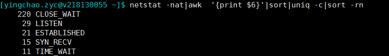
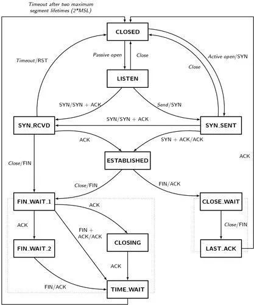
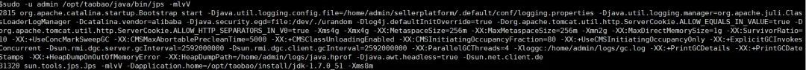
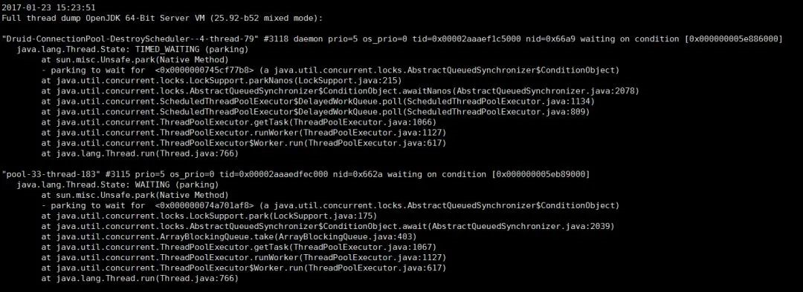
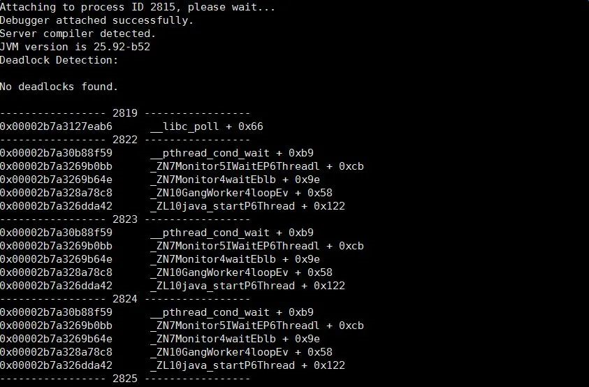
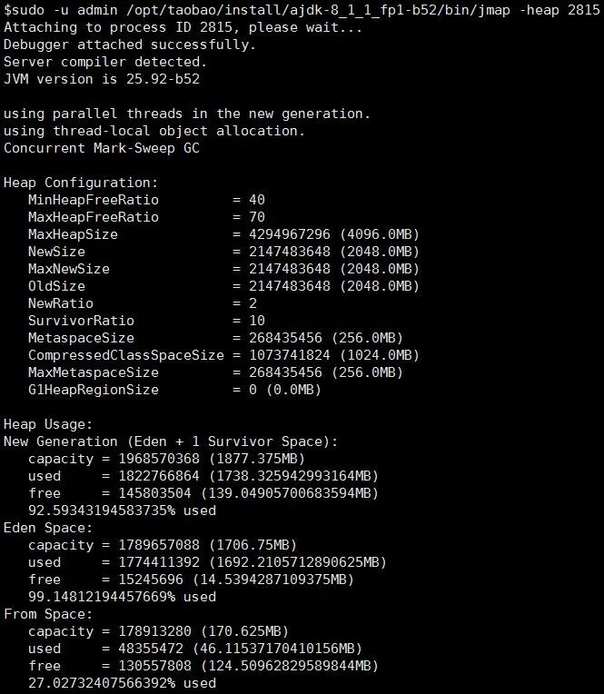
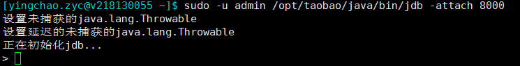

https://mp.weixin.qq.com/s/qK9Er-26fYqTcUbjedI7eQ

> 作者：红魔七号
> 链接：https://developer.aliyun.com/article/69520

# 一份超详细的java问题排查工具单


## Linux命令类

#### 1.**tail**

最常用的tail -f

```
tail -300f shopbase.log #倒数300行并进入实时监听文件写入模式
```

#### 2.**grep**

> grep forest f.txt   *#文件查找*
> grep forest f.txt cpf.txt *#多文件查找*
> grep 'log' /home/admin -r -n *#目录下查找所有符合关键字的文件*
> cat f.txt | grep -i shopbase  
> grep 'shopbase' /home/admin -r -n --include *.{vm,java} *#指定文件后缀*
> grep 'shopbase' /home/admin -r -n --exclude *.{vm,java} *#反匹配*
> seq 10 | grep 5 -A 3  *#上匹配*
> seq 10 | grep 5 -B 3  *#下匹配*
> seq 10 | grep 5 -C 3  *#上下匹配，平时用这个就妥了*
> cat f.txt | grep -c 'SHOPBASE'

#### 3.**awk**

1.基础命令：

```
awk '{print $4,$6}' f.txt
awk '{print NR,$0}' f.txt cpf.txt    
awk '{print FNR,$0}' f.txt cpf.txt
awk '{print FNR,FILENAME,$0}' f.txt cpf.txt
awk '{print FILENAME,"NR="NR,"FNR="FNR,"$"NF"="$NF}' f.txt cpf.txt
echo 1:2:3:4 | awk -F: '{print $1,$2,$3,$4}'
```

2.匹配：

```
awk '/ldb/ {print}' f.txt   #匹配ldb
awk '!/ldb/ {print}' f.txt  #不匹配ldb
awk '/ldb/ && /LISTEN/ {print}' f.txt   #匹配ldb和LISTEN
awk '$5 ~ /ldb/ {print}' f.txt #第五列匹配ldb
```

3.内建变量

> - NR：NR表示从awk开始执行后，按照记录分隔符读取的数据次数，默认的记录分隔符为换行符，因此默认的就是读取的数据行数，NR可以理解为Number of Record的缩写。
> - FNR：在awk处理多个输入文件的时候，在处理完第一个文件后，NR并不会从1开始，而是继续累加，因此就出现了FNR，每当处理一个新文件的时候，FNR就从1开始计数，FNR可以理解为File Number of Record。
> - NF: NF表示目前的记录被分割的字段的数目，NF可以理解为Number of Field。

#### 4.**find**

```
sudo -u admin find /home/admin /tmp /usr -name \*.log(多个目录去找)
find . -iname \*.txt(大小写都匹配)
find . -type d(当前目录下的所有子目录)
find /usr -type l(当前目录下所有的符号链接)
find /usr -type l -name "z*" -ls(符号链接的详细信息 eg:inode,目录)
find /home/admin -size +250000k(超过250000k的文件，当然+改成-就是小于了)
find /home/admin f -perm 777 -exec ls -l {} \; (按照权限查询文件)
find /home/admin -atime -1  1天内访问过的文件
find /home/admin -ctime -1  1天内状态改变过的文件    
find /home/admin -mtime -1  1天内修改过的文件
find /home/admin -amin -1  1分钟内访问过的文件
find /home/admin -cmin -1  1分钟内状态改变过的文件    
find /home/admin -mmin -1  1分钟内修改过的文件
```

#### 5.**top**

top除了看一些基本信息之外，剩下的就是配合来查询vm的各种问题了

```
ps -ef | grep java
top -H -p pid
```

获得线程10进制转16进制后jstack去抓看这个线程到底在干啥

#### 6.**其他**

netstat -nat|awk  '{print $6}'|sort|uniq -c|sort -rn #查看当前连接，注意close_wait偏高的情况。

比如如下：





## java七板斧

#### 1.**jps**

我只用一条命令：

```
jps -mlvV
```



#### 2.**jstack**

普通用法:

```
jstack 2815
```



native+java栈:

```
jstack -m 2815
```



#### 3.**jinfo**

可看系统启动的参数，如下

```
jinfo -flags 2815
```


#### 4.**jmap**

两个用途

##### 1.查看堆的情况

```
jmap -heap 2815
```




##### 2.dump

```
jmap -dump:live,format=b,file=/tmp/heap2.bin 2815
或者
jmap -dump:format=b,file=/tmp/heap3.bin 2815
```

##### 3.看看堆都被谁占了?

```
jmap -histo 2815 | head -10
```



#### 5.**jstat**

jstat参数众多，但是使用一个就够了

```
jstat -gcutil 2815 1000 
```


#### 6.**jdb**

时至今日，jdb也是经常使用的。

jdb可以用来预发debug,假设你预发的java_home是/opt/taobao/java/，远程调试端口是8000.那么

> sudo -u admin /opt/taobao/java/bin/jdb -attach 8000.


出现以上代表jdb启动成功。后续可以进行设置断点进行调试。

具体参数可见oracle官方说明：

> http://docs.oracle.com/javase/7/docs/technotes/tools/windows/jdb.html

## plugin of intellij idea

#### 1.**key promoter**

快捷键一次你记不住，多来几次你总能记住了吧？


#### 2.**maven helper**

分析maven依赖的好帮手。

#### **3.Alibaba Java Coding Guidelines**

安装该插件后，代码超过 80 行、手动创建线程池等，这些和《手册》中的规约不符时，IDEA中会给出警告提示。

建议大家一定一定一定要安装该插件，它会帮助你检查出很多隐患，督促你写更规范的代码。

#### 4.**Stackoverflow**

这个插件其实是最实用的插件，程序猿遇到的问题，基本都能找到回答，但是它使用的是google搜索引擎。

对于不购买vpn的同学来说，感觉好鸡肋呀~

#### 5.**GrepConsole**

Idea console输出日志一大推，想要快速找到自己想要的类型日志，使用此插件可以快速定位到自己关注的类型日志，比如error，warn，自己也可以配置自己喜欢的颜色~

#### 6.**IdeaJad**

以前查看class文件形式的时候或者jar，都会使用一个外部反编译工具，这样操作明显不方便，使用此插件可以一直在idea中查看文件~

## VM options

#### 1、你的类到底是从哪个文件加载进来的？

> -XX:+TraceClassLoading
> 结果形如[Loaded java.lang.invoke.MethodHandleImpl$Lazy from D:\programme\jdk\jdk8U74\jre\lib\rt.jar]

#### 2、应用挂了输出dump文件

> -XX:+HeapDumpOnOutOfMemoryError -XX:HeapDumpPath=/home/admin/logs/java.hprof

## jar包冲突

> 把这个单独写个大标题不过分吧？
>
> 每个人或多或少都处理过这种烦人的case。
>
> 我特么下边这么多方案不信就搞不定你?

```
mvn dependency:tree > ~/dependency.txt
```

打出所有依赖

```
mvn dependency:tree -Dverbose -Dincludes=groupId:artifactId
```

只打出指定groupId和artifactId的依赖关系

```
-XX:+TraceClassLoading
```

vm启动脚本加入。在tomcat启动脚本中可见加载类的详细信息

```
-verbose
```

## 其他

#### **1.dmesg**

如果发现自己的java进程悄无声息的消失了，几乎没有留下任何线索，那么dmesg一发，很有可能有你想要的。

```
sudo dmesg|grep -i kill|less
```

去找关键字oom_killer。找到的结果类似如下:

> [6710782.021013] java invoked oom-killer: gfp_mask=0xd0, order=0, oom_adj=0, oom_scoe_adj=0
> [6710782.070639] [<ffffffff81118898>] ? oom_kill_process+0x68/0x140 
> [6710782.257588] Task in /LXC011175068174 killed as a result of limit of /LXC011175068174 
> [6710784.698347] Memory cgroup out of memory: Kill process 215701 (java) score 854 or sacrifice child 
> [6710784.707978] Killed process 215701, UID 679, (java) total-vm:11017300kB, anon-rss:7152432kB, file-rss:1232kB

以上表明，对应的java进程被系统的OOM Killer给干掉了，得分为854。

解释一下OOM killer（Out-Of-Memory killer），该机制会监控机器的内存资源消耗。

当机器内存耗尽前，该机制会扫描所有的进程（按照一定规则计算，内存占用，时间等），挑选出得分最高的进程，然后杀死，从而保护机器。

dmesg 日志时间转换公式:

log实际时间=格林威治1970-01-01+(当前时间秒数-系统启动至今的秒数+dmesg打印的log时间)秒数：

> date -d "1970-01-01 UTC `echo "$(date +%s)-$(cat /proc/uptime|cut -f 1 -d' ')+12288812.926194"|bc ` seconds"

剩下的，就是看看为什么内存这么大，触发了OOM-Killer了。