# 第三章 垃圾收集器与内存分配策略

GC需要完成的3件事情： 

> 哪些内存需要回收？
>
>  什么时候回收？ 
>
> 如何回收？

#### 一、判断对象是否存活

###### 1.引用计数算法

> 给对象中添加一个引用计数器，每当有 一个地方引用它时，计数器值就加1；当引用失效时，计数器值就减1；任何时刻计数器为0 的对象就是不可能再被使用的。
>
> java 虚拟机没有 采用这种方法，很难解决对象之间相互循环引用问题2.

###### 2.可达性分析算法

> 这个算法的基本思 路就是通过一系列的称为“GC Roots”的对象作为起始点，从这些节点开始向下搜索，搜索所 走过的路径称为引用链（Reference Chain），当一个对象到GC Roots没有任何引用链相连 （用图论的话来说，就是从GC Roots到这个对象不可达）时，则证明此对象是不可用的

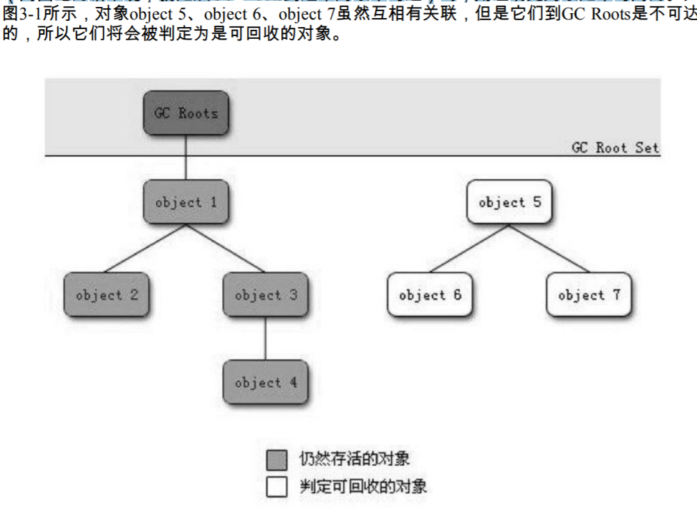

在Java语言中，可作为GC Roots的对象包括下面几种： 虚拟机栈（栈帧中的本地变量表）中引用的对象。 方法区中类静态属性引用的对象。 方法区中常量引用的对象。 本地方法栈中JNI（即一般说的Native方法）引用的对象。

###### 3.生存 还是死亡

> 要真正宣告一个对象死亡，至少要经历两次标记过程， 如果对象在进行可达 性分析后发现没有与GC Roots相连接的引用链，那它将会被第一次标记并且进行一次筛选， 筛选的条件是此对象是否有必要执行finalize（）方法。当对象没有覆盖finalize（）方法，或 者finalize（）方法已经被虚拟机调用过，虚拟机将这两种情况都视为“没有必要执行”。
>
> finalize（）方法是对象逃脱死亡命运的最后一次机会， 任何一个对象的finalize（）方法都只会被系统自动调用一次， 如果对象面临下一次回收，它的finalize（）方法不会被再次执行

###### 4.回收方法区

> 在方法区中进行垃圾收集 的“性价比”一般比较低：在堆中，尤其是在新生代中，常规应用进行一次垃圾收集一般可以 回收70%～95%的空间，而永久代的垃圾收集效率远低于此。
>
> 永久代的垃圾收集主要回收两部分内容：废弃常量和无用的类。

5.废弃常量

> 没有任何 String对象引用常量池中的“abc”常量，会被回收

6.无用的类

> 该类所有的实例都已经被回收，也就是Java堆中不存在该类的任何实例。 
>
> 加载该类的ClassLoader已经被回收。 该类对应的java.lang.Class对象没有在任何地方被引用，无法在任何地方通过反射访问该 类的方法。

> 在大量使用反射、动态代理、CGLib等ByteCode框架、动态生成JSP以及OSGi这类频繁 自定义ClassLoader的场景都需要虚拟机具备类卸载的功能，以保证永久代不会溢出。

#### 二、垃圾回收算法

###### 1.标记清除算法（最基础的算法 ）

> 如同它的名字一样，算法分 为“标记”和“清除”两个阶段：首先标记出所有需要回收的对象，在标记完成后统一回收所有 被标记的对象

主要不足有两个：

> 一个是效率问题，标记和清除两个过程的效率都不高；
>
> 另一个是 空间问题，标记清除之后会产生大量不连续的内存碎片，空间碎片太多可能会导致以后在程 序运行过程中需要分配较大对象时，无法找到足够的连续内存而不得不提前触发另一次垃圾 收集动作

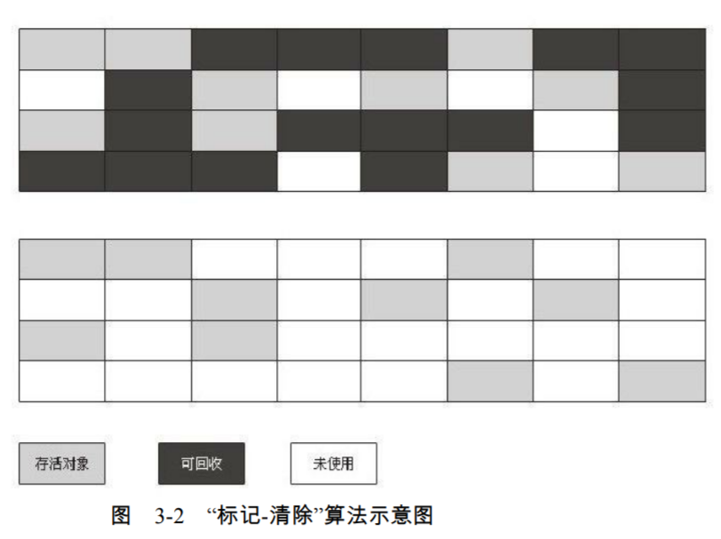

###### 2.复制算法

> 为了解决效率问题， 它将可用内存按容 量划分为大小相等的两块，每次只使用其中的一块。当这一块的内存用完了，就将还存活着 的对象复制到另外一块上面，然后再把已使用过的内存空间一次清理掉。这样使得每次都是 对整个半区进行内存回收，内存分配时也就不用考虑内存碎片等复杂情况，只要移动堆顶指 针，按顺序分配内存即可，实现简单，运行高效。
>
> 只是这种算法的代价是将内存缩小为了原 来的一半，未免太高了一点

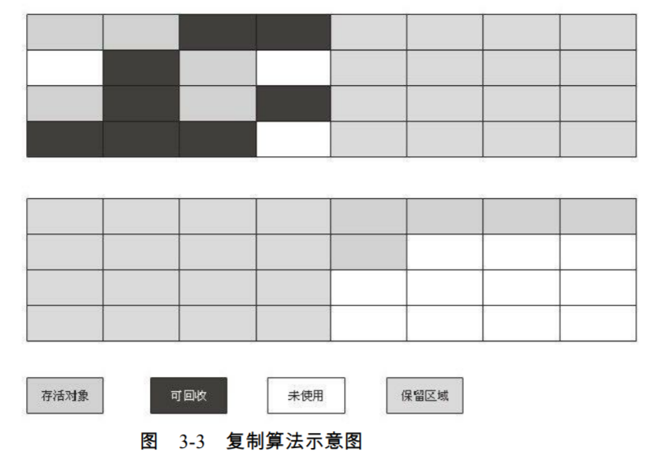

> 将内存 分为一块较大的Eden空间和两块较小的Survivor空间， HotSpot虚拟机默认Eden和Survivor的大小比例是 8:1，也就是每次新生代中可用内存空间为整个新生代容量的90%（80%+10%），只有10% 的内存会被“浪费” ，当然，98%的对象可回收只是一般场景下的数据，我们没有办法保证每 次回收都只有不多于10%的对象存活，
>
> 当Survivor空间不够用时，需要依赖其他内存（这里 指老年代）进行分配担保（Handle Promotion）。

###### 3.标记整理算法

> 复制收集算法在对象存活率较高时就要进行较多的复制操作，效率将会变低。 更关键的 是，如果不想浪费50%的空间，就需要有额外的空间进行分配担保，以应对被使用的内存中 所有对象都100%存活的极端情况，所以在老年代一般不能直接选用这种算法（复制收集算法）
>
> 根据老年代的特点，有人提出了另外一种“标记-整理”（Mark-Compact）算法，标记过程 仍然与“标记-清除”算法一样，但后续步骤不是直接对可回收对象进行清理，而是让所有存 活的对象都向一端移动，然后直接清理掉端边界以外的内存

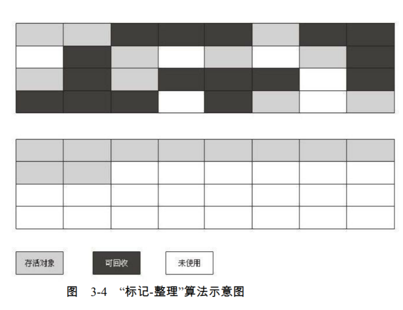

###### 4.分代收集算法

> 当前商业虚拟机的垃圾收集都采用“分代收集”（Generational Collection）算法，这种算 法并没有什么新的思想，只是根据对象存活周期的不同将内存划分为几块。一般是把Java堆 分为新生代和老年代，这样就可以根据各个年代的特点采用最适当的收集算法。
>
> 在新生代 中，每次垃圾收集时都发现有大批对象死去，只有少量存活，那就选用复制算法，只需要付 出少量存活对象的复制成本就可以完成收集。
>
> 而老年代中因为对象存活率高、没有额外空间 对它进行分配担保，就必须使用“标记—清理”或者“标记—整理”算法来进行回收。

#### 三、**HotSpot的算法实现**

###### 1.**枚举根节点**

> **可达性分析对执行时间的敏感还体现在GC停顿上****，因为这项分析工作必须在一 个能确保一致性的快照中进行，GC停顿时，必须停顿执行的所有线程 Stop the world,包括 号称不停顿的CMS收集器，枚举根节点也是必须停顿的**
>
> **虚拟机有办法直接得知哪些地方存放着对象引用。****在 HotSpot的实现中，是使用一组称为OopMap的数据结构来达到这个目的的，在类加载完成的 时候，HotSpot就把对象内什么偏移量上是什么类型的数据计算出来，**

###### 2.**安全点**

> **在“特定的 位置”记录 ，****生成OopMap，叫安全点 safepoint,程序并非在所有的所有的地方都能停下来jc,只有到达安全点才能gc,****对于Sefepoint，另一个需要考虑的问题是如何在GC发生时让所有线程（这里不包括执行 JNI调用的线程）都“跑”到最近的安全点上再停顿下来,抢先 式中断和主动式中断，**

###### 3.**抢先式**

> **不需 要线程的执行代码主动去配合，在GC发生时，首先把所有线程全部中断，如果发现有线程 中断的地方不在安全点上，就恢复线程，让它“跑”到安全点上。现在几乎没有虚拟机实现采 用抢先式中断来暂停线程从而响应GC事件**

4.**主动式中断**

> **当gc 需要中断程序的时候，不之间对线程操作，仅仅简单的设置个标志， 当线程执行时访问这个标志，发现中断标识为真就自己挂起，轮询标志的地方和安全点是重合的，另外加上创建兑现需要分配内存的地方。**

###### 5.**安全区域 （safe region）**

> **在一段代码片段之中，引用关系不会发生变化，在这个区域中，任意地方开始gc 都是安全的****
>
> 标识自己已经进入了Safe Region，那样，当 在这段时间里JVM要发起GC时，就不用管标识自己为Safe Region状态的线程了。在线程要离 开Safe Region时，它要检查系统是否已经完成了根节点枚举（或者是整个GC过程），如果完 成了，那线程就继续执行，否则它就必须等待直到收到可以安全离开Safe Region的信号为 止。**

#### 四、**垃圾收集器**

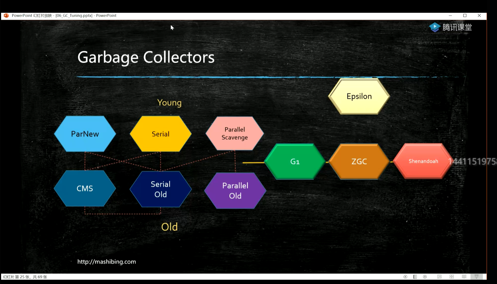

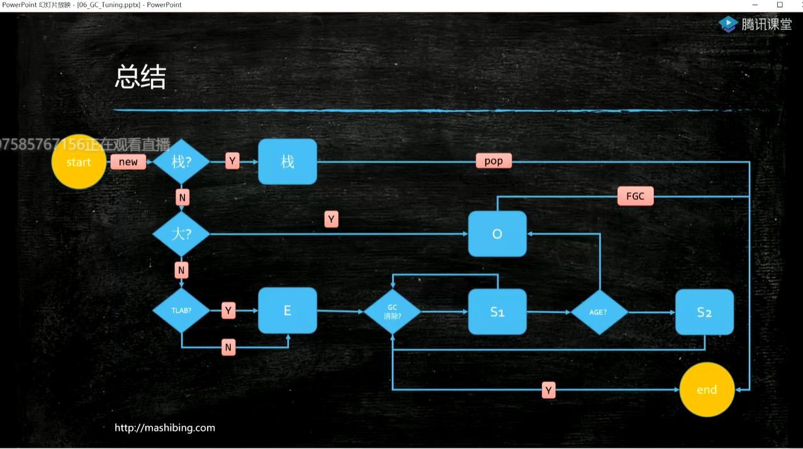

###### 1.**Serial收集器(新生代)**

> **单线程收集器，他进行垃圾回收时，必须暂停掉 其他所有的工作线程，直到他收集结束，**

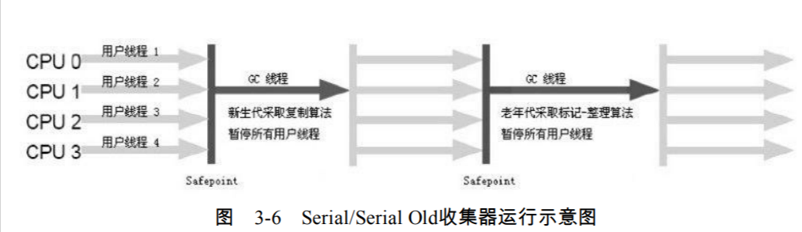

> 从Serial收集器到Parallel收集器，再到 Concurrent Mark Sweep（CMS）乃至GC收集器的最前沿成果Garbage First（G1）收集器，我 们看到了一个个越来越优秀（也越来越复杂）的收集器的出现，用户线程的停顿时间在不断 缩短，但是仍然没有办法完全消除（这里暂不包括RTSJ中的收集器）。它依然是虚拟机运行在Client模式下的默认新生代收集器。 
>
> 它也有着优于其他收集器的地方：简单而高效（与其他收集器的单线程比），对于限定单个 CPU的环境来说，Serial收集器由于没有线程交互的开销，专心做垃圾收集自然可以获得最 高的单线程收集效率。
>
> 在用户的桌面应用场景中， 分配给虚拟机管理的内存一般不会很大（几十兆到一两百兆的新生代）Serial收集器对于运行在Client模式下的虚拟机来说是一个很好的 选择。

###### 2.ParNew收集器**(新生代)**

> Serial收集器的多线程版本，除了使用多条线程进行垃圾收集之 外，其余行为包括Serial收集器可用的所有控制参数（例如：-XX：SurvivorRatio、-XX： PretenureSizeThreshold、-XX：HandlePromotionFailure等）、收集算法、Stop The World、对 象分配规则、回收策略等都与Serial收集器完全一样，在实现上，这两种收集器也共用了相 当多的代码。

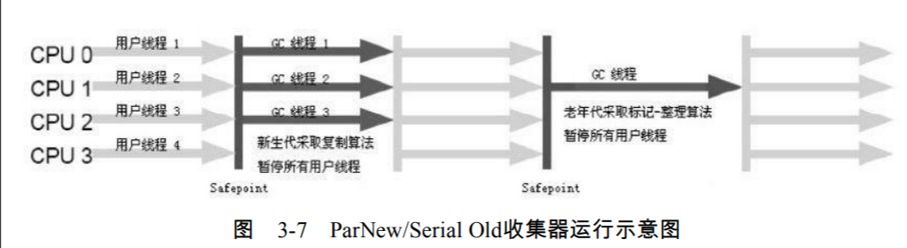

> 他与Serial收集器相比并没有太多创新之处，但 它却是许多运行在Server模式下的虚拟机中首选的新生代收集器，
>
> 其中有一个与性能无关但 很重要的原因是，除了Serial收集器外，目前只有它能与CMS收集器配合工作。在JDK 1.5时 期，HotSpot推出了一款在强交互应用中几乎可认为有划时代意义的垃圾收集器——CMS收 集器（Concurrent Mark Sweep，本节稍后将详细介绍这款收集器），这款收集器是HotSpot虚 拟机中第一款真正意义上的并发（Concurrent）收集器

> ParNew收集器在单CPU的环境中绝对不会有比Serial收集器更好的效果，甚至由于存在 线程交互的开销，该收集器在通过超线程技术实现的两个CPU的环境中都不能百分之百地保 证可以超越Serial收集器。当然，随着可以使用的CPU的数量的增加，它对于GC时系统资源 的有效利用还是很有好处的。

###### 3.并发和并行

> 这两个名词都是并发编程中的概念， 在谈论垃圾收集器的上下文语境中，它们可以解释如下。 
>
> ●并行（Parallel）：指多条垃圾收集线程并行工作，但此时用户线程仍然处于等待状 态。 
>
> ●并发（Concurrent）：指用户线程与垃圾收集线程同时执行（但不一定是并行的，可能 会交替执行），用户程序在继续运行，而垃圾收集程序运行于另一个CPU上。

###### 4.Parallel Scavenge收集器**(新生代)**

> Parallel Scavenge收集器是一个新生代收集器，它也是使用复制算法的收集器，又是并行 的多线程收集器……看上去和ParNew都一样

> Parallel Scavenge收集器的特点是它的关注点与其他收集器不同，CMS等收集器的关注点 是尽可能地缩短垃圾收集时用户线程的停顿时间，而Parallel Scavenge收集器的目标则是达到 一个可控制的吞吐量（Throughput）。
>
> 所谓吞吐量就是CPU用于运行用户代码的时间与CPU总 消耗时间的比值，即吞吐量=运行用户代码时间/（运行用户代码时间+垃圾收集时间）
>
> Parallel Scavenge收集器也经常称为“吞吐量优先”收集器。 自 适应调节策略也是Parallel Scavenge收集器与ParNew收集器的一个重要区别。

###### 5.Serial Old收集器（老年代）

> Serial收集器的老年代版本，它同样是一个单线程收集器，使用“标记-整 理”算法。
>
> 这个收集器的主要意义也是在于给Client模式下的虚拟机使用。如果在Server模式 下，那么它主要还有两大用途：
>
> 一种用途是在JDK 1.5以及之前的版本中与Parallel Scavenge 收集器搭配使用[1]，
>
> 另一种用途就是作为CMS收集器的后备预案，在并发收集发生Concurrent Mode Failure时使用。

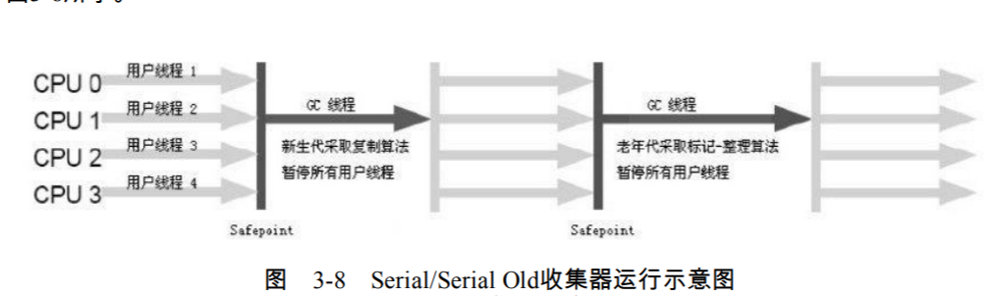

###### 6.Parallel Old收集器（老年代）

> 是Parallel Scavenge收集器的老年代版本， 使用多线程和“标记-整理”算法。
>
> 直到Parallel Old收集器出现后，“吞吐量优先”收集器终于有了比较名副其实的应用组 合，在注重吞吐量以及CPU资源敏感的场合，都可以优先考虑Parallel Scavenge加Parallel Old 收集器

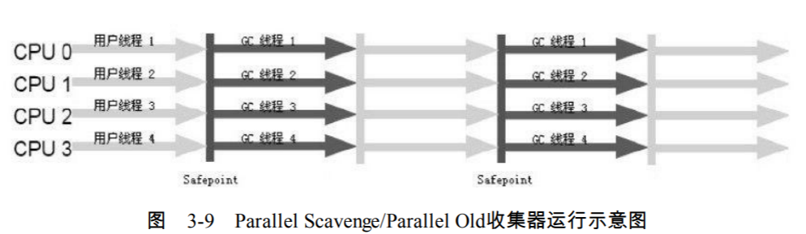

###### 7.CMS收集器（老年代）

> CMS收集器是基于“标记—清除”算法实现 的，它的运作过程相对于前面几种收集器来说更复杂一些，整个过程分为4个步骤
>
> 初始标记（CMS initial mark） 
>
> 并发标记（CMS concurrent mark） 
>
> 重新标记（CMS remark） 
>
> 并发清除（CMS concurrent sweep）

> 它的主要优点在名字上已经体现出来了：并发收集、低停 顿CMS（Concurrent Mark Sweep）
>
> 收集器是一种以获取最短回收停顿时间为目标的收集 器。目前很大一部分的Java应用集中在互联网站或者B/S系统的服务端上，这类应用尤其重 视服务的响应速度，希望系统停顿时间最短，以给用户带来较好的体验。CMS收集器就非常 符合这类应用的需求。

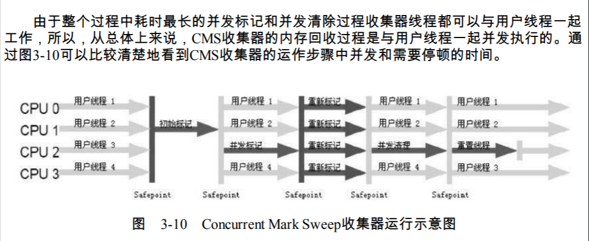

缺点：

CMS收集器无法处理浮动垃圾（Floating Garbage），可能出现“Concurrent Mode Failure”失败而导致另一次Full GC的产生， CMS是一款基于“标记—清除”算法实现的收集 器，如果读者对前面这种算法介绍还有印象的话，就可能想到这意味着收集结束时会有大量 空间碎片产生。空间碎片过多时，将会给大对象分配带来很大麻烦，往往会出现老年代还有 很大空间剩余，但是无法找到足够大的连续空间来分配当前对象，不得不提前触发一次Full GC

###### 8.G1收集器

> G1是一款面向服务端应用的垃圾收集器,

并行与并发：

> G1能充分利用多CPU、多核环境下的硬件优势，使用多个CPU（CPU或者 CPU核心）来缩短Stop-The-World停顿的时间，部分其他收集器原本需要停顿Java线程执行的 GC动作，G1收集器仍然可以通过并发的方式让Java程序继续执行

分代收集：

> 与其他收集器一样，分代概念在G1中依然得以保留。虽然G1可以不需要其 他收集器配合就能独立管理整个GC堆，但它能够采用不同的方式去处理新创建的对象和已 经存活了一段时间、熬过多次GC的旧对象以获取更好的收集效果。

空间整合：

> 与CMS的“标记—清理”算法不同，G1从整体来看是基于“标记—整理”算法实 现的收集器，从局部（两个Region之间）上来看是基于“复制”算法实现的，但无论如何，这 两种算法都意味着G1运作期间不会产生内存空间碎片，收集后能提供规整的可用内存。这种 特性有利于程序长时间运行，分配大对象时不会因为无法找到连续内存空间而提前触发下一 次GC。

可预测的停顿：

> 这是G1相对于CMS的另一大优势，降低停顿时间是G1和CMS共同的关 注点，但G1除了追求低停顿外，还能建立可预测的停顿时间模型，能让使用者明确指定在一 个长度为M毫秒的时间片段内，消耗在垃圾收集上的时间不得超过N毫秒，这几乎已经是实 时Java（RTSJ）的垃圾收集器的特征了。

使用G1收集器时，Java堆的内存布局就与其他收集器有很大差别，它将整个Java堆划分 为多个大小相等的独立区域（Region），虽然还保留有新生代和老年代的概念，但新生代和 老年代不再是物理隔离的了，它们都是一部分Region（不需要连续）的集合

> G1收集器之所以能建立可预测的停顿时间模型，是 因为它可以有计划地避免在整个Java 堆中进行全区域的垃圾收集。G1跟踪各个Region里面的垃圾堆积的价值大小（回收所获得的 空间大小以及回收所需时间的经验值），在后台维护一个优先列表，每次根据允许的收集时 间，优先回收价值最大的Region（这也就是Garbage-First名称的来由）。这种使用Region划分 内存空间以及有优先级的区域回收方式，保证了G1收集器在有限的时间内可以获取尽可能高 的收集效率。

> 虚拟机都是使用Remembered Set来避免全堆扫描的。G1中每个Region都有一个与之对 应的Remembered Set，虚拟机发现程序在对Reference类型的数据进行写操作时，会产生一个 Write Barrier暂时中断写操作，检查Reference引用的对象是否处于不同的Region之中（在分代 的例子中就是检查是否老年代中的对象引用了新生代中的对象），如果是，便通过 CardTable把相关引用信息记录到被引用对象所属的Region的Remembered Set之中。当进行内 存回收时，在GC根节点的枚举范围中加入Remembered Set即可保证不对全堆扫描也不会有遗 漏。

如果不计算维护Remembered Set的操作，G1收集器的运作大致可划分为以下几个步骤：

>  初始标记（Initial Marking） 
>
> 并发标记（Concurrent Marking）
>
>  最终标记（Final Marking） 
>
> 筛选回收（Live Data Counting and Evacuation）

###### 9.理解GC日志

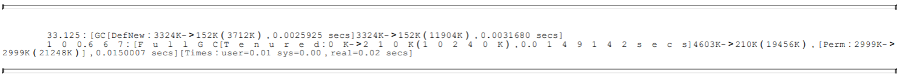

> 最前面的数字“33.125：”和“100.667：”代表了GC发生的时间，这个数字的含义是从Java 虚拟机启动以来经过的秒数。

> GC日志开头的“[GC”和“[Full GC”说明了这次垃圾收集的停顿类型，而不是用来区分新 生代GC还是老年代GC的。如果有“Full”，说明这次GC是发生了Stop-The-World的，

> 接下来的“[DefNew”、“[Tenured”、“[Perm”表示GC发生的区域，这里显示的区域名称与 使用的GC收集器是密切相关的，例如上面样例所使用的Serial收集器中的新生代名为“Default New Generation”，所以显示的是“[DefNew”。
>
> 如果是ParNew收集器，新生代名称就会变 为“[ParNew”，意为“Parallel New Generation”。
>
> 如果采用Parallel Scavenge收集器，那它配套 的新生代称为“PSYoungGen”，老年代和永久代同理，名称也是由收集器决定的。

> 后面方括号内部的“3324K-＞152K（3712K）”含义是“GC前该内存区域已使用容量-＞ GC后该内存区域已使用容量（该内存区域总容量）”。而在方括号之外的“3324K-＞ 152K（11904K）”表示“GC前Java堆已使用容量-＞GC后Java堆已使用容量（Java堆总容 量）”。

> 再往后，“0.0025925 secs”表示该内存区域GC所占用的时间，

> “[Times：user=0.01 sys=0.00，real=0.02 secs]”，这里面的user、 sys和real与Linux的time命令所输出的时间含义一致，分别代表用户态消耗的CPU时间、内核 态消耗的CPU事件和操作从开始到结束所经过的墙钟时间（Wall Clock Time）。

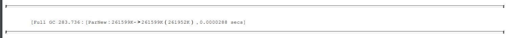

> 新生代收集器ParNew的日志也会出现“[Full GC”（这一般是因为出现了分配担保失败之 类的问题，所以才导致STW）。如果是调用System.gc（）方法所触发的收集，那么在这里将 显示“[Full GC（System）”。

#### 五、一些概念

###### 1.内存分配与回收策略

> 对象的内存分配，往大方向讲，就是在堆上分配（但也可能经过JIT编译后被拆散为标 量类型并间接地栈上分配）, 对象主要分配在新生代的Eden区上，如果启动了本地线程分 配缓冲，将按线程优先在TLAB上分配 ,少数情况下也可能会直接分配在老年代中，分配的 规则并不是百分之百固定的，其细节取决于当前使用的是哪一种垃圾收集器组合，还有虚拟 机中与内存相关的参数的设置。

###### 2.对象优先在Eden分配

> ( 当Eden区没有足够空间进行分配时，虚拟 机将发起一次Minor GC,新生代)

###### 3.新生代GC（Minor GC）：

> 指发生在新生代的垃圾收集动作，因为Java对象大多都具备朝 生夕灭的特性，所以Minor GC非常频繁，一般回收速度也比较快

###### 4.老年代GC（Major GC/Full GC）

> 指发生在老年代的GC，出现了Major GC，经常会伴 随至少一次的Minor GC（但非绝对的，在Parallel Scavenge收集器的收集策略里就有直接进行 Major GC的策略选择过程）。Major GC的速度一般会比Minor GC慢10倍以上

###### 5.大对象直接进入老年代

> 所谓的大对象是指，需要大量连续内存空间的Java对象，最典型的大对象就是那种很长 的字符串以及数组（笔者列出的例子中的byte[]数组就是典型的大对象）
>
> 遇到一个大对象更加坏的消息 就是遇到一群“朝生夕灭”的“短命大对象”，写程序的时候应当避免

###### 6.长期存活的对象将进入老年代

> 既然虚拟机采用了分代收集的思想来管理内存，那么内存回收时就必须能识别哪些对象 应放在新生代，哪些对象应放在老年代中。为了做到这点，虚拟机给每个对象定义了一个对 象年龄（Age）计数器。如果对象在Eden出生并经过第一次Minor GC后仍然存活，并且能被 Survivor容纳的话，将被移动到Survivor空间中，并且对象年龄设为1。对象在Survivor区中 每“熬过”一次Minor GC，年龄就增加1岁，当它的年龄增加到一定程度（默认为15岁），就 将会被晋升到老年代中

###### 7.动态对象年龄判定

> 为了能更好地适应不同程序的内存状况，虚拟机并不是永远地要求对象的年龄必须达到 了MaxTenuringThreshold才能晋升老年代，如果在Survivor空间中相同年龄所有对象大小的总 和大于Survivor空间的一半，年龄大于或等于该年龄的对象就可以直接进入老年代，无须等 到MaxTenuringThreshold中要求的年龄

###### 8.空间分配担保

> 在发生Minor GC之前，虚拟机会先检查老年代最大可用的连续空间是否大于新生代所有 对象总空间，如果这个条件成立，那么Minor GC可以确保是安全的。如果不成立，则虚拟机 会查看HandlePromotionFailure设置值是否允许担保失败。如果允许，那么会继续检查老年代 最大可用的连续空间是否大于历次晋升到老年代对象的平均大小，如果大于，将尝试着进行 一次Minor GC，尽管这次Minor GC是有风险的；如果小于，或者HandlePromotionFailure设置 不允许冒险，那这时也要改为进行一次Full GC。 

下面解释一下“冒险”是冒了什么风险

> 前面提到过，新生代使用复制收集算法，但为了 内存利用率，只使用其中一个Survivor空间来作为轮换备份，因此当出现大量对象在Minor GC后仍然存活的情况（最极端的情况就是内存回收后新生代中所有对象都存活），就需要 老年代进行分配担保，把Survivor无法容纳的对象直接进入老年代。与生活中的贷款担保类 似，老年代要进行这样的担保，前提是老年代本身还有容纳这些对象的剩余空间，一共有多 少对象会活下来在实际完成内存回收之前是无法明确知道的，所以只好取之前每一次回收晋 升到老年代对象容量的平均大小值作为经验值，与老年代的剩余空间进行比较，决定是否进 行Full GC来让老年代腾出更多空间。

> 取平均值进行比较其实仍然是一种动态概率的手段，也就是说，如果某次Minor GC存活 后的对象突增，远远高于平均值的话，依然会导致担保失败（Handle Promotion Failure）。 如果出现了HandlePromotionFailure失败，那就只好在失败后重新发起一次Full GC。虽然担保 失败时绕的圈子是最大的，但大部分情况下都还是会将HandlePromotionFailure开关打开，避 免Full GC过于频繁，