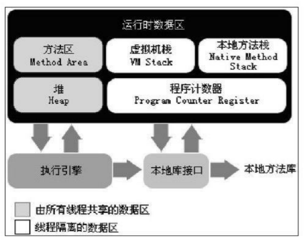

# 第二章--java 内存区域与内存溢出异常

#### 1， java运行时数据区

###### 程序计数器

> 程序计数器（Program Counter Register）是一块较小的内存空间，它可以看作是当前线 程所执行的字节码的行号指示器。在虚拟机的概念模型里（仅是概念模型，各种虚拟机可能 会通过一些更高效的方式去实现），字节码解释器工作时就是通过改变这个计数器的值来选 取下一条需要执行的字节码指令，分支、循环、跳转、异常处理、线程恢复等基础功能都需 要依赖这个计数器来完成。
>
> 每条线程都有独立的程序计数器；（线程私有的内存）
>
> 如果一个线程正在执行一段java方法，这几个计数器记录的就是正在执行的 虚拟机字节码的指令地址，如果执行的是native （非java ）方法，这个技术器记录的是空（undefined）; 没有OOM（out of memoryError）的区域

###### java虚拟机栈 （线程私有的内存区域，生命周期和线程相同）

> 描述的是java 方法执行的内存模型，每个方法在执行的同时 会创建一个 栈帧（stack frame）,用于存储 局部变量表，操作数栈，动态链接，方法出口 等信息。局部变量表存放了编译期可知的各种基本数据类型（boolean、byte、char、short、int、 float、long、double）、对象引用（reference类型，它不等同于对象本身，可能是一个指向对 象起始地址的引用指针，也可能是指向一个代表对象的句柄或其他与此对象相关的位置）和 returnAddress类型（指向了一条字节码指令的地址）。
>
> 其中64位长度的long和double类型的数据会占用2个局部变量空间（Slot），其余的数据 类型只占用1个。局部变量表需要的内存空间在编译期间完成分配，这个方法在帧中分配多大的局部变量空间是确定的
>
> 两种异常：
>
> 1.如果线程请求的栈深度大于虚 拟机所允许的深度，将抛出StackOverflowError异常，
>
> 2. 如果虚拟机栈可以动态扩展（当前大部 分的Java虚拟机都可动态扩展，只不过Java虚拟机规范中也允许固定长度的虚拟机栈），如 果扩展时无法申请到足够的内存，就会抛出OutOfMemoryError异常。

###### 本地方法栈

> 为虚 拟机使用到的Native方法服务,Sun HotSpot虚拟机  直接就把本地方法栈和虚拟机栈合二为一。与虚拟机栈一样，本地方法 栈区域也会抛出StackOverflowError和OutOfMemoryError异常。

###### java堆

> java堆  是被所有线程共享的一块内存区域，在虚拟机启动时创建。作用是存放 对象实例，几乎所有的对象实例都存放在 堆中，java 虚拟机规范中: 所有对象实例和数组都要放在堆 中
>
> 是java 垃圾管理的 主要内存区域
>
> 所以Java堆中还可以细分为：新生代和老年代；再细致一点的有 Eden空间、From Survivor空间、To Survivor空间等。
>
> 从内存分配的角度来看，线程共享的 Java堆中可能划分出多个线程私有的分配缓冲区（Thread Local Allocation Buffer,TLAB）
>
> 如 果在堆中没有内存完成实例分配，并且堆也无法再扩展时，将会抛出OutOfMemoryError异 常。

###### 方法区 

>  各个线程共享的内存区域，它用于存储已被虚 拟机加载的类信息、常量、静态变量、即时编译器编译后的代码等数据 ， Non-Heap（非堆）
>
> 这区 域的内存回收目标主要是针对常量池的回收和对类型的卸载，
>
> 一般来说，这个区域的回 收“成绩”比较难以令人满意，尤其是类型的卸载，条件相当苛刻，但是这部分区域的回收确 实是必要的
>
> 根据Java虚拟机规范的规定，当方法区无法满足内存分配需求时，将抛出 OutOfMemoryError异常

###### 运行时常量池

> 是方法区的一部分 ，
>
> 用于 存放编译期生成的各种字面量和符号引用，这部分内容将在类加载后进入方法区的运行时常 量池中存放
>
> 运行时常量池相对于Class文件常量池的另外一个重要特征是具备动态性，Java语言并不 要求常量一定只有编译期才能产生，也就是并非预置入Class文件中常量池的内容才能进入方 法区运行时常量池，运行期间也可能将新的常量放入池中，这种特性被开发人员利用得比较 多的便是String类的intern（）方法。
>
> 当常量池无法再申 请到内存时会抛出OutOfMemoryError异常。

###### 直接内存

>  并不是虚拟机运行时数据区的一部分，也不是Java虚拟机规 范中定义的内存区域 ，是指本机的内存
>
> 本机直接内存的分配不会受到Java堆大小的限制，但是，既然是内存，肯定还是 会受到本机总内存（包括RAM以及SWAP区或者分页文件）大小以及处理器寻址空间的限 制

#### 2.虚拟机对象探秘 hotspot 虚拟机 

###### 对象的创建，

> 虚拟机遇到一条new指令时，首先将去检查这个指令的参数是否能在常量池中定位到一 个类的符号引用，并且检查这个符号引用代表的类是否已被加载、解析和初始化过。如果没 有，那必须先执行相应的类加载过程，

选择哪种分配方式由 

> 1. Java堆是否规整决定。 
> 2. 2是Java堆是否规整又由所采用的垃圾收集器是否带有压缩整理功能决 定 

###### 指针碰撞 （ 用Serial、ParNew等带Compact过程的收集器时）

> 假设Java堆中内存是绝对规整的，所有用过的内 存都放在一边，空闲的内存放在另一边，中间放着一个指针作为分界点的指示器，那所分配 内存就仅仅是把那个指针向空闲空间那边挪动一段与对象大小相等的距离

###### 空闲列表（ 而使用CMS这种基于Mark-Sweep算法的收集器 ）

> 如果Java堆中的内存并不是规整的，已使用的内存和空 闲的内存相互交错，那就没有办法简单地进行指针碰撞了，虚拟机就必须维护一个列表，记 录上哪些内存块是可用的，在分配的时候从列表中找到一块足够大的空间划分给对象实例， 并更新列表上的记录，这种分配方式称为“空闲列表”（Free List）

需要考虑的问题是对象创建在虚拟机中是非常 频繁的行为

> 一种是对分配内存空间的动作进行同步处理 ——实际上虚拟机采用CAS配上失败重试的方式保证更新操作的原子性；
>
> 另一种是把内存分 配的动作按照线程划分在不同的空间之中进行，即每个线程在Java堆中预先分配一小块内 存，称为本地线程分配缓冲（Thread Local Allocation Buffer,TLAB）。哪个线程要分配内 存，就在哪个线程的TLAB上分配，只有TLAB用完并分配新的TLAB时，

###### 对象的内存布局

在HotSpot虚拟机中，对象在内存中存储的布局可以分为3块区域：对象头（Header）、 实例数据（Instance Data）和对齐填充（Padding）

###### 对象头包括两部分信息:

> 第一部分用于存储对象自身的运行时数据， 如哈希码（HashCode）、GC分代年龄、锁状态标志、线程持有的锁、偏向线程ID、偏向时 间戳等（ Mark Word ），
>
>  另外一部分是类型指针，即对象指向它的类元数据的指针，虚拟机通过这个指 针来确定这个对象是哪个类的实例。

实例数据部分是对象真正存储的有效信息，也是在程序代码中所定义的各种类 型的字段内容， 无论是从父类继承下来的，还是在子类中定义的，都需要记录起来

###### 对象的访问定位

我们的Java程序需要通过栈上的reference数据来操作堆上的 具体对象， 前主流的访问方式有使用句柄和直接指针两种

这两种对象访问方式各有优势，

> 使用句柄来访问的最大好处就是reference中存储的是稳 定的句柄地址，在对象被移动（垃圾收集时移动对象是非常普遍的行为）时只会改变句柄中 的实例数据指针，而reference本身不需要修改。 

> 使用直接指针访问方式的最大好处就是速度更快，它节省了一次指针定位的时间开销， 由于对象的访问在Java中非常频繁，因此这类开销积少成多后也是一项非常可观的执行成 本。

就本书讨论的主要虚拟机Sun HotSpot而言，它是使用第二种方式进行对象访问的，但从 整个软件开发的范围来看，各种语言和框架使用句柄来访问的情况也十分常见