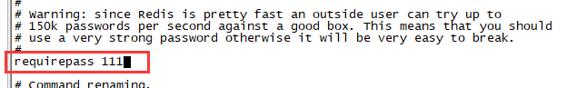
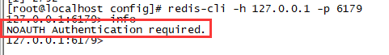
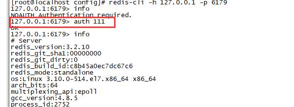
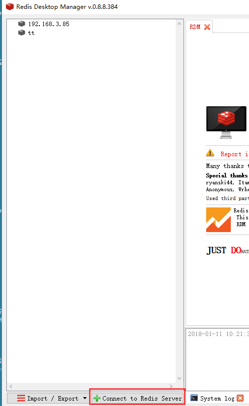

# [CentOS7 linux下yum安装redis以及使用](https://www.cnblogs.com/rslai/p/8249812.html)

#  一、安装redis

1、检查是否有redis yum 源

```
yum ``install` `redis
```

2、下载fedora的epel仓库

```
yum ``install` `epel-release
```

3、安装redis数据库

```
yum ``install` `redis
```

4、安装完毕后，使用下面的命令启动redis服务

```
# 启动redis``service redis start``# 停止redis``service redis stop``# 查看redis运行状态``service redis status``# 查看redis进程``ps` `-ef | ``grep` `redis
```

5、设置redis为开机自动启动

```
chkconfig redis on
```

6、进入redis服务

```
# 进入本机redis``redis-cli``# 列出所有key``keys *
```

7、防火墙开放相应端口

```
# 开启6379
/sbin/iptables -I INPUT -p tcp --dport 6379 -j ACCEPT
# 开启6380
/sbin/iptables -I INPUT -p tcp --dport 6380 -j ACCEPT
# 保存
/etc/rc.d/init.d/iptables save
# centos 7下执行
service iptables save
```

二、修改redis默认端口和密码

1、打开配置文件

```
vi` `/etc/redis``.conf
```

2、修改默认端口，查找 port 6379 修改为相应端口即可


3、修改默认密码，查找 requirepass foobared 将 foobared 修改为你的密码

 

4、使用配置文件启动 redis

```
redis-server ``/etc/redis``.conf &
```

5、使用端口登录

```
redis-cli -h 127.0.0.1 -p 6179
```

6、此时再输入命令则会报错



7、输入刚才输入的密码

```
auth 111
```



 8、停止redis

　　命令方式关闭redis

```
redis-cli -h 127.0.0.1 -p 6179``shutdown
```

　　进程号杀掉redis

```
ps` `-ef | ``grep` `redis``kill` `-9 XXX
```

三、使用redis desktop manager远程连接redis

1、访问如下网址下载redis desktop manager

> <a href="https://redisdesktop.com/download" target="_blank">https://redisdesktop.com/download</a>

2、安装后启动，新建一个连接



 3、填写如下信息后点击“Test Connection”测试是否连接成功


4、如果长时间连接不上，可能有两种可能性

　　a）bind了127.0.01：只允许在本机连接redis

　　b）protected-mode设置了yes（使用redis desktop manager工具需要配置，其余不用）

　　解决办法：

```
# 打开redis配置文件``vi` `/etc/redis``.conf``# 找到 bind 127.0.0.1 将其注释``# 找到 protected-mode yes 将其改为``protected-mode no
```

5、重启redis

```
service redis stop``service redis start
```

6、再次连接即可


 

参考：

　　https://www.cnblogs.com/wiseroll/p/7061673.html

　　http://blog.csdn.net/gebitan505/article/details/54602662

　　http://blog.csdn.net/lh2420124680/article/details/75426144

 