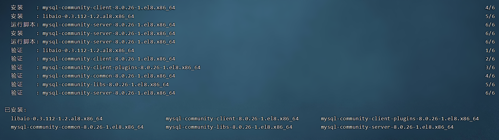
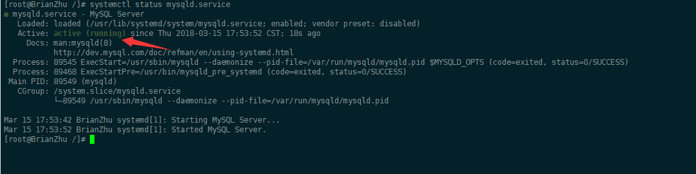
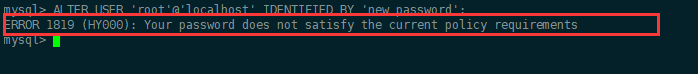
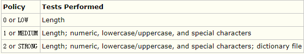

https://www.cnblogs.com/brianzhu/p/8575243.html

# [MySQL安装之yum安装](https://www.cnblogs.com/brianzhu/p/8575243.html)

在CentOS7中默认安装有MariaDB，这个是MySQL的分支，但为了需要，还是要在系统中安装MySQL，而且安装完成之后可以直接覆盖掉MariaDB。

### 1. 下载并安装MySQL官方的 Yum Repository

https://mirrors.tuna.tsinghua.edu.cn/mysql/yum/mysql-8.0-community-el8-x86_64/

```
[root@BrianZhu /]# wget -i -c https://mirrors.tuna.tsinghua.edu.cn/mysql/yum/mysql-8.0-community-el8-x86_64/mysql80-community-release-el8-1.noarch.rpm
```

　　使用上面的命令就直接下载了安装用的Yum Repository，大概25KB的样子，然后就可以直接yum安装了。

```
[root@BrianZhu /]# yum -y install mysql80-community-release-el8-1.noarch.rpm
```

　　下面就是使用yum安装MySQL了

```
[root@BrianZhu /]# yum -y install mysql-community-server
```

　　这步可能会花些时间，安装完成后就会覆盖掉之前的mariadb。



出现这样的提示表示安装成功

### 2. MySQL数据库设置

首先启动MySQL

```
[root@BrianZhu /] systemctl start  mysqld.service
```

查看MySQL运行状态，运行状态如图：

```
[root@BrianZhu /] systemctl status mysqld.service
```



此时MySQL已经开始正常运行，不过要想进入MySQL还得先找出此时root用户的密码，通过如下命令可以在日志文件中找出密码：

```
[root@BrianZhu /]# grep "password" /var/log/mysqld.log
```


上面标记的就是初始密码

 如下命令进入数据库：

```
[root@BrianZhu /]# mysql -uroot -p     # 回车后会提示输入密码
```

输入初始密码，此时不能做任何事情，因为MySQL默认必须修改密码之后才能操作数据库：

```
mysql> ALTER USER 'root'@'localhost' IDENTIFIED BY 'new password';
```

这里有个问题，新密码设置的时候如果设置的过于简单会报错：



原因是因为MySQL有密码设置的规范，具体是与validate_password_policy的值有关：



MySQL完整的初始密码规则可以通过如下命令查看：

```
mysql> SHOW VARIABLES LIKE 'validate_password%';
+--------------------------------------+-------+
| Variable_name                        | Value |
+--------------------------------------+-------+
| validate_password_check_user_name    | OFF   |
| validate_password_dictionary_file    |       |
| validate_password_length             | 4     |
| validate_password_mixed_case_count   | 1     |
| validate_password_number_count       | 1     |
| validate_password_policy             | LOW   |
| validate_password_special_char_count | 1     |
+--------------------------------------+-------+
rows in set (0.01 sec)
```

密码的长度是由validate_password_length决定的，而validate_password_length的计算公式是：

```
validate_password_length = validate_password_number_count + validate_password_special_char_count + (2 * validate_password_mixed_case_count)

```

解决方法就是修改密码为规范复杂的密码：

```
mysql> ALTER USER 'root'@'localhost' IDENTIFIED BY 'z?guwrBhH7p>';
Query OK, 0 rows affected (0.00 sec)
 
mysql>
```

这时候我们要把密码规则改一下，执行下面sql就可以了：

```
mysql> set global validate_password_policy=0;
Query OK, 0 rows affected (0.00 sec)
 
mysql> set global validate_password_length=1;
Query OK, 0 rows affected (0.00 sec)
 
mysql>
```

设置之后就是我上面查出来的那几个值了，此时密码就可以设置的很简单，例如1234之类的。到此数据库的密码设置就完成了。

 但此时还有一个问题，就是因为安装了Yum Repository，以后每次yum操作都会自动更新，需要把这个卸载掉：

> yum -y remove mysql57-community-release-el7-10.noarch

### 可视化工具的登录授权：(如果授权不成功，请查看防火墙)

操作完成上面的，现在还不能用可视化的客户端进行连接，需要我们进行授权：

```
grant all on *.* to root@'%' identified by '数据库密码';
```

　　大功告成！！！