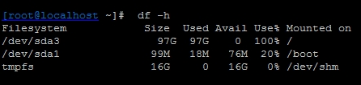
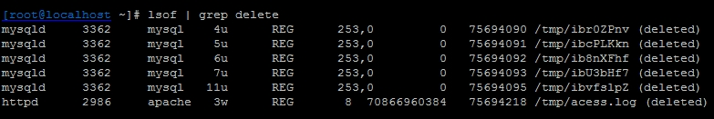

# **运维实战案例之文件已删除但空间不释放问题解析**

https://blog.51cto.com/ixdba/1435781

#### **1、错误现象**

运维的监控系统发来通知，报告一台服务器空间满了，登陆服务器查看，根分区确实没有空间了，如下图所示：



这里首先说明一下服务器的一些删除策略，由于Linux没有回收站功能，我们的线上服务器所有要删除的文件都会首先移动到系统/tmp目录下，然后定期清除/tmp目录下的数据。这个策略本身没有问题，但是通过检查发现这台服务器的系统分区中并没有单独划分/tmp分区，这样/tmp下的数据其实是占用了根分区的空间。既然找到了问题，那么删除/tmp目录下一些大数据即可，执行如下命令，检查/tmp下最大的三个数据文件，如下图所示：

```
[root@localhost~ ]# du -s /tmp/*|sort -nr|head -3
69206016 /tmp/access_log
36 /tmp/hsperfdata_root
36 /tmp/hsperfdata_mapred
```

通过命令输出发现在/tmp目录下有个66G大小的文件access_log，这个文件应该是apache产生的访问日志文件，从日志大小来看，应该是很久没有清理apache日志文件了，基本判定是这个文件导致的根空间爆满，在确认此文件可以删除后，执行如下删除操作：

```
[root@localhost ~]#  rm  /tmp/access_log
```

接着查看系统根分区空间是否释放，如下图所示：


从输出可以看到，根分区空间仍然没有释放，这是怎么回事？

#### **2、解决思路**

一般说来不会出现删除文件后空间不释放的情况，但是也存在例外，比如文件被进程锁定，或者有进程一直在向这个文件写数据等等，要理解这个问题，就需要知道Linux下文件的存储机制和存储结构。

一个文件在文件系统中的存放分为两个部分：数据部分和指针部分，指针位于文件系统的meta-data中，数据被删除后，这个指针就从meta-data中清除了，而数据部分存储在磁盘中，数据对应的指针从meta-data中清除后，文件数据部分占用的空间就可以被覆盖并写入新的内容，之所以出现删除access_log文件后，空间还没释放，就是因为httpd进程还在一直向这个文件写入内容，导致虽然删除了access_log文件，但文件对应的指针部分由于进程锁定，并未从meta-data中清除，而由于指针并未被删除，那么系统内核就认为文件并未被删除，因此通过df命令查询空间并未释放也就不足为奇了。

#### **3、问题排查**

既然有了解决问题的思路，那么接下来看看是否有进程一直在向acess.log文件中写数据，这里需要用到Linux下的lsof命令，通过这个命令可以获取一个已经被删除但仍然被应用程序占用的文件列表，命令执行如下图所示：



从输出结果可以看到，/tmp/acess.log文件被进程httpd锁定，而httpd进程还一直向这个文件写入日志数据，从第七列可知，这个日志文件大小仅70G，而系统根分区总大小才100G，由此可知，这个文件就是导致系统根分区空间耗尽的罪魁祸首，在最后一列的“deleted”状态，说明这个日志文件已经被删除，但由于进程还在一直向此文件写入数据，空间并未释放。

#### **4、解决问题**

到这里问题就基本排查清楚了，解决这一类问题的方法有很多种，最简单的方法是关闭或者重启httpd进程，当然也可以重启操作系统，不过这并不是最好的方法，对待这种进程不停对文件写日志的操作，要释放文件占用的磁盘空间，最好的方法是在线清空这个文件，可以通过如下命令完成：

> #### [root@localhost ~]# echo " " >/tmp/acess.log

通过这种方法，磁盘空间不但可以马上释放，也可保障进程继续向文件写入日志，这种方法经常用于在线清理Apache、Tomcat、Nginx等Web服务产生的日志文件。