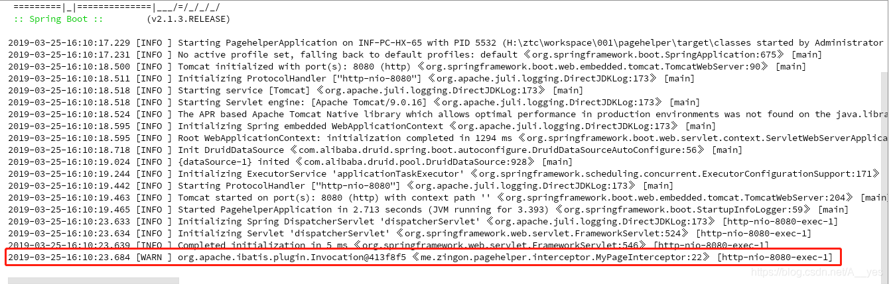
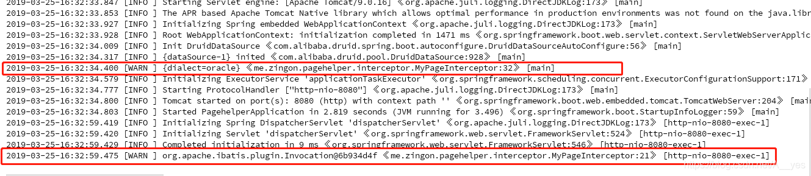

https://mybatis.org/mybatis-3/zh/index.html  文档 mybatis 

分页插件小运用-https://www.cnblogs.com/A-yes/p/12026944.html

https://www.cnblogs.com/A-yes/p/10619390.html

开发过程中经常回需要对要执行的sql加以自定义处理，比如分页，计数等。通过 MyBatis 提供的强大机制，使用插件是非常简单的，只需实现 Interceptor 接口，并指定想要拦截的方法签名即可。

```
@Intercepts({@Signature(type = Executor.class,method = "query",args = {MappedStatement.class,Object.class, RowBounds.class,ResultHandler.class})})
public class MyPageInterceptor implements Interceptor {
    private static final Logger logger= LoggerFactory.getLogger(MyPageInterceptor.class);
    @Override
    public Object intercept(Invocation invocation) throws Throwable {
        logger.warn(invocation.toString());
        return invocation.proceed();
    }
    @Override
    public Object plugin(Object o) {
        return Plugin.wrap(o,this);
    }
    @Override
    public void setProperties(Properties properties) {
        logger.warn(properties.toString());
    }
}
```

我的配置

```
mybatis:
  type-aliases-package: me.zingon.pagehelper.model
  mapper-locations: classpath:mapper/*.xml
  configuration:
    map-underscore-to-camel-case: true
    default-fetch-size: 100
    default-statement-timeout: 30
```

在springboot中要给mybatis加上这个拦截器，有三种方法，前两种方法在启动项目时不会自动调用自定义拦截器的setProperties方法。

#### 第一种

直接给自定义拦截器添加一个 @Component注解，当调用sql时结果如下，可以看到拦截器生效了，但是启动时候并没有自动调用setProperties方法。



#### 第二种

在配置类里添加拦截器，这种方法结果同上，也不会自动调用setProperties方法。

```
@Configuration
public class MybatisConfig {
    @Bean
    ConfigurationCustomizer mybatisConfigurationCustomizer() {
        return new ConfigurationCustomizer() {
            @Override
            public void customize(org.apache.ibatis.session.Configuration configuration) {
                configuration.addInterceptor(new MyPageInterceptor());
            }
        };
    }
}
```

#### 第三种

这种方法就是跟以前的配置方法类似，在yml配置文件中指定mybatis的xml配置文件,注意config-location属性和configuration属性不能同时指定

```
mybatis:
  config-location: classpath:mybatis.xml
  type-aliases-package: me.zingon.pagehelper.model
  mapper-locations: classpath:mapper/*.xml
```

mybatis.xml

```
<?xml version="1.0" encoding="UTF-8" ?>
<!DOCTYPE configuration PUBLIC "-//mybatis.org//DTD Config 3.0//EN"
        "http://mybatis.org/dtd/mybatis-3-config.dtd">
<configuration>
    <typeAliases>
        <package name="me.zingon.pacargle.model"/>
    </typeAliases>
    <plugins>
        <plugin interceptor="me.zingon.pagehelper.interceptor.MyPageInterceptor"> 
            <property name="dialect" value="oracle"/>
        </plugin>
    </plugins>
</configuration>
```



#### 总结

前两种方法可以在初始化自定义拦截器的时候通过 @Value 注解直接初始化需要的参数。