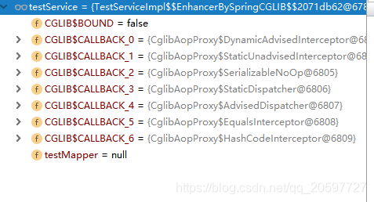
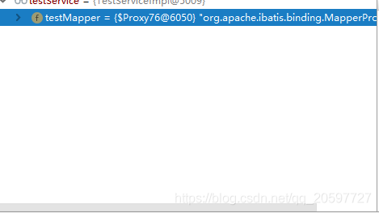

https://mp.weixin.qq.com/s/3IAlX0-2h_07Jmz8G57QWg


## Transactional失效场景介绍

### 第一种 

Transactional注解标注方法修饰符为非public时，@Transactional注解将会不起作用。例如以下代码。

定义一个错误的@Transactional标注实现，修饰一个默认访问符的方法

```java
/**
 * @author zhoujy
 **/
@Component
public class TestServiceImpl {
    @Resource
    TestMapper testMapper;
    
    @Transactional
    void insertTestWrongModifier() {
        int re = testMapper.insert(new Test(10,20,30));
        if (re > 0) {
            throw new NeedToInterceptException("need intercept");
        }
        testMapper.insert(new Test(210,20,30));
    }
}
```

在同一个包内，新建调用对象，进行访问。

```java
@Component
public class InvokcationService {
    @Resource
    private TestServiceImpl testService;
    public void invokeInsertTestWrongModifier(){
        //调用@Transactional标注的默认访问符方法
        testService.insertTestWrongModifier();
    }
}
```

测试用例

```java
@RunWith(SpringRunner.class)
@SpringBootTest
public class DemoApplicationTests {
   @Resource
   InvokcationService invokcationService;

   @Test
   public void  testInvoke(){
      invokcationService.invokeInsertTestWrongModifier();
   }
}
```

以上的访问方式，导致事务没开启，因此在方法抛出异常时，testMapper.insert(new Test(10,20,30));操作不会进行回滚。如果`TestServiceImpl#insertTestWrongModifier`方法改为public的话将会正常开启事务，testMapper.insert(new Test(10,20,30));将会进行回滚。

### 第二种

在类内部调用调用类内部@Transactional标注的方法。这种情况下也会导致事务不开启。示例代码如下。

设置一个内部调用

```java
/**
 * @author zhoujy
 **/
@Component
public class TestServiceImpl implements TestService {
    @Resource
    TestMapper testMapper;

    @Transactional
    public void insertTestInnerInvoke() {
        //正常public修饰符的事务方法
        int re = testMapper.insert(new Test(10,20,30));
        if (re > 0) {
            throw new NeedToInterceptException("need intercept");
        }
        testMapper.insert(new Test(210,20,30));
    }


    public void testInnerInvoke(){
        //类内部调用@Transactional标注的方法。
        insertTestInnerInvoke();
    }

}
```

测试用例。

```java
@RunWith(SpringRunner.class)
@SpringBootTest
public class DemoApplicationTests {

   @Resource
   TestServiceImpl testService;

   /**
    * 测试内部调用@Transactional标注方法
    */
   @Test
   public void  testInnerInvoke(){
       //测试外部调用事务方法是否正常
      //testService.insertTestInnerInvoke();
       //测试内部调用事务方法是否正常
      testService.testInnerInvoke();
   }
}
```

上面就是使用的测试代码，运行测试知道，外部调用事务方法能够征程开启事务，testMapper.insert(new Test(10,20,30))操作将会被回滚；

然后运行另外一个测试用例，调用一个方法在类内部调用内部被@Transactional标注的事务方法，运行结果是事务不会正常开启，testMapper.insert(new Test(10,20,30))操作将会保存到数据库不会进行回滚。

### 第三种

事务方法内部捕捉了异常，没有抛出新的异常，导致事务操作不会进行回滚。示例代码如下。

```java
/**
 * @author zhoujy
 **/
@Component
public class TestServiceImpl implements TestService {
    @Resource
    TestMapper testMapper;

    @Transactional
    public void insertTestCatchException() {
        try {
            int re = testMapper.insert(new Test(10,20,30));
            if (re > 0) {
                //运行期间抛异常
                throw new NeedToInterceptException("need intercept");
            }
            testMapper.insert(new Test(210,20,30));
        }catch (Exception e){
            System.out.println("i catch exception");
        }
    }
    
}
```

测试用例代码如下。

```java
@RunWith(SpringRunner.class)
@SpringBootTest
public class DemoApplicationTests {

   @Resource
   TestServiceImpl testService;

   @Test
   public void testCatchException(){
      testService.insertTestCatchException();
   }
}
```

运行测试用例发现，虽然抛出异常，但是异常被捕捉了，没有抛出到方法 外， testMapper.insert(new Test(210,20,30))操作并没有回滚。

以上三种就是@Transactional注解不起作用，@Transactional注解失效的主要原因。下面结合spring中对于@Transactional的注解实现源码分析为何导致@Transactional注解不起作用。

## @Transactional注解不起作用原理分析

### 第一种

`@Transactional`注解标注方法修饰符为非public时，`@Transactional`注解将会不起作用。这里分析 的原因是，`@Transactional`是基于动态代理实现的，`@Transactional`注解实现原理中分析了实现方法，在bean初始化过程中，对含有`@Transactional`标注的bean实例创建代理对象，这里就存在一个spring扫描`@Transactional`注解信息的过程，不幸的是源码中体现，标注@Transactional的方法如果修饰符不是public，那么就默认方法的`@Transactional`信息为空，那么将不会对bean进行代理对象创建或者不会对方法进行代理调用

`@Transactional`注解实现原理中，介绍了如何判定一个bean是否创建代理对象，大概逻辑是。根据spring创建好一个aop切点`BeanFactoryTransactionAttributeSourceAdvisor`实例，遍历当前bean的class的方法对象，判断方法上面的注解信息是否包含`@Transactional`，如果bean任何一个方法包含`@Transactional`注解信息，那么就是适配这个BeanFactoryTransactionAttributeSourceAdvisor切点。则需要创建代理对象，然后代理逻辑为我们管理事务开闭逻辑。

spring源码中，在拦截bean的创建过程，寻找bean适配的切点时，运用到下面的方法，目的就是寻找方法上面的@Transactional信息，如果有，就表示切点BeanFactoryTransactionAttributeSourceAdvisor能够应用（canApply）到bean中，

AopUtils#canApply(org.springframework.aop.Pointcut, java.lang.Class<?>, boolean)

```java
public static boolean canApply(Pointcut pc, Class<?> targetClass, boolean hasIntroductions) {
   Assert.notNull(pc, "Pointcut must not be null");
   if (!pc.getClassFilter().matches(targetClass)) {
      return false;
   }

   MethodMatcher methodMatcher = pc.getMethodMatcher();
   if (methodMatcher == MethodMatcher.TRUE) {
      // No need to iterate the methods if we're matching any method anyway...
      return true;
   }

   IntroductionAwareMethodMatcher introductionAwareMethodMatcher = null;
   if (methodMatcher instanceof IntroductionAwareMethodMatcher) {
      introductionAwareMethodMatcher = (IntroductionAwareMethodMatcher) methodMatcher;
   }

    //遍历class的方法对象
   Set<Class<?>> classes = new LinkedHashSet<Class<?>>(ClassUtils.getAllInterfacesForClassAsSet(targetClass));
   classes.add(targetClass);
   for (Class<?> clazz : classes) {
      Method[] methods = ReflectionUtils.getAllDeclaredMethods(clazz);
      for (Method method : methods) {
         if ((introductionAwareMethodMatcher != null &&
               introductionAwareMethodMatcher.matches(method, targetClass, hasIntroductions)) ||
             //适配查询方法上的@Transactional注解信息  
             methodMatcher.matches(method, targetClass)) {
            return true;
         }
      }
   }

   return false;
}
```

我们可以在上面的方法打断点，一步一步调试跟踪代码，最终上面的代码还会调用如下方法来判断。在下面的方法上断点，回头看看方法调用堆栈也是不错的方式跟踪

```
AbstractFallbackTransactionAttributeSource#getTransactionAttribute
```

- `AbstractFallbackTransactionAttributeSource#computeTransactionAttribute`

```java
protected TransactionAttribute computeTransactionAttribute(Method method, Class<?> targetClass) {
   // Don't allow no-public methods as required.
   //非public 方法，返回@Transactional信息一律是null
   if (allowPublicMethodsOnly() && !Modifier.isPublic(method.getModifiers())) {
      return null;
   }
   //后面省略.......
 }
```

#### 不创建代理对象

所以，如果所有方法上的修饰符都是非public的时候，那么将不会创建代理对象。以一开始的测试代码为例，如果正常的修饰符的testService是下面图片中的，经过cglib创建的代理对象。



如果class中的方法都是非public的那么将不是代理对象。



#### 不进行代理调用

考虑一种情况，如下面代码所示。两个方法都被@Transactional注解标注，但是一个有public修饰符一个没有，那么这种情况我们可以预见的话，一定会创建代理对象，因为至少有一个public修饰符的@Transactional注解标注方法。

创建了代理对象，insertTestWrongModifier就会开启事务吗？答案是不会。

```java
/**
 * @author zhoujy
 **/
@Component
public class TestServiceImpl implements TestService {
    @Resource
    TestMapper testMapper;

    @Override
    @Transactional
    public void insertTest() {
        int re = testMapper.insert(new Test(10,20,30));
        if (re > 0) {
            throw new NeedToInterceptException("need intercept");
        }
        testMapper.insert(new Test(210,20,30));
    }
    
    @Transactional
    void insertTestWrongModifier() {
        int re = testMapper.insert(new Test(10,20,30));
        if (re > 0) {
            throw new NeedToInterceptException("need intercept");
        }
        testMapper.insert(new Test(210,20,30));
    }
}
```

原因是在动态代理对象进行代理逻辑调用时，在cglib创建的代理对象的拦截函数中`CglibAopProxy.DynamicAdvisedInterceptor#intercept`，有一个逻辑如下，目的是获取当前被代理对象的当前需要执行的method适配的aop逻辑。

```
List<Object> chain = this.advised.getInterceptorsAndDynamicInterceptionAdvice(method, targetClass);
```

而针对@Transactional注解查找aop逻辑过程，相似地，也是执行一次

```
AbstractFallbackTransactionAttributeSource#getTransactionAttribute
```

- `AbstractFallbackTransactionAttributeSource#computeTransactionAttribute`

也就是说还需要找一个方法上的@Transactional注解信息，没有的话就不执行代理@Transactional对应的代理逻辑，直接执行方法。没有了@Transactional注解代理逻辑，就无法开启事务，这也是上一篇已经讲到的。

### 第二种

在类内部调用调用类内部@Transactional标注的方法。这种情况下也会导致事务不开启。

经过对第一种的详细分析，对这种情况为何不开启事务管理，原因应该也能猜到；

> 既然事务管理是基于动态代理对象的代理逻辑实现的，那么如果在类内部调用类内部的事务方法，这个调用事务方法的过程并不是通过代理对象来调用的，而是直接通过this对象来调用方法，绕过的代理对象，肯定就是没有代理逻辑了。

其实我们可以这样玩，内部调用也能实现开启事务，代码如下。

```java
/**
 * @author zhoujy
 **/
@Component
public class TestServiceImpl implements TestService {
    @Resource
    TestMapper testMapper;

    @Resource
    TestServiceImpl testServiceImpl;


    @Transactional
    public void insertTestInnerInvoke() {
        int re = testMapper.insert(new Test(10,20,30));
        if (re > 0) {
            throw new NeedToInterceptException("need intercept");
        }
        testMapper.insert(new Test(210,20,30));
    }


    public void testInnerInvoke(){
        //内部调用事务方法
        testServiceImpl.insertTestInnerInvoke();
    }

}
```

上面就是使用了代理对象进行事务调用，所以能够开启事务管理，但是实际操作中，没人会闲的蛋疼这样子玩~

### 第三种

事务方法内部捕捉了异常，没有抛出新的异常，导致事务操作不会进行回滚。

这种的话，可能我们比较常见，问题就出在代理逻辑中，我们先看看源码里卖弄动态代理逻辑是如何为我们管理事务的。

```
TransactionAspectSupport#invokeWithinTransaction
```

代码如下。

```java
protected Object invokeWithinTransaction(Method method, Class<?> targetClass, final InvocationCallback invocation)
      throws Throwable {

   // If the transaction attribute is null, the method is non-transactional.
   final TransactionAttribute txAttr = getTransactionAttributeSource().getTransactionAttribute(method, targetClass);
   final PlatformTransactionManager tm = determineTransactionManager(txAttr);
   final String joinpointIdentification = methodIdentification(method, targetClass);

   if (txAttr == null || !(tm instanceof CallbackPreferringPlatformTransactionManager)) {
      // Standard transaction demarcation with getTransaction and commit/rollback calls.
       //开启事务
      TransactionInfo txInfo = createTransactionIfNecessary(tm, txAttr, joinpointIdentification);
      Object retVal = null;
      try {
         // This is an around advice: Invoke the next interceptor in the chain.
         // This will normally result in a target object being invoked.
          //反射调用业务方法
         retVal = invocation.proceedWithInvocation();
      }
      catch (Throwable ex) {
         // target invocation exception
          //异常时，在catch逻辑中回滚事务
         completeTransactionAfterThrowing(txInfo, ex);
         throw ex;
      }
      finally {
         cleanupTransactionInfo(txInfo);
      }
       //提交事务
      commitTransactionAfterReturning(txInfo);
      return retVal;
   }

   else {
     //....................
   }
}
```

所以看了上面的代码就一目了然了，事务想要回滚，必须能够在这里捕捉到异常才行，如果异常中途被捕捉掉，那么事务将不会回滚。

