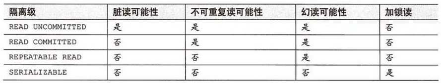

# [事务及事务隔离级别](https://www.cnblogs.com/xrq730/p/5087378.html)

https://www.cnblogs.com/xrq730/p/5087378.html

#### **1.什么是事务**

> 事务是访问数据库的一个操作序列，数据库应用系统通过事务集来完成对数据库的存取。**事务的正确执行使得数据库从一种状态转换为另一种状态**。事务必须服从ISO/IEC所制定的ACID原则。ACID是原子性（atomicity）、一致性（consistency）、隔离性（isolation）、持久性（durability）的缩写，这四种状态的意思是：
>
> **1、原子性**
>
> 即不可分割，事务要么全部被执行，要么全部不执行。如果事务的所有子事务全部提交成功，则所有的数据库操作被提交，数据库状态发生变化；如果有子事务失败，则其他子事务的数据库操作被回滚，即数据库回到事务执行前的状态，不会发生状态转换
>
> **2、一致性**
>
> 事务的执行使得数据库从一种正确状态转换成另外一种正确状态
>
> **3、隔离性**
>
> 在事务正确提交之前，不允许把事务对该数据的改变提供给任何其他事务，即在事务正确提交之前，它可能的结果不应该显示给其他事务
>
> **4、持久性**
>
> 事务正确提交之后，其结果将永远保存在数据库之中，即使在事务提交之后有了其他故障，事务的处理结果也会得到保存

#### 2.**事务的作用**

> 事务管理对于企业级应用而言至关重要，它保证了用户的每一次操作都是可靠的，即便出现了异常的访问情况，也不至于破坏后台数据的完整性。就像银行的自动提款机ATM，通常ATM都可以正常为客户服务，但是也难免遇到操作过程中及其突然出故障的情况，此时，事务就必须确保出故障前对账户的操作不生效，就像用户刚才完全没有使用过ATM机一样，以保证用户和银行的利益都不受损失。

#### 3.**并发下事务会产生的问题**

> 举个例子，事务A和事务B操纵的是同一个资源，事务A有若干个子事务，事务B也有若干个子事务，事务A和事务B在高并发的情况下，会出现各种各样的问题。"各种各样的问题"，总结一下主要就是五种：第一类丢失更新、第二类丢失更新、脏读、不可重复读、幻读。五种之中，第一类丢失更新、第二类丢失更新不重要，不讲了，讲一下脏读、不可重复读和幻读。

###### **1、脏读**

> 所谓脏读，就是指**事务A读到了事务B还没有提交的数据**，比如银行取钱，事务A开启事务，此时切换到事务B，事务B开启事务-->取走100元，此时切换回事务A，事务A读取的肯定是数据库里面的原始数据，因为事务B取走了100块钱，并没有提交，数据库里面的账务余额肯定还是原始余额，这就是脏读。

###### **2、不可重复读**

> 所谓不可重复读，就是指**在一个事务里面读取了两次某个数据，读出来的数据不一致**。还是以银行取钱为例，事务A开启事务-->查出银行卡余额为1000元，此时切换到事务B事务B开启事务-->事务B取走100元-->提交，数据库里面余额变为900元，此时切换回事务A，事务A再查一次查出账户余额为900元，这样对事务A而言，在同一个事务内两次读取账户余额数据不一致，这就是不可重复读。

###### **3、幻读**

> 所谓幻读，就是指**在一个事务里面的操作中发现了未被操作的数据**。比如学生信息，事务A开启事务-->修改所有学生当天签到状况为false，此时切换到事务B，事务B开启事务-->事务B插入了一条学生数据，此时切换回事务A，事务A提交的时候发现了一条自己没有修改过的数据，这就是幻读，就好像发生了幻觉一样。幻读出现的前提是并发的事务中有事务发生了插入、删除操作。

#### 4.**事务隔离级别**

> 事务隔离级别，就是为了解决上面几种问题而诞生的。为什么要有事务隔离级别，因为**事务隔离级别越高，在并发下会产生的问题就越少，但同时付出的性能消耗也将越大****，因此很多时候必须在并发性和性能之间做一个权衡**。所以设立了几种事务隔离级别，以便让不同的项目可以根据自己项目的并发情况选择合适的事务隔离级别，对于在事务隔离级别之外会产生的并发问题，在代码中做补偿。
>
> 事务隔离级别有4种，但是像Spring会提供给用户5种，来看一下：

###### **1、DEFAULT**

> 默认隔离级别，每种数据库支持的事务隔离级别不一样，如果Spring配置事务时将isolation设置为这个值的话，那么将使用底层数据库的默认事务隔离级别。顺便说一句，如果使用的MySQL，可以使用"**select @@tx_isolation**"来查看默认的事务隔离级别

###### **2、READ_UNCOMMITTED**

> 读未提交，即能够读取到没有被提交的数据，所以很明显这个级别的隔离机制无法解决脏读、不可重复读、幻读中的任何一种，因此很少使用

###### **3、READ_COMMITED**

> 读已提交，即能够读到那些已经提交的数据，自然能够防止脏读，但是无法限制不可重复读和幻读

###### **4、REPEATABLE_READ**

> 重复读取，即在数据读出来之后加锁，类似"select * from XXX for update"，明确数据读取出来就是为了更新用的，所以要加一把锁，防止别人修改它。REPEATABLE_READ的意思也类似，读取了一条数据，这个事务不结束，别的事务就不可以改这条记录，这样就解决了脏读、不可重复读的问题，但是幻读的问题还是无法解决

**5、SERLALIZABLE**

> 串行化，最高的事务隔离级别，不管多少事务，挨个运行完一个事务的所有子事务之后才可以执行另外一个事务里面的所有子事务，这样就解决了脏读、不可重复读和幻读的问题了
>
> 网上专门有图用表格的形式列出了事务隔离级别解决的并发问题：

再必须强调一遍，不是事务隔离级别设置得越高越好，事务隔离级别设置得越高，意味着势必要花手段去加锁用以保证事务的正确性，那么效率就要降低，因此实际开发中往往要在效率和并发正确性之间做一个取舍，一般情况下会设置为READ_COMMITED，此时避免了脏读，并发性也还不错，之后再通过一些别的手段去解决不可重复读和幻读的问题就好了。

#### 5.**事物隔离级别查看及修改**

首先说明一下MySQL查看和修改事务隔离级别的几个命令：

- 查看事务隔离级别使用select @@tx_isolation
- 修改当前会话事务隔离级别使用**SET session TRANSACTION ISOLATION LEVEL Serializable;**（参数可以为：Read uncommitted|Read committed|Repeatable read|Serializable）
- 修改全局事务隔离级别使用**SET global TRANSACTION ISOLATION LEVEL Serializable;**（参数可以为：Read uncommitted|Read committed|Repeatable read|Serializable）

修改了会话的事务隔离级别，比如MyBatis，getSqlSession()的时候，只针对这一次拿到的Session有效；比如CMD命令行，只对这一次的窗口有效。

修改了全局的事务隔离级别，那么针对此后所有的会话有效，**当前已经存在的会话不受影响**。

关于MySQL事务隔离级别，推荐大家一篇文章，很详细地测试了四种事务隔离级别https://www.cnblogs.com/snsdzjlz320/p/5761387.html，相信大家读了一定有所进步。