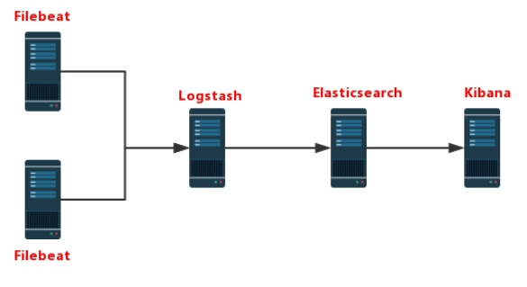
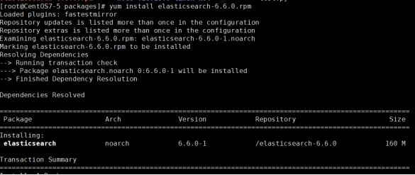
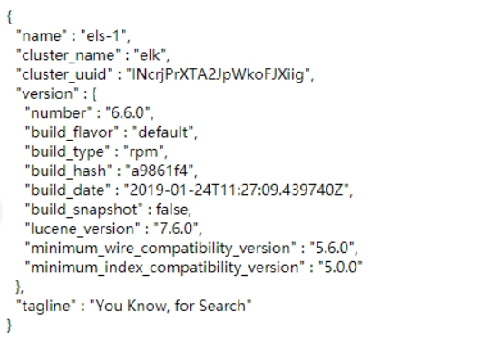
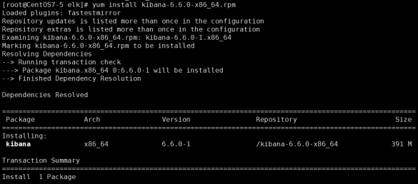
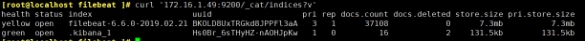
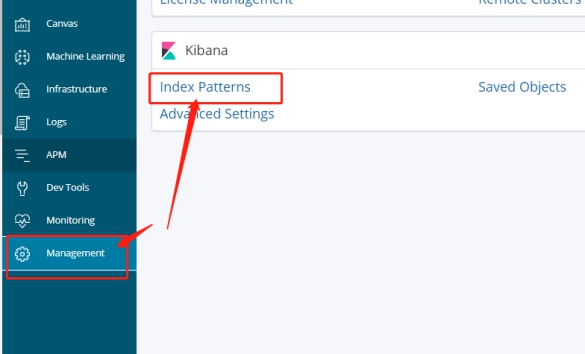
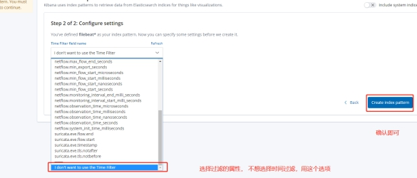
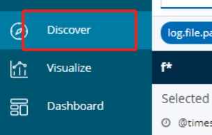
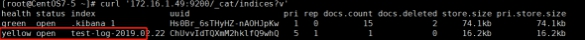

# ELK部署

### 一、前言

> 日志主要包括系统日志和应用程序日志，运维和开发人员可以通过日志了解服务器中软硬件的信息，检查应用程序或系统的故障，了解故障出现的原因，以便解决问题。分析日志可以更清楚的了解服务器的状态和系统安全状况，从而可以维护服务器稳定运行。
>
> 但是日志通常都是存储在各自的服务器中。如果管理数十台服务器， 查阅日志需要依次登陆不同的服务器，查看过程就会很繁琐从而导致工作效率低下。虽然可以使用 rsyslog 服务将日志汇总。但是统计一些日志中的数据或者检索也是很麻烦的，一般使用grep、awk、wc、sort等Linux命令来统计和检索。如果对数量巨大的日志进行统计检索，人工的效率还是十分低下。
>
> 通过我们对日志进行收集、汇总到一起，完整的日志数据具有非常重要的作用：
>
> 1. 信息查找。通过检索日志信息，查找相应的报错，可以快速的解决BUG。
>
> 2. 数据分析。如果是截断整理格式化后的日志信息，可以进一步对日志进行数据分析和统计，可以选出头条，热点，或者爆款。
>
> 3. 系统维护。对日志信息分析可以了解服务器的负荷和运行状态。可以针对性的对服务器进行优化。

### 二、ELK简介

> ELK实时日志收集分析系统可以完美的解决以上问题。ELK作为一款开源软件可以免费使用，也有强大的团队和社区对它实时更新。
>
> ELK主要由ElasticSearch、Logstash和Kibana三个开源工具组成，还有其他专门由于收集数据的轻量型数据采集器Beats。
>
> ***\*Elasticsearch\**** ：分布式搜索引擎。具有高可伸缩、高可靠、易管理等特点。可以用于全文检索、结构化检索和分析，并能将这三者结合起来。Elasticsearch 是用Java 基于 Lucene 开发，现在使用最广的开源搜索引擎之一，Wikipedia 、StackOverflow、Github 等都基于它来构建自己的搜索引擎。
>
> ***\*在elasticsearch中，所有节点的数据是均等的。\****
>
> ***\*Logstash\**** ：数据收集处理引擎。支持动态的从各种数据源搜集数据，并对数据进行过滤、分析、丰富、统一格式等操作，然后存储以供后续使用。
>
> ***\*Kibana\**** ：可视化化平台。它能够搜索、展示存储在 Elasticsearch 中索引数据。使用它可以很方便的用图表、表格、地图展示和分析数据。
>
> ***\*Filebeat\****：轻量级数据收集引擎。相对于Logstash所占用的系统资源来说，Filebeat 所占用的系统资源几乎是微乎及微。它是基于原先 Logstash-fowarder 的源码改造出来。换句话说：Filebeat就是新版的 Logstash-fowarder，也会是 ELK Stack 在 Agent 的第一选择。

版本说明：

> ***\*Elasticsearch、Logstash、Kibana、Filebeat安装的版本号必须全部一致\****,不然会出现kibana无法显示web页面。

ELK工作演示图：

> 1. Filebeat在APP Server端收集日志
>
> 2. Logstash处理过滤Filebeat收集过来的日志
>
> 3. Elasticsearch存储Logstash提供的处理之后的日志，用以检索、统计
>
> 4. Kibana提供web页面，将Elasticsearch的数据可视化的展示出来



### 三、ELK安装部署

##### 1 . 首先配置JDK环境

> ```shell
> #自行下载jdk
> 
>  rpm -ivh  jdk-8u144-linux-x64.rpm
> 
>  #或者 yum install java-1.8.0-openjdk*
> 
>  vim /etc/profile.d/java.sh
> 
>   export JAVA_HOME=/usr/lib/jvm/java-1.8.0-openjdk-1.8.0.131-11.b12.el7.x86_64
> 
>   export PATH=$JAVA_HOME/jre/bin:$PATH
> 
>  source /etc/profile.d/java.sh
> ```
>
> 

##### 2 . 配置ELK yum源

```shell
vim /etc/yum.repo.d/ELK.repo
[ELK]
name=ELK-Elasticstack
baseurl=https://mirrors.tuna.tsinghua.edu.cn/elasticstack/yum/elastic-6.x/
gpgcheck=0
enabled=1
#关闭selinux
setenforce 0
sed -i.bak  's@^SELINUX=\(.*\)@SELINUX=disabled@p' /etc/selinux/config
#关闭防火墙#Centos7
systemctl disable firewalld
systemctl stop firewalld#CentOS6
service iptables stop
service iptables disable
```

##### 3 . 部署elasticsearch

###### 1. 安装elasticsearch

```shell
yum install elasticsearsh
# 修改系统配置文件属性# vim /etc/security/limits.conf 
elasticsearch soft memlock unlimited
elasticsearch hard memlock unlimited
elasticsearch soft nofile 65536
elasticsearch hard nofile 131072
```



###### 2. 修改配置文件

```shell
# vim /etc/elasticsearch/elasticsearch.yml#集群名称
cluster.name: els#节点名称
node.name: els-1#数据存放路径
path.data: /data/els_data#日志存放路径
path.logs: /data/log/els#锁定jvm.options指定的内存,不交换swap内存
bootstrap.memory_lock: true#绑定IP地址
network.host: 172.16.1.49#端口号
http.port: 9200

#配置集群配置，填写集群节点，会自动发现节点# discovery.zen.ping.unicast.hosts: ["host1", "host2"]# 集群配置 只需要修改节点名，和绑定ip地址即可
# vim /etc/elasticsearch/jvm.options
-Xms1g  #指定占用内存大小，两个数字要一致 都是1g
-Xmx1g
```

###### 3. 创建数据目录

```shell
#创建elasticsearch数据库目录，并且修改属主为elasticsearch·
mkdir /data/els_data
mkdir /data/log/els
chown -R elasticsearch.elasticsearch /data/els_data
chown -R elasticsearch.elasticsearch /data/log/els
```

###### 4. 启动elasticsearch

```shell
systemctl start elasticsearch# 启动后自动关闭#报错
[1] bootstrap checks failed
[1]: memory locking requested for elasticsearch process but memory is not locked
#将配置文件中的 bootstrap.memory_lock: true 注释掉，不使用；即可启动成功
```

报错


启动成功后

访问172.16.1.49:9200



###### 5.Elasticsearch API

> · 集群状态：http:// 172.16.1.100:9200/_cluster/health?pretty
>
> · 节点状态：http:// 172.16.1.100:9200/_nodes/process?pretty
>
> · 分片状态：http:// 172.16.1.100:9200/_cat/shards
>
> · 索引分片存储信息：http:// 172.16.1.100:9200/index/_shard_stores?pretty
>
> · 索引状态：http:// 172.16.1.100:9200/index/_stats?pretty
>
> · 索引元数据：http:// 172.16.1.100:9200/index?pretty

##### 4. 部署Kibana

> Kibana是node.js 编写的，不需要java环境。直接安装即可

###### 1. 安装Kibana

```shell
yum install kibana# 版本号需要和Elasticsearch 相同
```



###### 2. 配置Kibana

```shell
vim /etc/kibana/kibana.yml
server.port: 5601
server.host: "172.16.1.50"
elasticsearch.url: "http://172.16.1.49:9200"
kibana.index: ".kibana"
logging.dest: /data/log/kibana/kibana.log # 配置kibana日志输出到哪里
# 创建日志目录文件
mkdir -p /data/log/kibana/
touch /data/log/kibana/kibana.log
chmod o+rw  /data/log/kibana/kibana.log
访问172.16.1.50:5601
出现 Kibana server is not ready yet
说明kibana与Elasticsearch版本号不一致
# 查看版本号
rpm -qa elasticsearch kibana
```

***\*如果版本号一模一样，那就多刷新几次页面吧。。。。\****

启动成功后，访问页面可以看到：


##### 5. 部署Logstash

> ***\*配置与Elasticsearch相同的Java环境，版本为8以上的Java环境。\****

###### 1. 安装Logstash

```
yum install logstash-"Version"
```

###### 2. 修改配置文件

```xml
http.host: "172.16.1.229"
http.port: 9600-9700
```

###### 3. 配置收集nginx日志配置文件

修改nginx的日志格式

```
log_format main '{"@timestamp":"$time_iso8601",''"host":"$server_addr",''"clientip":"$remote_addr",''"request":"$request",''"size":$body_bytes_sent,''"responsetime":$request_time,''"upstreamtime":"$upstream_response_time",''"upstreamhost":"$upstream_addr",''"http_host":"$host",''"url":"$uri",''"referer":"$http_referer",''"agent":"$http_user_agent",''"status":"$status"}';

access_log /var/log/nginx/access_test.log  main;
```

配置Lostash收集日志配置文件

```
input {
        file {
                type =>"nginx-log"
                path => ["/var/log/nginx/access.log"]
                start_position => "beginning"
                sincedb_path => "/dev/null"
                }
}

output {
        elasticsearch {
                hosts => ["172.16.1.49:9200"]
                index => "nginx-log-%{+YYYY.MM}"
        }
}
```

###### 4.测试配置文件可用性

```shell
cd /usr/share/logstash/bin
./logstash --path.settings /etc/logstash/ -f /etc/logstash/conf.d/nginx.conf  --config.test_and_exit

OpenJDK 64-Bit Server VM warning: If the number of processors is expected to increase from one, then you should configure the number of parallel GC threads appropriately using -XX:ParallelGCThreads=N
Sending Logstash logs to /var/log/logstash which is now configured via log4j2.properties
[2019-02-20T17:34:29,949][WARN ][logstash.config.source.multilocal] Ignoring the 'pipelines.yml' file because modules or command line options are specified
Configuration OK # 配置文件OK 可以使用
[2019-02-20T17:34:39,048][INFO ][logstash.runner          ] Using config.test_and_exit mode. Config Validation Result: OK. Exiting Logstash
```

***\*WARN报错不影响运行\****

直接使用命令

```
./logstash --path.settings /etc/logstash/ -f /etc/logstash/conf.d/nginx.conf
```

就可以直接运行logstash

#####  6.部署filebeat

> Logstash的数据都是从Beats中获取，Logstash已经不需要自己去数据源中获取数据了。
>
> 以前我们使用的日志采集工具是logstash，但是logstash占用的资源比较大，没有beats轻量，所以官方也推荐使用beats来作为日志采集工具。而且beats可扩展，支持自定义构建。

```
yum install filebeat-6.6.0
```

###### 1. 修改filebeat配置文件

vim /etc/filebeat/filebeat.yml

```
- type: log
	paths:
		- /Log_File #/var/log/messages
		#output.elasticsearch: #注释掉输出到elasticsearch的配置 
	# hosts: ["localhost:9200"]
	
output.console: #添加输出到当前终端的配置
	enable: true
```

###### 2. 测试filebeat

```
/usr/share/filebeat/bin/filebeat -c  /etc/filebeat/filebeat.yml #运行filebeat，可以看见日志输出在当前终端
```

###### 3.修改配置将日志输出到elasticsearch中

```
- type: log
	paths:
		- /Log_File #/var/log/messages
		
output.elasticsearch: #注释掉输出到elasticsearch的配置 
	hosts: ["172.16.1.49:9200"]
```

启动 filebeat systemctl start filebeat

运行curl '172.16.1.49:9200/_cat/indices?v'，查看日志索引



###### 4.在Kibana中配置索引








***\*即可查看到日志\****

###### 5. 将日志输出到logstash中

```
#------------------- Logstash output ----------------------
output.logstash:  #将输出到elasticsearch的配置注释
  # The Logstash hosts
  hosts: ["172.16.1.229:5044"]

  # Optional SSL. By default is off.
  # List of root certificates for HTTPS server verifications
  #ssl.certificate_authorities: ["/etc/pki/root/ca.pem"]

  # Certificate for SSL client authentication
  #ssl.certificate: "/etc/pki/client/cert.pem"

  # Client Certificate Key
  #ssl.key: "/etc/pki/client/cert.key"
```

###### 6. 配置logstash

vim /etc/logstash/conf.d/test.conf

```shell
input { 
        beats { 
                port =>5044
                }
}#filter{} #过滤器，自定义过滤日志中的一些数据
output {
        stdout {
                codec => rubydebug
        }
        elasticsearch {
                hosts => "172.16.1.49:9200"
                index => "test-log-%{+YYYY.MM.dd}"
        }
}
```



Elasticsearch上已经有了日志索引，在kibana上也可以查看到

***\*yellow 表示没有副本节点可用，因为测试时没有搭建两台Elasticsearch\****

可以用filebeat监控个自定义文件，手动插入数据。