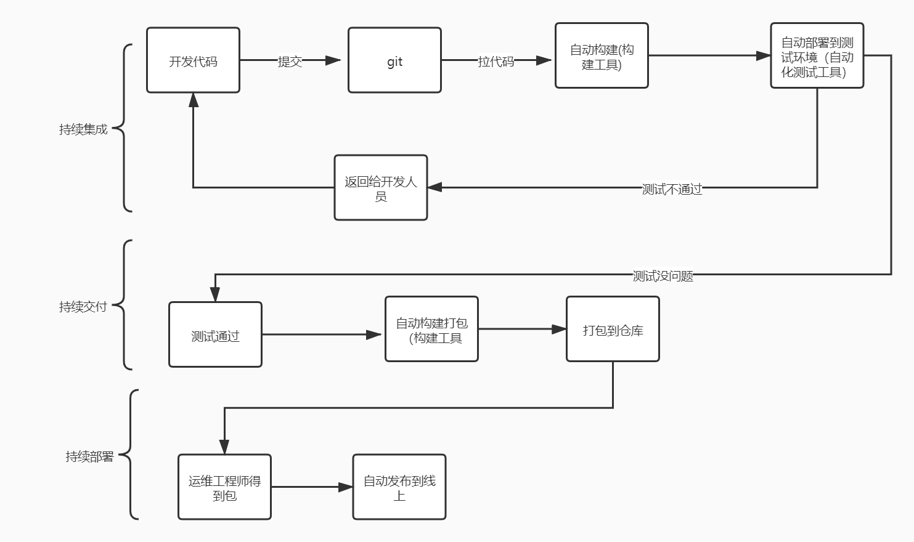
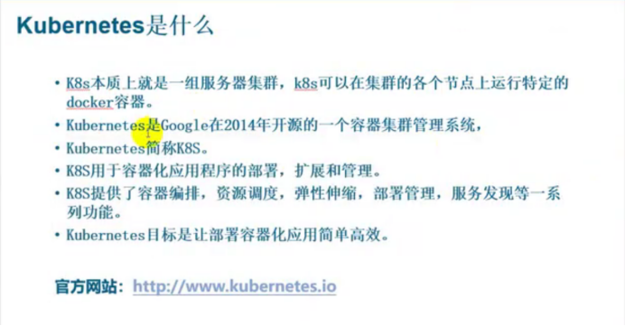
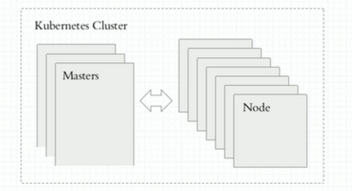
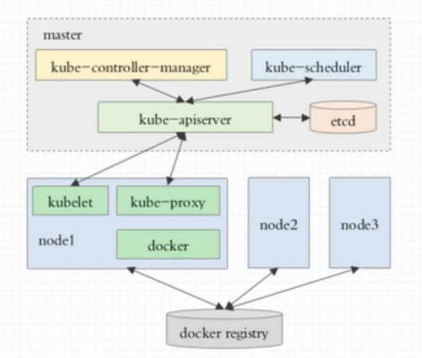
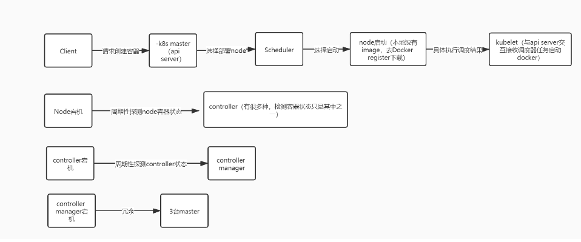
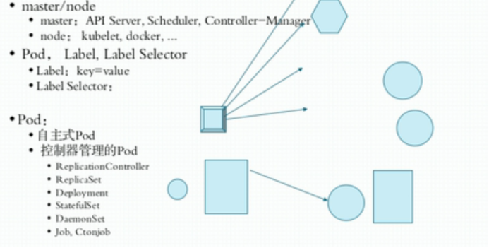
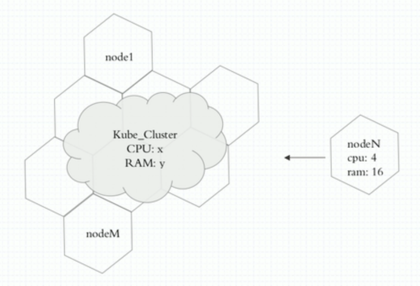
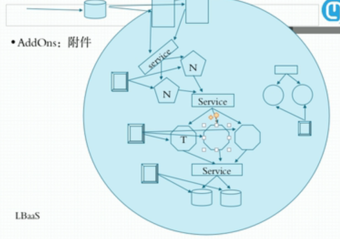

#### 1、Devops

> CI，CD

###### 1.流程：

> 计划------设计------开发------构建-----测试------上线

###### 2.持续集成：

###### 3.问题：

> 1、构建好的包要部署到目标平台，目标平台是什么（linux，win。。。。。。）
>
> 如果平台不定，无法通用自动构建、交付、部署（环境问题等等）
>
> 容器解决了这些问题

 

2、微服务环境下，如此众多的容器如何管理（故障转移，服务关系。。。。。。），手工无法管理，怎么办？

> 需要容器编排工具。

#### 2.k8s：

###### 1.如果要使用k8s前提：

> 容器应用配置外部化，解耦容器镜像和可变配置，从而保障工作负载(Pod)的可移植性。---k8s有专门的配置中心解决

###### 2.k8s结构：

###### 3.Master为什么有3台？

请求创建容器流程：

Api server：

> 接受请求、解析请求、处理请求

Scheduler：

> 根据现有所有node节点可用资源情况，两级调度选择node
>
> 一级：预选（选出所有符合要求的node）
>
> 二级：优选（在一级的集合中，利用优选算法选择node）
>
> 观测每个node的总共可用资源，cpu、ram、存储。。。。。

Docker register：

> node启动时如果本地没有image，去这里下载

Kubelet：

> 与api server交互接收调度器任务启动docker等

###### 4.Pod？Docker？

> k8s上最小运行的单元不是docker，是pod 
>
> Pod是docker的外壳，给docker做了一层抽象的封装，是一个逻辑概念（逻辑组件）
>
> 可以将pod理解为一个虚拟机，共享网络名称空间，共享存储卷。
>
> Node上运行pod，一般一个pod只放一个docker
>
> 如果一个pod放多个docker，一定有一个docker是主容器，其他容器都是辅助这个主容器的功能。

例如：

> 一个pod中运行nginx容器（主），filebeat容器（辅）
>
> 辅容器学名：sidecar
>
> ---------------k8s调度编排使用户不用关心docker运行在那个node上

如此多的pod如何管理？

> Pod可以用元数据打标签，例如dockerfile中的tag。用标签识别pod。
>
> 标签 key---value，例如，app---nginx
>
> Pod有了标签后，怎么挑选出对应标签的pod？
>
> Label selector 标签选择器 ，这个概念比较重要

###### 5.Pod分类：

> 1、自管理pod（无法全局调度，node坏了，pod就消失了）
>
> 2、控制器管理pod
>
>  例如：replication controller 复制控制器，滚动更新容器
>
> ​                   回滚容器

###### 6.当一个pod坏掉：

> ​                                          请求                       创建新pod 
>
> replication controller-------------api server----------------------Scheduler-----------后续流程同上

例如：deployment-----hpa

Hpa自动控制pod

例如线程池，配置最大线程数，初始线程数

 

新建pod了，pod也分组了，但是怎么去调用pod那？

> Pod会自动伸缩，每次的ip都不一样，client怎么调用？

> 服务发现：
>
> Pod需要注册
>
> k8s为每一组pod和client之间提供中间层  service 
>
> ​      代理访问pod，依靠标签选择器选择pod
>
> Client---------------service----------------pod（label1）
>
> ​            |
>
> ​            |
>
> ​            ---------pod（label1）

> 注：service不是实体组件，也不是应用程序，是一条规则
>
>  
>
> 那这个规则放在哪里那？
>
> ​        DNS
>
> Service名称--------------------------ip
>
>  
>
> 

###### 7.Dns

k8s集群会默认先安装dns pod（addon 附件----系统架构级pod）

添加修改等service或者ip，dns pod会动态更新

有了dns了，pod如何路由那？

1、IPtables

2、Ipvs 每创建个service，就会增加一个ipvs规则，支持用户制定调度算法

Service发生改变，如何通知？

 

Service发生改变后会通过Kube-proxy，与api server 通信， api server会生成通知事件，通知所有Kube-proxy service变更，去改变IPtables or ipvs

集群所有状态如何保存，例如：调度器

Etcd ----- master所有集群状态数据存在此，kv

Etcd集群