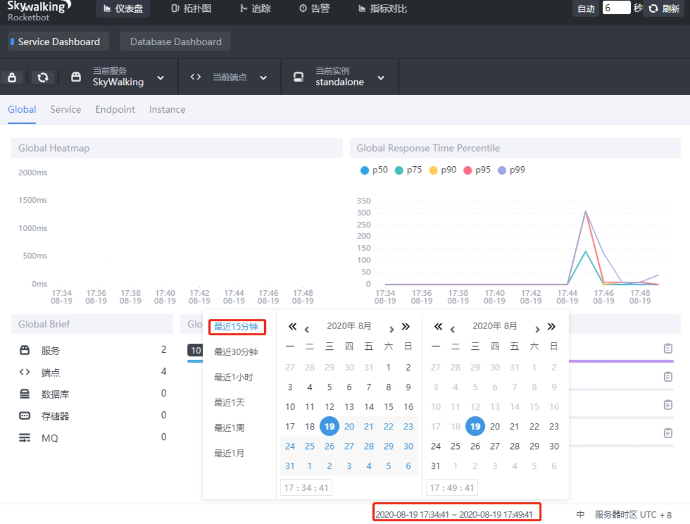

# ***\*skywalking部署\****

## 一、概述

#### 1.简介

>
> skywalking是一个开放源码的，用于收集、分析，聚合，可视化来自于不同服务和本地基础服务的数据的可观察的平台，
> skywalking提供了一个简单的方法来让你对你的分布式系统甚至是跨云的服务有清晰的了解。
> 它更像是一个现代的系统性能管理，特别为分布式系统而设计。

#### 2.功能

>
> skywalking提供了在很多不同的场景下用于观察和监控分布式系统的方式。首先，像传统的方法，skywalking为java,c#,Node.js等提供了自动探针代理.同时，它为Go,C++提供了手工探针。随着本地服务越来越多，需要越来越多的语言，掌控代码的风险也在增加，
> Skywalking可以使用网状服务探针收集数据，以了解整个分布式系统。通常，skywalking提供了观察service,service instance,endpoint的能力。

> service: 一个服务
> Service Instance: 服务的实例(1个服务会启动多个节点)
> Endpoint: 一个服务中的其中一个接口

#### 3.架构图

## 二、快速部署

#### 1.环境说明

> 操作系统：centos 7.6
>
> docker版本：19.03.12
>
> ip地址：192.168.31.xx
>
> 配置：4核8g

#### 2.下载镜像

> docker pull elasticsearch:7.5.1
> docker pull apache/skywalking-oap-server:6.6.0-es7
> docker pull apache/skywalking-ui:6.6.0
> 说明：使用最新版本的elasticsearch和skywalking-oap-server镜像，启动会有问题。
>
> 因此，必须使用上述版本才可以。
>
> 
>
> 下载源码包，下面会用到agent
>
> https://archive.apache.org/dist/skywalking/6.6.0/apache-skywalking-apm-6.6.0.tar.gz
>
> 安装elasticsearch
> 修改系统参数
> vim /etc/security/limits.conf
> 调整参数
>
> vm.max_map_count=262144
> 刷新参数
>
> sysctl -p
>  
>
> 启动elasticsearch
> docker run -d --name=es7 \
> -p 9200:9200 -p 9300:9300 \
>
> -e "discovery.type=single-node" elasticsearch:7.5.1
> 等待30秒左右，查看docker日志，如果有出现
>
> "publish_address {172.17.0.2:9300}, bound_addresses {0.0.0.0:9300}"
> 说明启动成功了。

创建持久化目录，并重启启动elasticsearch

> docker cp [es7:/usr/share/elasticsearch/data](http://es7/usr/share/elasticsearch/data) /data/elasticsearch/
> docker cp [es7:/usr/share/elasticsearch/logs](http://es7/usr/share/elasticsearch/logs) /data/elasticsearch/
> docker rm -f es7
> mkdir -p /data/elasticsearch
> docker run -d --name=es7 \
> --restart=always \
> -p 9200:9200 -p 9300:9300 \
> -e "discovery.type=single-node" \
> -v /data/elasticsearch/[data:/usr/share/elasticsearch/data](http://data/usr/share/elasticsearch/data) \
> -v /data/elasticsearch/[logs:/usr/share/elasticsearch/logs](http://logs/usr/share/elasticsearch/logs) \
> elasticsearch:7.5.1

安装oap
注意：等待elasticsearch完全启动之后，再启动oap

> docker run --name oap --restart always -d \
> --restart=always \
> -e TZ=Asia/Shanghai \
> -p 12800:12800 \
> -p 11800:11800 \
> --link es7:es7 \
> -e SW_STORAGE=elasticsearch \
> -e SW_STORAGE_ES_CLUSTER_NODES=es7:9200 \
> apache/skywalking-oap-server:6.6.0-es7
> 说明：这里指定elasticsearch 来存储数据

安装ui

> docker run -d --name skywalking-ui \
> --restart=always \
> -e TZ=Asia/Shanghai \
> -p 8088:8080 \
> --link oap:oap \
> -e SW_OAP_ADDRESS=oap:12800 \
> apache/skywalking-ui:6.6.0
> 注意：这里映射的端口为8088，防止端口冲突。

## 三、spring-boot实例部署

项目地址
这里一个SpringBootDemo为例，github地址：

https://github.com/solochen84/SpringBootDemo

 

制作jar包

> 找一台安装了jdk1.8和maven的服务器，使用maven构建命令进行打包
>
> mvn clean package

打包好之后，会在target目录，生成jar包，文件名为：spring-boot-demo-0.0.1-SNAPSHOT.jar

 

启动jar包
原来的启动方式为：

> java -jar spring-boot-demo-0.0.1-SNAPSHOT.jar
>  

那么使用skywalking agent，启动命令为：

> java -javaagent:/opt/apache-skywalking-apm-bin/agent/skywalking-agent.jar -Dskywalking.agent.service_name=xxxtest -Dskywalking.collector.backend_service=127.0.0.1:11800 -jar /opt/spring-boot-demo-0.0.1-SNAPSHOT.jar

说明：

> -javaagent 指定agent包位置。这里我将apache-skywalking-apm-6.6.0.tar.gz解压到/opt目录了，因此路径为：/opt/apache-skywalking-apm-bin/agent/skywalking-agent.jar
>
> -Dskywalking.agent.service_name 指定服务名
>
> -Dskywalking.collector.backend_service 指定skywalking oap地址，由于在本机，地址为：127.0.0.1:11800
>
> -jar 指定jar包的路径，这里我直接放到/opt/目录了。

 

访问ui
http://192.168.31.146:8088/
效果如下：

因为机制为懒加载，所以当只有你调用该java接口时，页面上才有显示。所以第一次访问时，数据是没有的。

访问demo接口
SpringBootDemo启动端口为：8080，api接口有3个

> GET /
> GET /?name=cheney
> GET /random
>

页面多刷新几次接口

> http://192.168.31.146:8080/
> http://192.168.31.146:8080/?name=cheney
> http://192.168.31.146:8080/randomAbout

仪表盘
刷新ui页面，选择最近15分钟的。

 拓扑图
点击拓扑图，选择最近15分钟的

 可以看到xxxtest，就是我们定义的服务名称

追踪
同样，可是查看最近15分钟的。

告警
查看最近15分钟的。

指标
这里可以选定3个指标，进行对比。

