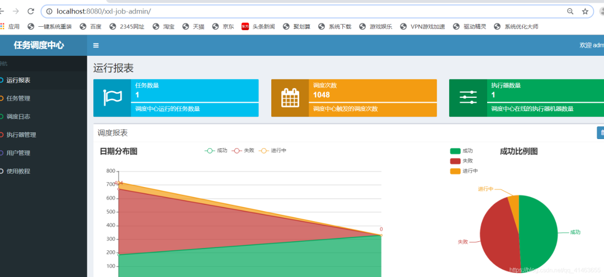

https://mp.weixin.qq.com/s/JWiuUsW6yhTLrkBXadCyiw

Quartz表达式生成地址：http://cron.qqe2.com/

支持生成定时任务表达式和反解析，使用Quartz表达式的定时任务如下

- xxl-job
- springboot 的 @Scheduled
- Quartz 框架
- 

## **一、job 定时任务的五种创建方式**

#### 1、使用线程创建 job 定时任务

```java
/**
  * TODO  使用线程创建 job 定时任务
  * @author 王松
  */
public class JobThread {

    public static class Demo01 {
        static long count = 0;

        public static void main(String[] args) {
            Runnable runnable = new Runnable() {
                @Override
                public void run() {
                    while (true) {
                        try {
                            Thread.sleep(1000);
                            count++;
                            System.out.println(count);
                        } catch (Exception e) {
                            // TODO: handle exception
                        }
                    }
                }
            };
            Thread thread = new Thread(runnable);
            thread.start();
        }
    }
}
```

#### 2、使用 TimerTask 创建job定时任务

```java
/**
 * TODO  使用 TimerTask 创建job定时任务
 * @author 王松
 */
public class JobTimerTask {

    static long count = 0;
    public static void main(String[] args) {
        TimerTask timerTask = new TimerTask() {
            @Override
            public void run() {
                count++;
                System.out.println(count);
            }
        };
        //创建timer对象设置间隔时间
        Timer timer = new Timer();
        // 间隔天数
        long delay = 0;
        // 间隔毫秒数
        long period = 1000;
        timer.scheduleAtFixedRate(timerTask, delay, period);
    }
}
```

#### 3、使用线程池创建 job定时任务

```
 /**
  * TODO  使用线程池创建 job定时任务
  * @author 王松
  */
public class JobScheduledExecutorService {
        public static void main(String[] args) {
            Runnable runnable = new Runnable() {
                @Override
                public void run() {
                    // task to run goes here
                    System.out.println("Hello !!");
                }
            };
            ScheduledExecutorService service = Executors.newSingleThreadScheduledExecutor();
            // 第二个参数为首次执行的延时时间，第三个参数为定时执行的间隔时间
            service.scheduleAtFixedRate(runnable, 1, 1, TimeUnit.SECONDS);
        }
}
```

#### 4.Quartz 框架

##### 1.引入maven依赖

```xml
<dependencies>
 <!-- quartz -->
 <dependency>
  <groupId>org.quartz-scheduler</groupId>
  <artifactId>quartz</artifactId>
  <version>2.2.1</version>
 </dependency>
 <dependency>
  <groupId>org.quartz-scheduler</groupId>
  <artifactId>quartz-jobs</artifactId>
  <version>2.2.1</version>
 </dependency>
</dependencies>
```

##### 2.任务调度类

```java
public class MyJob implements Job {

    @Override
    public void execute(JobExecutionContext context) throws JobExecutionException {
        System.out.println("quartz MyJob date:" + System.currentTimeMillis());
    }
}
```

##### 3.启动类

```java
public class JobQuartz {

    public static void main(String[] args) throws SchedulerException {
        //1.创建Scheduler的工厂
        SchedulerFactory sf = new StdSchedulerFactory();
        //2.从工厂中获取调度器实例
        Scheduler scheduler = sf.getScheduler();
        //3.创建JobDetail，
        JobDetail jb = JobBuilder.newJob(MyJob.class)
                //job的描述
                .withDescription("this is a ram job")
                //job 的name和group
                .withIdentity("ramJob", "ramGroup")
                .build();
        //任务运行的时间，SimpleSchedle类型触发器有效，3秒后启动任务
        long time=  System.currentTimeMillis() + 3*1000L;
        Date statTime = new Date(time);
        //4.创建Trigger
        //使用SimpleScheduleBuilder或者CronScheduleBuilder
        Trigger t = TriggerBuilder.newTrigger()
                .withDescription("")
                .withIdentity("ramTrigger", "ramTriggerGroup")
                //.withSchedule(SimpleScheduleBuilder.simpleSchedule())
                //默认当前时间启动
                .startAt(statTime)
                //两秒执行一次，Quartz表达式，支持各种牛逼表达式
                .withSchedule(CronScheduleBuilder.cronSchedule("0/2 * * * * ?"))
                .build();
        //5.注册任务和定时器
        scheduler.scheduleJob(jb, t);
        //6.启动 调度器
        scheduler.start();
    }
```

#### 5.springboot 的 @Scheduled 注解

```java
@Component
@Configuration      //1.主要用于标记配置类，兼备Component的效果。
@EnableScheduling   // 2.开启定时任务
public class SaticScheduleTask {

    @Scheduled(cron = "0/5 * * * * ?")  //3.添加定时任务
    //@Scheduled(fixedRate=5000)        //或直接指定时间间隔，例如：5秒
    private void configureTasks() {
        System.err.println("执行静态定时任务时间: " + LocalDateTime.now());
    }
}
```

## **二、xxl-job 任务调度后台 Admin**

xxl-job 有什么用？

- 分布式集群的情况下，保证定时任务不被重复执行。
- 执行原理同Nginx 类型，所有定时任务通过任务调度平台分发，也可配置负载均衡等等
- 首先让我们能够使用起来，搭建一个自己的任务

#### 第一步: github下载源码导入

下载地址：https://github.com/xuxueli/xxl-job/

当前版本目录结构 2.1.1


#### 第二步: 执行sql

文件地址：xxl-job/doc/db/tables_xxl_job.sql

当前2.1.1版本sql


#### 第三步: 修改xxl-job-admin项目配置

配置文件：application.properties

修改数据库连接


第四步: 启动admin项目

springboot 方式启动项目，


访问 http://localhost:8080/xxl-job-admin/

账号密码：admin / 123456



任务调度中心就搭建好了

接下来需要创建一个服务器连接任务调度中心

## **三、自创建boot项目的任务xxl-job 示例demo**

创建一个 boot 项目

我的目录结构


pom.xml

web核心及 xxl-job-core

```xml
<!-- spring-boot-starter-web (spring-webmvc + tomcat) -->
<dependency>
    <groupId>org.springframework.boot</groupId>
    <artifactId>spring-boot-starter-web</artifactId>
</dependency>
<dependency>
    <groupId>org.springframework.boot</groupId>
    <artifactId>spring-boot-starter-test</artifactId>
    <scope>test</scope>
</dependency>

<!-- xxl-job-core  版本号根据自己下载的版本修改 -->
<dependency>
    <groupId>com.xuxueli</groupId>
    <artifactId>xxl-job-core</artifactId>
    <version>2.1.1-SNAPSHOT</version>
</dependency>
```

logback.xml

日志配置直接拷贝

```xml
<?xml version="1.0" encoding="UTF-8"?>
<configuration debug="false" scan="true" scanPeriod="1 seconds">

    <contextName>logback</contextName>
    <property name="log.path" value="/data/applogs/xxl-job/xxl-job-executor-sample-springboot.log"/>

    <appender name="console" class="ch.qos.logback.core.ConsoleAppender">
        <encoder>
            <pattern>%d{HH:mm:ss.SSS} %contextName [%thread] %-5level %logger{36} - %msg%n</pattern>
        </encoder>
    </appender>

    <appender name="file" class="ch.qos.logback.core.rolling.RollingFileAppender">
        <file>${log.path}</file>
        <rollingPolicy class="ch.qos.logback.core.rolling.TimeBasedRollingPolicy">
            <fileNamePattern>${log.path}.%d{yyyy-MM-dd}.zip</fileNamePattern>
        </rollingPolicy>
        <encoder>
            <pattern>%date %level [%thread] %logger{36} [%file : %line] %msg%n
            </pattern>
        </encoder>
    </appender>

    <root level="info">
        <appender-ref ref="console"/>
        <appender-ref ref="file"/>
    </root>

</configuration>
```

application.properties 加入配置

需修改或自定义

- xxl-job admin 地址
- xxl.job.executor.appname 自定义名称，后台配置必须对应
- xxl.job.executor.ip 当前电脑Ip，或部署项目的电脑Ip
- xxl.job.executor.port 端口

```properties
# 端口号
server.port=8081
# 日志
logging.config=classpath:logback.xml

## xxl-job admin 地址，多个逗号分隔"
xxl.job.admin.addresses=http://127.0.0.1:8080/xxl-job-admin

## xxl-job名称 || socket ip 当前项目部署的ip地址/本机ip || socket 端口号
xxl.job.executor.appname=xxl-job-executor-sample
xxl.job.executor.ip=192.168.43.153
xxl.job.executor.port=9999

## xxl-job, access token
xxl.job.accessToken=
## xxl-job log path
xxl.job.executor.logpath=/data/applogs/xxl-job/jobhandler
## xxl-job log retention days
xxl.job.executor.logretentiondays=-1
```

添加boot配置类 XxlJobConfig

```java
package xxljob.config;
import com.xxl.job.core.executor.impl.XxlJobSpringExecutor;
import org.slf4j.Logger;
import org.slf4j.LoggerFactory;
import org.springframework.beans.factory.annotation.Value;
import org.springframework.context.annotation.Bean;
import org.springframework.context.annotation.Configuration;

/**
 * xxl-job xxljob.config
 */
@SuppressWarnings("ALL")
@Configuration
public class XxlJobConfig {
    private Logger logger = LoggerFactory.getLogger(XxlJobConfig.class);

    @Value("${xxl.job.admin.addresses}")
    private String adminAddresses;

    @Value("${xxl.job.executor.appname}")
    private String appName;

    @Value("${xxl.job.executor.ip}")
    private String ip;

    @Value("${xxl.job.executor.port}")
    private int port;

    @Value("${xxl.job.accessToken}")
    private String accessToken;

    @Value("${xxl.job.executor.logpath}")
    private String logPath;

    @Value("${xxl.job.executor.logretentiondays}")
    private int logRetentionDays;


    @Bean(initMethod = "start", destroyMethod = "destroy")
    public XxlJobSpringExecutor xxlJobExecutor() {
        logger.info(">>>>>>>>>>> xxl-job xxljob.config init.");
        XxlJobSpringExecutor xxlJobSpringExecutor = new XxlJobSpringExecutor();
        xxlJobSpringExecutor.setAdminAddresses(adminAddresses);
        xxlJobSpringExecutor.setAppName(appName);
        xxlJobSpringExecutor.setIp(ip);
        xxlJobSpringExecutor.setPort(port);
        xxlJobSpringExecutor.setAccessToken(accessToken);
        xxlJobSpringExecutor.setLogPath(logPath);
        xxlJobSpringExecutor.setLogRetentionDays(logRetentionDays);
        System.err.println(ip+":"+port);
        return xxlJobSpringExecutor;
    }

    /**
     * 针对多网卡、容器内部署等情况，可借助 "spring-cloud-commons" 提供的 "InetUtils" 组件灵活定制注册IP；
     *
     *      1、引入依赖：
     *          <dependency>
     *             <groupId>org.springframework.cloud</groupId>
     *             <artifactId>spring-cloud-commons</artifactId>
     *             <version>${version}</version>
     *         </dependency>
     *
     *      2、配置文件，或者容器启动变量
     *          spring.cloud.inetutils.preferred-networks: 'xxx.xxx.xxx.'
     *
     *      3、获取IP
     *          String ip_ = inetUtils.findFirstNonLoopbackHostInfo().getIpAddress();
     */
}
```

任务job

```java
@JobHandler(value="demoJobHandler")
@Component
public class DemoJobHandler extends IJobHandler {

     static int count;
    @Override
    public ReturnT<String> execute(String param) throws Exception {
        System.out.println("执行job任务"+count++);
        return SUCCESS;
    }
}
```

admin 后台配置

执行管理器下


任务管理下编辑任务

定时规则生成：http://cron.qqe2.com/

job任务名：@JobHandler注解值 >> 如:`@JobHandler(value=“demoJobHandler”)`


启动


这样就配置完成了

