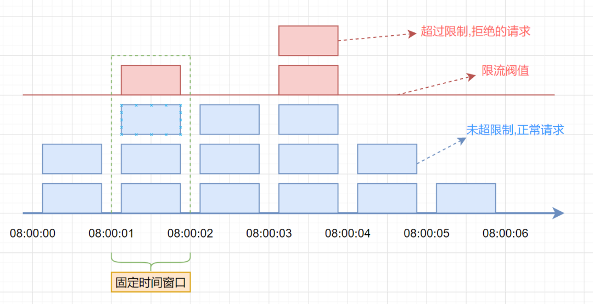
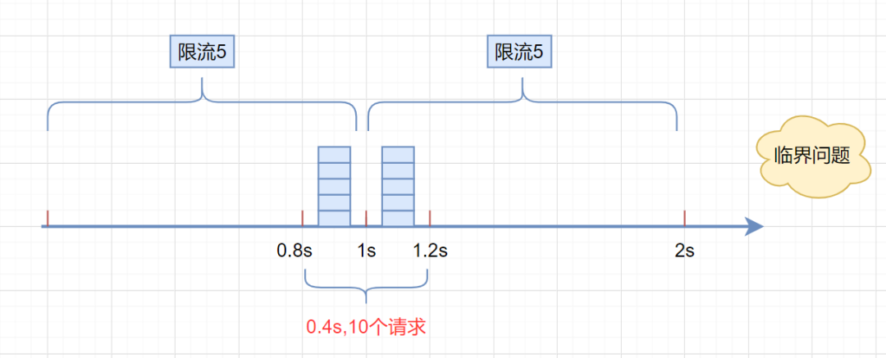
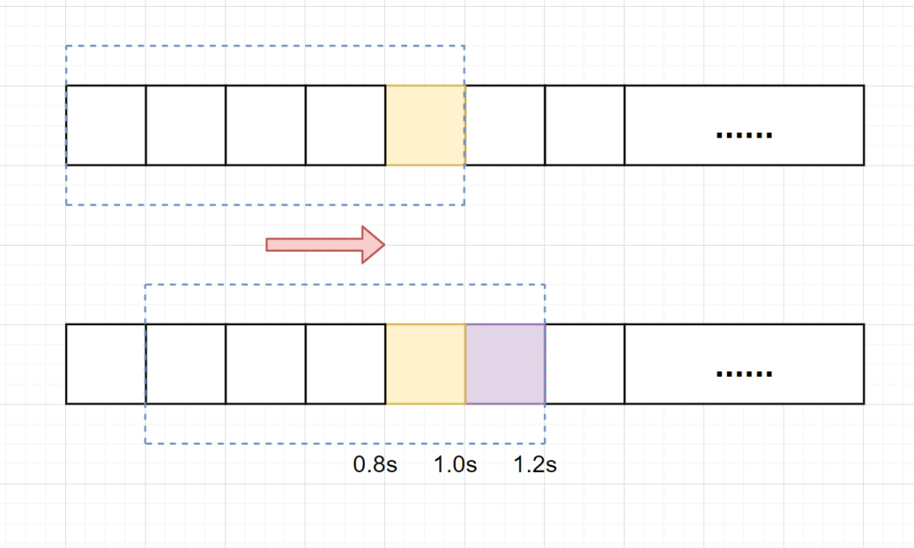
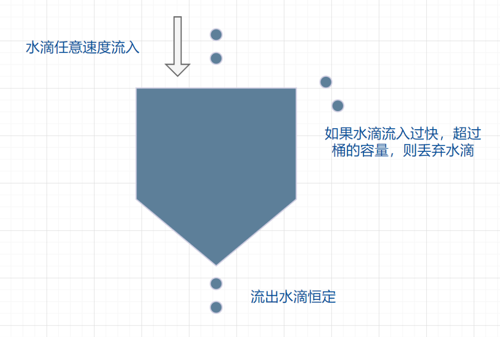
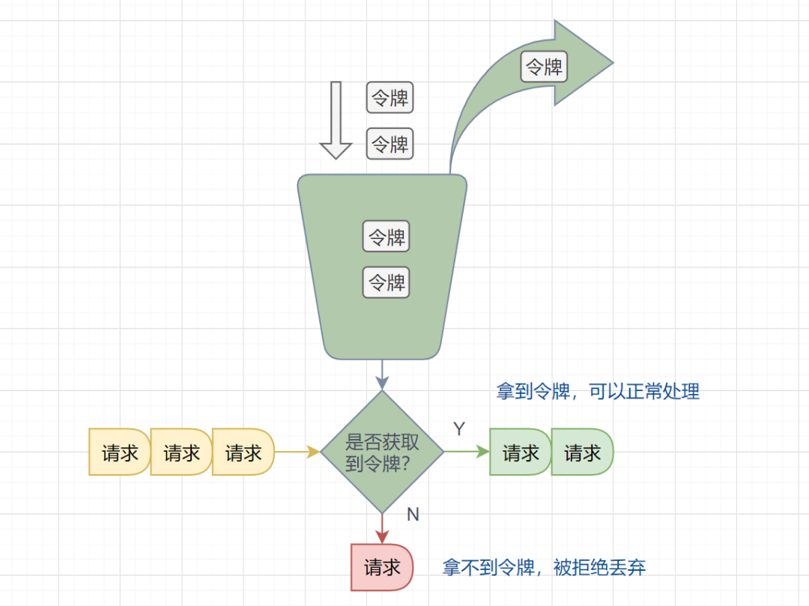

https://mp.weixin.qq.com/s/EQRrVAAjip02r8W2YhPlZg

## **限流是什么?**

维基百科的概念如下：

> In computer networks, rate limiting is used to control the rate of requests sent or
> received by a network interface controller. It can be used to prevent DoS attacks 
> and limit web scraping

> 简单翻译一下：在计算机网络中，限流就是控制网络接口发送或接收请求的速率，它可防止DoS攻击和限制Web爬虫

限流，也称流量控制。是指系统在面临高并发，或者**大流量请求**的情况下，**限制新的请求对系统的访问**，从而**保证系统的稳定性**。限流会导致部分用户请求处理不及时或者被拒，这就影响了用户体验。所以一般需要在系统稳定和用户体验之间**平衡**一下。举个生活的例子：

> 一些热门的旅游景区，一般会对每日的旅游参观人数有限制的。每天只会卖出固定数目的门票，比如5000张。假设在五一、国庆假期，你去晚了，可能当天的票就已经卖完了，就无法进去游玩了。即使你进去了，排队也能排到你怀疑人生。

## **常见的限流算法**

### 固定窗口限流算法

首先维护一个计数器，将单位时间段当做一个窗口，计数器记录这个窗口接收请求的次数。

- 当次数少于限流阀值，就允许访问，并且计数器+1
- 当次数大于限流阀值，就拒绝访问。
- 当前的时间窗口过去之后，计数器清零。

假设单位时间是1秒，限流阀值为3。在单位时间1秒内，每来一个请求,计数器就加1，如果计数器累加的次数超过限流阀值3，后续的请求全部拒绝。等到1s结束后，计数器清0，重新开始计数。如下图：



伪代码如下：

```java
    /**
     * 固定窗口时间算法
     * @return
     */
    boolean fixedWindowsTryAcquire() {
        long currentTime = System.currentTimeMillis();  //获取系统当前时间
        if (currentTime - lastRequestTime > windowUnit) {  //检查是否在时间窗口内
            counter = 0;  // 计数器清0
            lastRequestTime = currentTime;  //开启新的时间窗口
        }
        if (counter < threshold) {  // 小于阀值
            counter++;  //计数器加1
            return true;
        }

        return false;
    }
```

但是，这种算法有一个很明显的**临界问题**：假设限流阀值为5个请求，单位时间窗口是1s,如果我们在单位时间内的前0.8-1s和1-1.2s，分别并发5个请求。虽然都没有超过阀值，但是如果算0.8-1.2s,则并发数高达10，已经**超过单位时间1s不超过5阀值**的定义啦。



### 滑动窗口限流算法

滑动窗口限流解决固定窗口临界值的问题。它将单位时间周期分为n个小周期，分别记录每个小周期内接口的访问次数，并且根据时间滑动删除过期的小周期。

一张图解释滑动窗口算法，如下：



假设单位时间还是1s，滑动窗口算法把它划分为5个小周期，也就是滑动窗口（单位时间）被划分为5个小格子。每格表示0.2s。每过0.2s，时间窗口就会往右滑动一格。然后呢，每个小周期，都有自己独立的计数器，如果请求是0.83s到达的，0.8~1.0s对应的计数器就会加1。

我们来看下滑动窗口是如何解决临界问题的？

假设我们1s内的限流阀值还是5个请求，0.8~1.0s内（比如0.9s的时候）来了5个请求，落在黄色格子里。时间过了1.0s这个点之后，又来5个请求，落在紫色格子里。如果**是固定窗口算法，是不会被限流的**，但是**滑动窗口的话，每过一个小周期，它会右移一个小格**。过了1.0s这个点后，会右移一小格，当前的单位时间段是0.2~1.2s，这个区域的请求已经超过限定的5了，已触发限流啦，实际上，紫色格子的请求都被拒绝啦。

**TIPS:** 当滑动窗口的格子周期划分的越多，那么滑动窗口的滚动就越平滑，限流的统计就会越精确。

滑动窗口算法**伪代码实现**如下：

```java
 /**
     * 单位时间划分的小周期（单位时间是1分钟，10s一个小格子窗口，一共6个格子）
     */
    private int SUB_CYCLE = 10;

    /**
     * 每分钟限流请求数
     */
    private int thresholdPerMin = 100;

    /**
     * 计数器, k-为当前窗口的开始时间值秒，value为当前窗口的计数
     */
    private final TreeMap<Long, Integer> counters = new TreeMap<>();

   /**
     * 滑动窗口时间算法实现
     */
    boolean slidingWindowsTryAcquire() {
        long currentWindowTime = LocalDateTime.now().toEpochSecond(ZoneOffset.UTC) / SUB_CYCLE * SUB_CYCLE; //获取当前时间在哪个小周期窗口
        int currentWindowNum = countCurrentWindow(currentWindowTime); //当前窗口总请求数

        //超过阀值限流
        if (currentWindowNum >= thresholdPerMin) {
            return false;
        }

        //计数器+1
        counters.get(currentWindowTime)++;
        return true;
    }

   /**
    * 统计当前窗口的请求数
    */
    private int countCurrentWindow(long currentWindowTime) {
        //计算窗口开始位置
        long startTime = currentWindowTime - SUB_CYCLE* (60s/SUB_CYCLE-1);
        int count = 0;

        //遍历存储的计数器
        Iterator<Map.Entry<Long, Integer>> iterator = counters.entrySet().iterator();
        while (iterator.hasNext()) {
            Map.Entry<Long, Integer> entry = iterator.next();
            // 删除无效过期的子窗口计数器
            if (entry.getKey() < startTime) {
                iterator.remove();
            } else {
                //累加当前窗口的所有计数器之和
                count =count + entry.getValue();
            }
        }
        return count;
    }
```

滑动窗口算法虽然解决了**固定窗口的临界问题**，但是一旦到达限流后，请求都会直接暴力被拒绝。酱紫我们会损失一部分请求，这其实对于产品来说，并不太友好。

### 漏桶算法

漏桶算法面对限流，就更加的柔性，不存在直接的粗暴拒绝。

它的原理很简单，可以认为就是**注水漏水**的过程。往漏桶中以任意速率流入水，以固定的速率流出水。当水超过桶的容量时，会被溢出，也就是被丢弃。因为桶容量是不变的，保证了整体的速率。



- 流入的水滴，可以看作是访问系统的请求，这个流入速率是不确定的。
- 桶的容量一般表示系统所能处理的请求数。
- 如果桶的容量满了，就达到限流的阀值，就会丢弃水滴（拒绝请求）
- 流出的水滴，是恒定过滤的，对应服务按照固定的速率处理请求。

漏桶算法**伪代码实现**如下：

```
/**
     * 每秒处理数（出水率）
     */
    private long rate;

    /**
     *  当前剩余水量
     */
    private long currentWater;

    /**
     * 最后刷新时间
     */
    private long refreshTime;

    /**
     * 桶容量
     */
    private long capacity;

    /**
     * 漏桶算法
     * @return
     */
    boolean leakybucketLimitTryAcquire() {
        long currentTime = System.currentTimeMillis();  //获取系统当前时间
        long outWater = (currentTime - refreshTime) / 1000 * rate; //流出的水量 =(当前时间-上次刷新时间)* 出水率
        long currentWater = Math.max(0, currentWater - outWater); // 当前水量 = 之前的桶内水量-流出的水量
        refreshTime = currentTime; // 刷新时间

        // 当前剩余水量还是小于桶的容量，则请求放行
        if (currentWater < capacity) {
            currentWater++;
            return true;
        }
        
        // 当前剩余水量大于等于桶的容量，限流
        return false;
    }
```

在正常流量的时候，系统按照固定的速率处理请求，是我们想要的。但是**面对突发流量**的时候，漏桶算法还是循规蹈矩地处理请求，这就不是我们想看到的啦。流量变突发时，我们肯定**希望系统尽量快点处理请求**，提升用户体验嘛。

### 令牌桶算法

面对**突发流量**的时候，我们可以使用令牌桶算法限流。

**令牌桶算法原理**：

- 有一个令牌管理员，根据限流大小，定速往令牌桶里放令牌。
- 如果令牌数量满了，超过令牌桶容量的限制，那就丢弃。
- 系统在接受到一个用户请求时，都会先去令牌桶要一个令牌。如果拿到令牌，那么就处理这个请求的业务逻辑；
- 如果拿不到令牌，就直接拒绝这个请求。



漏桶算法伪代码实现如下：

```
/**
     * 每秒处理数（放入令牌数量）
     */
    private long putTokenRate;
    
    /**
     * 最后刷新时间
     */
    private long refreshTime;

    /**
     * 令牌桶容量
     */
    private long capacity;
    
    /**
     * 当前桶内令牌数
     */
    private long currentToken = 0L;

    /**
     * 漏桶算法
     * @return
     */
    boolean tokenBucketTryAcquire() {

        long currentTime = System.currentTimeMillis();  //获取系统当前时间
        long generateToken = (currentTime - refreshTime) / 1000 * putTokenRate; //生成的令牌 =(当前时间-上次刷新时间)* 放入令牌的速率
        currentToken = Math.min(capacity, generateToken + currentToken); // 当前令牌数量 = 之前的桶内令牌数量+放入的令牌数量
        refreshTime = currentTime; // 刷新时间
        
        //桶里面还有令牌，请求正常处理
        if (currentToken > 0) {
            currentToken--; //令牌数量-1
            return true;
        }
        
        return false;
    }
```

如果令牌发放的策略正确，这个系统即不会被拖垮，也能提高机器的利用率。Guava的RateLimiter限流组件，就是基于**令牌桶算法**实现的。

### 参考与感谢

- https://mp.weixin.qq.com/s/8S1860lmINRQR21eNmyfsw
- https://mp.weixin.qq.com/s/Kmy1gy0z7gaopKMmAsAd3g

