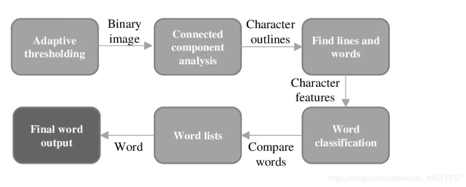

# 提取图片上的文字很难吗？看我用几行代码搞定它！

https://mp.weixin.qq.com/s/FZy3Ppm_y6qTK_Lz65WlvQ

## 摘要

近日浏览网上一些图片提取文字的网站，觉得甚是有趣，花费半日也做了个在线图片识别程序，完成了两个技术方案的选择，一是tesseract+python flask的方案实现，二是tesseract+spring web的技术解决方案，并简作论述，与君共勉。

## 一、tesseract-ocr介绍

ocr含义是Optical Character Recognition，含义即视觉字符识别。而tesseract是该领域特别优秀开源的作品。

官方的tesseract定义：

> “
>
> OCR engine - libtesseract and a command line program - tesseract.
>
> ”

即tesseract包括一个视觉字符识别引擎libtesseract和命令行程序tesseract。

当前最新稳定版本是4.x.x基于LSTM，源码可从找到tesseract的GitHub: tesseract.找到。



关于tesseract的工作模式如上图所示。假设现在有一个图片输入，整个执行流程为：

1. 输入（一张图片）
2. 有用信息提取（比如一个图片上只有一个字，那其他留白的是无用，这个字上每个色素是有效的并且相关）
3. 找出文字/线条
4. 字符分类集
5. 输入与分类集对比找出最接近的
6. 输出识别结果

## 二、安装tesseract

**第一步下载**

下载合适的exe安装文件：

网址：https://digi.bib.uni-mannheim.de/tesseract/，下载完成后后装即可


**第二步环境变量配置**

在path变量中加入tesseract-ocr的安装路径


**第三步安装成功检测**

使用tesseract指令，显示如下：


linux环境下载安装与上述类似


下载leptonica 和 tesseract两个包，解压安装，配置环境变量即可。网上很容易找到该安装包。

## 三、使用命令行

**1.tesseract + 图片路径 + 保存结果名 + -l 语言集**

示列: `tesseract 1606150081.png 1606150081 -l chi_sim`

**2.tesseract + 图片路径 +stdout -l +语言集**

示列: `tesseract D:\company\ruigushop\spring-2s\test.png stdout -l chi_sim`

有了上述之后就可以完成web图片识别程序的开发啦，废话不多说，直接上代码。

## 四、程序实现(Python)

程序设计思路:

> “
>
> 上传图片 -> 保存 ->对上传的图片执行tesseract指令->获取识别结果
>
> ”

只有二十多行代码就实现了，so easy，以后网上看到图片识别程序再也不会感觉神奇了吧！

```python
# coding=utf-8
from flask import Flask, request
import os
import datetime
import time

app = Flask(__name__)


def get_time_stamp():
    times = datetime.datetime.now().strftime('%Y-%m-%d %H:%M:%S')
    array = time.strptime(times, "%Y-%m-%d %H:%M:%S")
    time_stamp = int(time.mktime(array))
    return time_stamp


@app.route('/image/extract', methods=['POST'])
def pure_rec():
    file = request.files.get('file')
    ts = str(get_time_stamp())
    up_path = os.path.join(ts + file.filename)
    file.save(up_path)
    cmd = "tesseract "+up_path+" " + ts + " -l chi_sim"
    print(cmd)
    os.system(cmd)
    with open(ts+".txt", 'r+', encoding="utf-8") as f:
        result = f.read()
        return result


    if __name__ == '__main__':
        app.run(debug=True)
```

## 五、程序实现（Java）

不需要任何引入第三方jar包，搭建一个简单的springboot web项目就可以了，没有其他额外的依赖。

Controller:

```java
package com.lbh.web.controller;

/*
 * Copyright@lbhbinhao@163.com
 * Author:liubinhao
 * Date:2020/11/23
 * @author liubinhao
 */
import org.springframework.web.bind.annotation.PostMapping;
import org.springframework.web.bind.annotation.RequestParam;
import org.springframework.web.bind.annotation.RestController;
import org.springframework.web.multipart.MultipartFile;

import java.io.BufferedReader;
import java.io.File;
import java.io.IOException;
import java.io.InputStreamReader;

@RestController
public class LiteralExtractController {

    @PostMapping("/image/extract")
    public String reg(@RequestParam("file")MultipartFile file) throws IOException {
        String result = "";
        String filename = file.getOriginalFilename();
        File save = new File(System.getProperty("user.dir")+"\\"+filename);
        if (!save.exists()){
            save.createNewFile();
        }
        file.transferTo(save);
        String cmd = String.format("tesseract %s stdout -l %s",System.getProperty("user.dir")+"\\"+filename,"chi_sim");
        result = cmd(cmd);
        return result;
    }

    public static String cmd(String cmd) {
        BufferedReader br = null;
        try {
            Process p = Runtime.getRuntime().exec(cmd);
            br = new BufferedReader(new InputStreamReader(p.getInputStream()));
            String line = null;
            StringBuilder sb = new StringBuilder();
            while ((line = br.readLine()) != null) {
                sb.append(line + "\n");
            }
            return sb.toString();
        } catch (Exception e) {
            e.printStackTrace();
        }
        finally
        {
            if (br != null)
            {
                try {
                    br.close();
                } catch (Exception e) {
                    e.printStackTrace();
                }
            }
        }
        return null;
    }
}
```

## 六、实验测试

很简单二十多行代码就完成了，看看效果怎么样吧。

测试一图片：


测试一结果：


测试二图片：


测试二结果：


perfect，识别的很准确，第二个测试全部是英文字符的时候我们采用了中文训练的数据集，虽然也很好的识别了，但是速度会慢很多。

## 七、总结

图片识别在当今网络技术领域是非常热门的一块，而这次完成的这个程序完全是依赖别人开源框架来完成了这个技术实现，在应用层面这是成功的，但是本质上并没有实际算法，技术核心上的东西，如果只关心应用层开发上述解决了我们计算机在规则字符识别上的问题。

上述代码中基本没有难点，直接复制即可使用。此外，tesseract作为一款优秀的开源字符识别软件，但它也不是万能的，tesseract只能识别规则的字符，对于一些艺术字，抽象字它是无能为力的。

