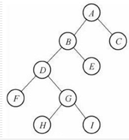
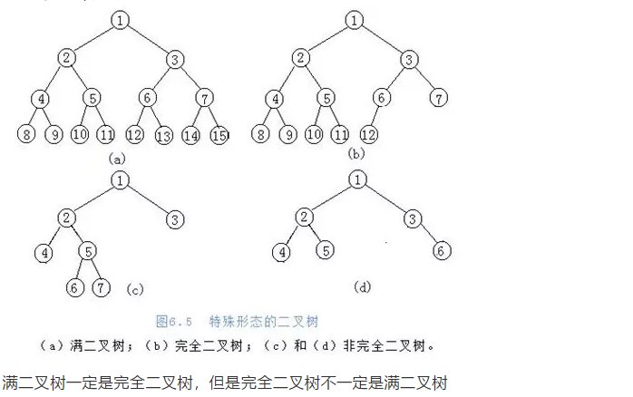
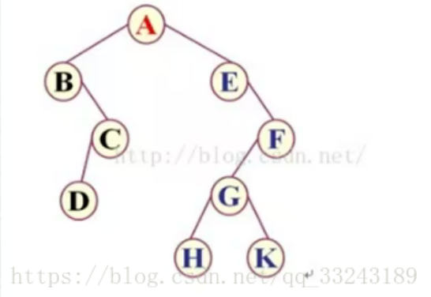

##### 二叉树

二叉树，就是度不差过2的树（节点最多有两个叉）



**1、满二叉树**

一个二叉树，如果每一个层的结点数都达到最大值，则这个二叉树就是满二叉树。

**2、完全二叉树**

叶节点只能出现在最下层和次下层，并且最下面一层的结点都集中在该层最左边的若干位置的二叉树



**3、存储方式**

​	二叉树的链式存储：将二叉树的节点定义为一个对象，节点之间通过类似链表的链接方式来连接。

```
public class Node {
    // 数据
    private Object data;
    // 左节点
    private Node leftNote;
    // 右节点
    private Node rightNode;
}

```

二叉树的遍历：

I 、先（前）序遍历：访问根结点的操作发生在遍历其左右子树之前

　 具体操作：若二叉树非空，则依次执行如下操作：

- ⑴ 访问根结点；
- ⑵ 遍历左子树；
- ⑶ 遍历右子树。

II、中序遍历：访问根结点的操作发生在遍历其左右子树之中（间）。

   具体操作： 若二叉树非空，则依次执行如下操作：

- ⑴遍历左子树；
- ⑵访问根结点；
- ⑶遍历右子树。

III、后序遍历：访问根结点的操作发生在遍历其左右子树之后。

   若二叉树非空，则依次执行如下操作：

- ⑴遍历左子树；
- ⑵遍历右子树；
- ⑶访问根结点。



前序遍历：ABCDEFGHK

中序遍历：BDCAEHGKF

后序遍历：DCBHKGFEA

```
遍历的时候， 遍历左节点和右节点的时候，需要将节点下下的所有节点 和左节点一起当作 左节点考虑。
```

