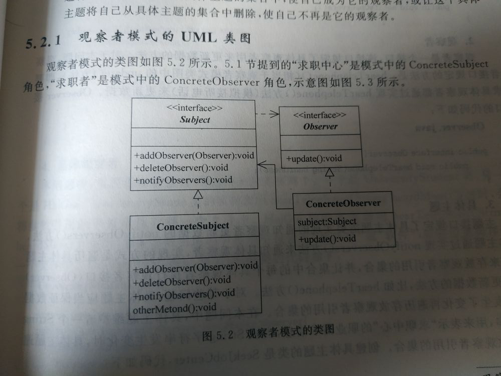

# 观察者模式

观察者模式（依赖，发布-订阅）

> 定义对象的一个一对多的依赖关系，当一个对象的状态发生变化时，所有依赖他的对象都得到通知，并被自动更新。

#### 1.观察者模式的结构中包括4中角色

>   主题：主题是一个接口，添加、删除观察者，以及通知观察者跟新数据的方法  
>
> 观察者：，接口，规定了具体观察者用来更新数据的方法 
>
>  具体主题：实现主题接口的一个实例，该实例包含有可能经常发生变化的数据。具体主题使用一个集合，比如ArrayList,存放观察者的引用，以便数据发生变化时通知观察者。  具体观察者:实现观察者接口的实例。
>
> 具体观察者，包含有可以存放具体主题引用的主题接口变量，以便让具体主题将自己的引用添加到具体主题的集合中，使自己成为他的观   察者 或者让具体主题将自己从具体主题的集合中删除，使自己不再是他的观察者



Subject.java

```java
package com.design.patterns.demo.observPattern;


public interface Subject {
        // 添加观察者
        public void addObserver(Observer o);
        //  删除观察者
        public void deleteObserver(Observer o);
        // 通知观察者跟新数据
        public void notifyObservers();
}
```

Observer.java

```java
package com.design.patterns.demo.observPattern;
public interface Observer {
    // 接收消息
    public void  hearTelephone(String heardMess);
}
```

SeekJobCenter.java 

```java
package com.design.patterns.demo.observPattern;
import org.springframework.util.StringUtils;
import java.util.ArrayList;

public class SeekJobCenter implements Subject {
    String message;
    boolean changed;
    ArrayList<Observer> personList;
    SeekJobCenter(){
        message="";
        changed =false;
        personList = new ArrayList<Observer>();
    }

    @Override
    public void addObserver(Observer o) {
        if(!personList.contains(o)){
            personList.add(o);
        }
    }


    @Override
    public void deleteObserver(Observer o) {
        if(personList.contains(o)){
            personList.remove(o);
        }
    }


    @Override
    public void notifyObservers() {
        if(changed){
            for (int i = 0; i <personList.size() ; i++) {
                Observer observer = personList.get(i);
                observer.hearTelephone(message);
            }
            changed=false;
        }
    }


    public void giveNewMessage(String str){
        if(message.equals(str)){
            changed=false;
        }else{
            message = str;
            changed=true;
        }
    }
}
```

UniversityStudent.java

```java
package com.design.patterns.demo.observPattern;
import java.io.File;
import java.io.IOException;
import java.io.RandomAccessFile;

public class UniversityStudent implements Observer {

    Subject subject;
    File myFile;

    UniversityStudent(Subject subject,String fileName){
        this.subject=subject;
        // 使当前实例成为sunject具体引用的具体主题的观察者
        subject.addObserver(this);
        myFile = new File(fileName);
    }


    @Override
    public void hearTelephone(String heardMess) {
        try {
            RandomAccessFile out = new RandomAccessFile(myFile,"rw");
            out.seek(out.length());
            byte [] b = heardMess.getBytes();
            out.write(b);
            System.out.print("我是一个大学生");
            System.out.println("我向文件"+myFile.getName()+"写入如下内容:");
            System.out.println(heardMess);
        }catch (IOException exp){
            System.out.println(exp.toString());
        }
    }
}
```

HaiGui.java

```java
package com.design.patterns.demo.observPattern;


import java.io.File;
import java.io.RandomAccessFile;

public class HaiGui implements Observer {

    Subject subject;
    File myFile;

    HaiGui(Subject subject,String fileName){
        this.subject=subject;
        subject.addObserver(this);
        myFile = new File(fileName);
    }
    @Override
    public void hearTelephone(String heardMess) {
        try{
            boolean boo = heardMess.contains("程序员")|| heardMess.contains("软件");
            if(boo){
                RandomAccessFile out = new RandomAccessFile(myFile,"rw");
                out.seek(out.length());
                byte [] b = heardMess.getBytes();
                out.write(b);
                System.out.print("我是一个海归");
                System.out.println("我向文件"+myFile.getName()+"写入如下内容:");
                System.out.println(heardMess);
            }else{
                System.out.println("我是海归，这次信息中没有我需要的信息");
            }
        }catch (Exception e){
            System.out.println(e.toString());
        }


    }
}
```

Application.java

```java
package com.design.patterns.demo.observPattern;

public class Application {
    public static void main(String[] args) {
        SeekJobCenter center = new SeekJobCenter();
        UniversityStudent zhangsan = new UniversityStudent(center,"a.txt");
        HaiGui jack = new HaiGui(center,"b.txt");
        center.giveNewMessage("辉腾公司需要10个程序员");
        center.notifyObservers();
        center.giveNewMessage("海景公司需要8个动画设计师");
        center.notifyObservers();
        center.giveNewMessage("人海公司需要 6个电工");
        center.notifyObservers();
        center.giveNewMessage("人海公司需要 6个电工");
        center.notifyObservers();
    }
}
```

#### 2.观察者模式中的 推数据 和拉数据

> 推数据方式：是指具体主题将变化后的所有数据推送给观察者，即将变化后的数据传递给具体观察者用户更新数据的参数。当具体主题认为具体观察者需要这些变化后的所有数据的时候采用这种方式。（上边的例子就是推数据方式） 
>
>  拉数据方式：具体主题不将变化后的数据交给观察者，而是提供了获取这些数据的方法，具体观察者在得到通知后，可以调用具体主题提供的方法得到数据（观察者自己将数据拉过来),但需要自己判断数据是否发生变化，当具体具体主题不知道具体观察者是否需要这些变化后的数据的时候采用这种方式